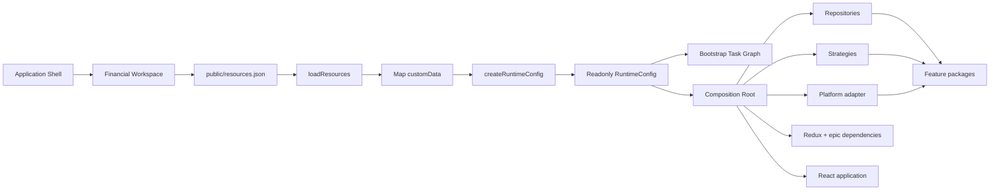

# Runtime Configuration Pattern

> **Showcase scope:** client-side only. Load one static `resources.json`, validate a handful of `customData` values with Zod, display them on `/startup`, and pass one typed immutable object into application creation. Do not build a configuration backend, administration UI, or generic configuration framework.

## 1. Short definition

**Runtime Configuration** separates deployment-specific choices from the JavaScript build.

The application is built once, then receives a small configuration document when it starts:

```text
build artifact + resources.json
              ↓
      validated RuntimeConfig
              ↓
       application creation
```

Features consume typed contracts and injected capabilities. They do not read `resources.json`, `window`, environment globals, or raw `customData` values directly.

In the Financial Workspace demo, runtime configuration determines choices such as:

- `direct` versus Worker-backed analytics;
- the bootstrap profile;
- the platform context provider;
- the intent-prefetch policy.

It does **not** create repositories, strategies, Workers, stores, actors, or React roots. The Composition Root creates those objects later.

---

## 2. Problem it solves

Without an explicit configuration boundary, environment checks and string decoding spread through features:

```ts
if (window.location.hostname.includes("test")) {
  // Select mock infrastructure.
}

if (import.meta.env.VITE_USE_WORKER === "true") {
  // Select Worker implementation.
}
```

Typical consequences:

- one small deployment difference requires another build;
- features become coupled to environment details;
- raw strings are interpreted repeatedly;
- unsupported values fail late;
- tests must reproduce browser globals;
- infrastructure selection becomes mixed with feature logic.

The target flow is:

```text
public/resources.json
        ↓
load resource document
        ↓
map customData entries
        ↓
validate and apply safe defaults
        ↓
freeze typed RuntimeConfig
        ↓
pass it to application startup
```

The external strings cross one controlled boundary and become a safe internal model exactly once.

---

## 3. Diagram



Boundary rule:

```text
resources.json  = external deployment data
RuntimeConfig   = validated application input
Composition Root = concrete object creation
Features        = business behavior through typed contracts
```

---

## 4. Demo scenario

The demo resource document is deliberately small:

```json
{
  "applicationId": "financial-workspace-demo",
  "customData": [
    { "key": "analyticsStrategy", "value": "worker" },
    { "key": "bootstrapProfile", "value": "standard" },
    { "key": "contextProvider", "value": "mock" },
    { "key": "prefetchMode", "value": "intent" }
  ]
}
```

The `/startup` route should display:

- the resource document;
- the mapped key/value record;
- the validated configuration;
- defaults that were applied;
- downstream implementation selections;
- a safe simulated invalid-profile failure.

Suggested local profiles:

| Profile | Analytics | Context | Prefetch | Purpose |
| --- | --- | --- | --- | --- |
| `standard` | Worker | Mock | Intent | Normal presentation path |
| `direct` | Direct | Mock | None | Demonstrate Strategy selection |
| `slow-startup` | Worker | Mock | Intent | Demonstrate bootstrap timing |
| `invalid` | Unsupported value | Mock | Intent | Demonstrate early failure |

These profiles are local presentation controls, not a production configuration service.

---

## 5. Architecture and responsibilities

### Resource document

Responsibilities:

- provide the application identifier;
- expose simple string-based `customData`;
- remain easy to replace during deployment;
- contain no secrets or user state.

```ts
export type ResourceEntry = Readonly<{
  key: string;
  value: string;
}>;

export type ResourceDocument = Readonly<{
  applicationId: string;
  customData: readonly ResourceEntry[];
}>;
```

### Resource loader

Responsibilities:

- fetch `/resources.json`;
- handle HTTP and JSON failures;
- validate the top-level document shape;
- return data without selecting implementations.

It must not create services, choose strategies, or mount React.

### Runtime-config factory

Responsibilities:

- reject empty and duplicate keys;
- validate supported values;
- apply safe defaults;
- reject unsupported keys;
- create one immutable typed object.

### Composition Root

The Composition Root receives `RuntimeConfig` and creates concrete implementations.

```text
analyticsStrategy = "worker"
        ↓
Composition Root creates WorkerAnalyticsStrategy
```

### Features

Features depend on capabilities:

```ts
export function createAnalyticsFeature(
  analytics: PortfolioAnalytics,
) {
  // Feature code does not know how the capability was selected.
}
```

They must not import the resource loader or read raw `customData`.

---

## 6. Minimal but complete code example

The planned configuration surface is intentionally small, so an explicit TypeScript implementation is sufficient. A schema library can be introduced later if the boundary becomes substantially larger.

### 6.1 Runtime configuration model

```ts
// packages/shared-runtime-config/src/runtimeConfig.ts

export type AnalyticsStrategyName =
  | "direct"
  | "worker";

export type BootstrapProfile =
  | "standard"
  | "slow-startup";

export type ContextProvider =
  | "mock"
  | "shell"
  | "fdc3";

export type PrefetchMode =
  | "none"
  | "intent";

export type RuntimeConfig = Readonly<{
  applicationId: string;
  analyticsStrategy: AnalyticsStrategyName;
  bootstrapProfile: BootstrapProfile;
  contextProvider: ContextProvider;
  prefetchMode: PrefetchMode;
}>;
```

### 6.2 Loading the resource document

> **Working showcase note:** the repository now uses Zod in
> `apps/financial-workspace/src/runtime/createRuntimeConfig.ts` as the single
> validation boundary. The expanded hand-written parsing example below remains
> useful for explaining what a schema library replaces, but it is not the code
> used by the running demo.

The resource object is intentionally not strict: platform-owned properties
that this application does not consume are accepted and ignored. Unknown
`customData` keys remain errors because they look like application
configuration but have no defined meaning.

```ts
// apps/financial-workspace/src/runtime/loadResources.ts

import type {
  ResourceDocument,
} from "@demo/shared-runtime-config";

export class ResourceLoadError extends Error {
  constructor(message: string, options?: ErrorOptions) {
    super(message, options);
    this.name = "ResourceLoadError";
  }
}

export async function loadResources(
  signal?: AbortSignal,
): Promise<ResourceDocument> {
  let response: Response;

  try {
    response = await fetch("/resources.json", {
      cache: "no-store",
      signal,
      headers: { Accept: "application/json" },
    });
  } catch (cause) {
    throw new ResourceLoadError(
      "Unable to load application resources.",
      { cause },
    );
  }

  if (!response.ok) {
    throw new ResourceLoadError(
      `Unable to load application resources: HTTP ${response.status}.`,
    );
  }

  let input: unknown;

  try {
    input = await response.json();
  } catch (cause) {
    throw new ResourceLoadError(
      "Application resources contain invalid JSON.",
      { cause },
    );
  }

  return parseResourceDocument(input);
}

function parseResourceDocument(
  input: unknown,
): ResourceDocument {
  if (!isRecord(input)) {
    throw new ResourceLoadError(
      "Application resources must be a JSON object.",
    );
  }

  if (
    typeof input.applicationId !== "string" ||
    input.applicationId.trim() === ""
  ) {
    throw new ResourceLoadError(
      "A non-empty applicationId is required.",
    );
  }

  if (!Array.isArray(input.customData)) {
    throw new ResourceLoadError(
      "A customData array is required.",
    );
  }

  const customData = input.customData.map((entry, index) => {
    if (
      !isRecord(entry) ||
      typeof entry.key !== "string" ||
      typeof entry.value !== "string"
    ) {
      throw new ResourceLoadError(
        `customData[${index}] must contain string key and value fields.`,
      );
    }

    return Object.freeze({
      key: entry.key,
      value: entry.value,
    });
  });

  return Object.freeze({
    applicationId: input.applicationId.trim(),
    customData: Object.freeze(customData),
  });
}

function isRecord(
  value: unknown,
): value is Record<string, unknown> {
  return (
    typeof value === "object" &&
    value !== null &&
    !Array.isArray(value)
  );
}
```

### 6.3 Mapping `customData`

```ts
// packages/shared-runtime-config/src/mapCustomData.ts

export class RuntimeConfigError extends Error {
  constructor(
    message: string,
    readonly details: Readonly<{
      key?: string;
      value?: string;
    }> = {},
  ) {
    super(message);
    this.name = "RuntimeConfigError";
  }
}

export function mapCustomData(
  entries: readonly Readonly<{
    key: string;
    value: string;
  }>[],
): Readonly<Record<string, string>> {
  const result: Record<string, string> = {};

  for (const entry of entries) {
    const key = entry.key.trim();

    if (key === "") {
      throw new RuntimeConfigError(
        "Runtime configuration contains an empty key.",
      );
    }

    if (Object.hasOwn(result, key)) {
      throw new RuntimeConfigError(
        `Duplicate runtime configuration key "${key}".`,
        { key },
      );
    }

    result[key] = entry.value.trim();
  }

  return Object.freeze(result);
}
```

### 6.4 Reading supported enum values

```ts
// packages/shared-runtime-config/src/readConfigValue.ts

import { RuntimeConfigError } from "./mapCustomData";

export function readEnum<const TValue extends string>(
  values: Readonly<Record<string, string>>,
  key: string,
  supported: readonly TValue[],
  defaultValue?: TValue,
): TValue {
  const rawValue = values[key];

  if (rawValue === undefined || rawValue === "") {
    if (defaultValue !== undefined) {
      return defaultValue;
    }

    throw new RuntimeConfigError(
      `Missing required runtime configuration key "${key}".`,
      { key },
    );
  }

  if (!supported.includes(rawValue as TValue)) {
    throw new RuntimeConfigError(
      `Unsupported value "${rawValue}" for key "${key}".`,
      { key, value: rawValue },
    );
  }

  return rawValue as TValue;
}
```

### 6.5 Creating `RuntimeConfig`

The running showcase implements this step declaratively with
`resourceDocumentSchema`, `runtimeValuesSchema`, `safeParse`, and `.check()`.
Open the working `createRuntimeConfig.ts` during the live code tour. The
explicit implementation below is the dependency-free equivalent.

```ts
// packages/shared-runtime-config/src/createRuntimeConfig.ts

import type { ResourceDocument } from "./resourceTypes";
import type { RuntimeConfig } from "./runtimeConfig";
import {
  mapCustomData,
  RuntimeConfigError,
} from "./mapCustomData";
import { readEnum } from "./readConfigValue";

const supportedKeys = new Set([
  "analyticsStrategy",
  "bootstrapProfile",
  "contextProvider",
  "prefetchMode",
]);

export function createRuntimeConfig(
  resources: ResourceDocument,
): RuntimeConfig {
  const values = mapCustomData(resources.customData);

  for (const key of Object.keys(values)) {
    if (!supportedKeys.has(key)) {
      throw new RuntimeConfigError(
        `Unsupported runtime configuration key "${key}".`,
        { key },
      );
    }
  }

  return Object.freeze({
    applicationId: resources.applicationId,

    analyticsStrategy: readEnum(
      values,
      "analyticsStrategy",
      ["direct", "worker"] as const,
      "worker",
    ),

    bootstrapProfile: readEnum(
      values,
      "bootstrapProfile",
      ["standard", "slow-startup"] as const,
      "standard",
    ),

    contextProvider: readEnum(
      values,
      "contextProvider",
      ["mock", "shell", "fdc3"] as const,
      "mock",
    ),

    prefetchMode: readEnum(
      values,
      "prefetchMode",
      ["none", "intent"] as const,
      "intent",
    ),
  });
}
```

### 6.6 Package public API

```ts
// packages/shared-runtime-config/src/index.ts

export type {
  ResourceDocument,
  ResourceEntry,
} from "./resourceTypes";

export type {
  AnalyticsStrategyName,
  BootstrapProfile,
  ContextProvider,
  PrefetchMode,
  RuntimeConfig,
} from "./runtimeConfig";

export { createRuntimeConfig } from "./createRuntimeConfig";
export { RuntimeConfigError } from "./mapCustomData";
```

Application code imports the package root only.

### 6.7 Startup entry point

```ts
// apps/financial-workspace/src/main.tsx

import {
  createRuntimeConfig,
} from "@demo/shared-runtime-config";

import { createApplication } from "./composition/createApplication";
import { loadResources } from "./runtime/loadResources";
import { renderStartupFailure } from "./runtime/renderStartupFailure";

async function start(): Promise<void> {
  const root = document.getElementById("root");

  if (!root) {
    throw new Error('Missing application root element "#root".');
  }

  try {
    const resources = await loadResources();
    const runtimeConfig = createRuntimeConfig(resources);
    const application = await createApplication(runtimeConfig);

    application.mount(root);

    window.addEventListener(
      "pagehide",
      application.stop,
      { once: true },
    );
  } catch (error) {
    renderStartupFailure(root, error);
  }
}

void start();
```

Required ordering:

```text
resources → RuntimeConfig → ApplicationRuntime → React mount
```

### 6.8 Startup failure screen

```ts
// apps/financial-workspace/src/runtime/renderStartupFailure.ts

export function renderStartupFailure(
  root: HTMLElement,
  error: unknown,
): void {
  const message =
    error instanceof Error
      ? error.message
      : "Unknown startup failure.";

  const container = document.createElement("main");
  const heading = document.createElement("h1");
  const description = document.createElement("p");

  heading.textContent =
    "Financial Workspace could not start.";
  description.textContent = message;

  container.append(heading, description);
  root.replaceChildren(container);
}
```

Do not expose stack traces, secrets, or complete resource documents in the user-facing error.

### 6.9 Priority tests

```ts
import { describe, expect, it } from "vitest";
import {
  createRuntimeConfig,
  RuntimeConfigError,
} from "./index";

describe("createRuntimeConfig", () => {
  it("applies safe defaults", () => {
    expect(
      createRuntimeConfig({
        applicationId: "financial-workspace-demo",
        customData: [],
      }),
    ).toEqual({
      applicationId: "financial-workspace-demo",
      analyticsStrategy: "worker",
      bootstrapProfile: "standard",
      contextProvider: "mock",
      prefetchMode: "intent",
    });
  });

  it("rejects duplicate keys", () => {
    expect(() =>
      createRuntimeConfig({
        applicationId: "financial-workspace-demo",
        customData: [
          { key: "contextProvider", value: "mock" },
          { key: "contextProvider", value: "fdc3" },
        ],
      }),
    ).toThrow(RuntimeConfigError);
  });

  it("rejects unsupported values", () => {
    expect(() =>
      createRuntimeConfig({
        applicationId: "financial-workspace-demo",
        customData: [
          { key: "analyticsStrategy", value: "unknown" },
        ],
      }),
    ).toThrow(/Unsupported value/);
  });
});
```

Additional cases:

- invalid JSON;
- invalid top-level shape;
- empty key;
- unknown key;
- immutable result;
- startup failure before React mounts.

---

## 7. Best-fit use cases

Use Runtime Configuration when:

- one build is deployed to multiple environments;
- infrastructure selection varies by deployment;
- the app selects mock, Shell, or FDC3 adapters;
- a Strategy implementation is selected externally;
- startup behavior uses a small supported profile;
- optional capabilities are intentionally enabled or disabled;
- public settings must change without rebuilding.

It is a particularly good fit for independently deployed micro-frontends.

---

## 8. When not to use it

Do not use Runtime Configuration for:

### User or workflow state

Examples:

- current filters;
- selected instrument;
- expanded panels;
- unsaved form data;
- current state-machine state.

Use URL state, Redux, React state, an actor, or a query cache.

### Complex business rules

Bad:

```json
{ "value": "if amount > 100000 then requireApproval" }
```

Use application code, a Strategy, or an authoritative backend policy.

### Object construction

Bad:

```ts
runtimeConfig.orderRepository = new RestOrderRepository();
```

Configuration is data. The Composition Root creates objects.

### Secrets

Anything delivered to the browser is visible to the browser user.

### Large datasets

Use APIs or static assets instead.

---

## 9. Benefits

- **Build once, deploy many times.**
- **Early failure.** Invalid required values fail before normal React mounting.
- **Single decoding boundary.** Raw strings become typed values once.
- **Clear ownership.** Deployment decisions stay outside features.
- **Simpler Composition Root.** One coherent input drives selection.
- **Better diagnostics.** The startup route can expose validated choices.
- **Improved tests.** No browser-global mutation is required.
- **Smaller feature APIs.** Features receive capabilities, not config plumbing.

---

## 10. Disadvantages and risks

### Additional startup dependency

The resource file must be available before the app can start.

Mitigation: keep it tiny, same-origin, and provide a clear failure screen.

### Validation maintenance

Supported values and Composition Root selection must remain synchronized.

Mitigation: central unions, exhaustive switches, and tests.

### Too much configurability

Teams may turn code decisions into arbitrary strings.

Mitigation:

> Configure deployment variation, not every implementation detail.

### Silent defaults

Defaults may hide deployment mistakes.

Mitigation: use them only for genuinely optional values and show them in diagnostics.

### Cache mismatch

HTML, JavaScript, and `resources.json` may use different cache lifetimes.

Mitigation: define an explicit deployment and caching policy and preserve backward compatibility during rolling deployments.

### Service-locator drift

Bad:

```ts
feature.get("orderRepository");
```

Mitigation: keep `RuntimeConfig` data-only and inject narrow contracts.

---

## 11. Relevant libraries

This demo uses **Zod** at the external resource boundary. The loader fetches and
parses JSON; `createRuntimeConfig(unknown)` owns structural validation,
supported values, duplicate-key checks, defaults, and error formatting.

Other reasonable schema options include:

- **Zod** — TypeScript-oriented parsing;
- **Valibot** — modular schema validation;
- **Ajv** — JSON Schema validation;
- **Effect Schema** — when the repository already uses Effect.

For this showcase, Zod makes the untrusted-data boundary visible and keeps the
schema declarative. A small application with an equally small stable document
could still use explicit TypeScript checks instead.

The pattern itself is independent of React, Redux, XState, and any particular validation library.

---

## 12. Relationship to the other patterns

### Composition Root

```text
Runtime Configuration describes choices.
Composition Root creates and connects implementations.
```

### Strategy Pattern

`analyticsStrategy: "direct" | "worker"` selects a Strategy by name. The Strategy owns the interchangeable behavior.

### Bootstrap Task Graph

Runtime configuration is the root startup prerequisite. It may be loaded before creating the bootstrap actor or represented as the first critical task. No other capability starts without a valid result.

### State Machines and Actor Model

Configuration may select adapters or actor-logic variants. It must not represent an actor's live state.

### Web Worker Offloading

Configuration may select a Worker-backed analytics Strategy. Worker execution remains an implementation detail of that Strategy.

### Intent-Based Prefetching

Configuration may select `none` or `intent`. The preload registry implements the policy.

### Graceful Capability Degradation

An intentionally unavailable optional feature is **Disabled**, not **Failed**. Invalid required configuration is an application startup failure, not local degradation.

---

## 13. Working demo location

Repository locations:

```text
apps/financial-workspace/public/resources.json

apps/financial-workspace/src/runtime/
  runtimeConfig.ts
  loadResources.ts
  createRuntimeConfig.ts
  index.ts

apps/financial-workspace/src/composition/
  createApplication.tsx

apps/financial-workspace/src/main.tsx
```

Primary route:

```text
/startup
```

Status during the documentation phase:

> Planned. These paths become definitive after the Runtime Foundation phase is implemented.

---

## 14. Presentation talking points

### One-sentence explanation

> Runtime Configuration lets us deploy one build with different public application settings while converting external strings into one validated typed object before the app is created.

### Visual story

```text
resources.json
    ↓
validate once
    ↓
typed RuntimeConfig
    ↓
Composition Root
    ↓
stable feature contracts
```

### Key distinction

> Runtime Configuration chooses the mode. It does not construct the mode.

### Suggested live demo

1. Open `resources.json`.
2. Show that every `customData` value is a string.
3. Show the typed validated result.
4. Switch `analyticsStrategy` from `worker` to `direct` through a safe local profile.
5. Restart and show a different concrete implementation in diagnostics.
6. Show that the analytics feature API did not change.
7. Select the invalid profile.
8. Show explicit startup failure before React mounts.

### Questions for the audience

- Which values genuinely vary by deployment?
- Which values must never default silently?
- Where are raw strings decoded today?
- Do features read environment globals directly?
- Are we configuring choices or accidentally building a service locator?
- Can one build artifact be promoted unchanged?

### Common misconception

```text
Runtime Configuration
≠ mutable global settings
≠ service locator
≠ feature state
≠ secret storage
```

---

## 15. Implementation checklist

### Resource file

- [ ] Add `public/resources.json`.
- [ ] Keep it small and public.
- [ ] Use only generic fake values.
- [ ] Document caching expectations.

### Loading and validation

- [ ] Fetch before application creation.
- [ ] Handle HTTP and JSON failures.
- [ ] Reject empty and duplicate keys.
- [ ] Reject unsupported keys and values.
- [ ] Apply only safe defaults.
- [ ] Freeze the result.

### Architecture

- [ ] Features do not import the resource loader.
- [ ] Features do not read raw `customData`.
- [ ] Features do not read `window` for configuration.
- [ ] Composition Root receives `RuntimeConfig`.
- [ ] React mounts only after application creation.
- [ ] Startup failure is rendered independently.

### Verification

- [ ] Unit tests cover defaults and invalid values.
- [ ] Production build includes `resources.json`.
- [ ] `/startup` shows the validated result.
- [ ] A safe profile changes implementation selection.
- [ ] Existing Part 1 routes remain unchanged.

---

## 16. Final summary

Runtime Configuration creates a narrow boundary between deployment data and application architecture:

```text
external strings
    ↓
one parser and validator
    ↓
typed immutable RuntimeConfig
    ↓
Composition Root
    ↓
concrete application runtime
```

For this showcase, success is not merely reading JSON. Success means:

> Deployment choices enter through one controlled boundary while the rest of the application remains typed, explicit, and independent of the external resource format.
