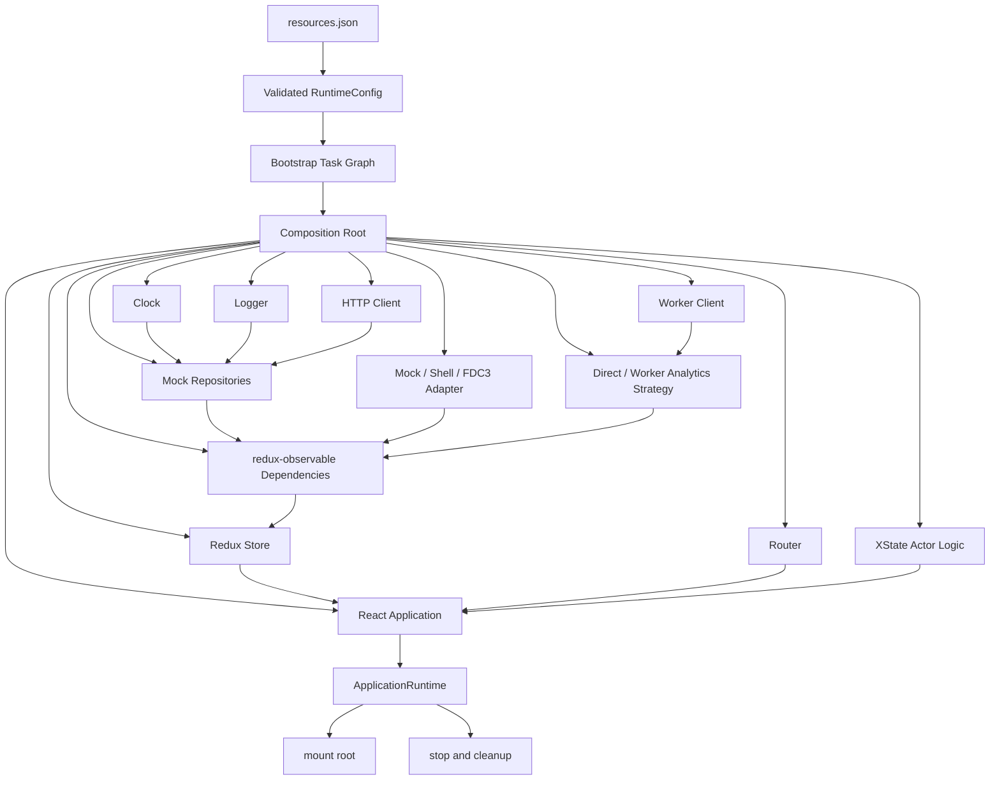

# Composition Root

> **Showcase scope:** one explicit TypeScript `createApplication` function for the browser application. It wires fake repositories, the existing Redux store, selected strategies, XState logic, a Worker-backed capability, and React lifecycle. Do not add a backend composition root or a dependency-injection container.

## 1. Short definition

A **Composition Root** is the single application boundary where concrete infrastructure is created, configured, connected, and given an explicit lifecycle.

```text
validated RuntimeConfig
        ↓
Composition Root
        ├── repositories
        ├── services
        ├── strategies
        ├── platform adapters
        ├── Redux and epic dependencies
        ├── actor logic
        ├── Worker-backed capabilities
        ├── router
        └── React application
```

The application’s features describe the contracts they need. The Composition Root decides which concrete implementations they receive.

> Features describe what they need. The Composition Root decides what they receive.

For the Financial Workspace demo, the root is responsible for turning validated runtime choices into one inspectable `ApplicationRuntime` with explicit `mount` and `stop` operations.

---

## 2. Problem it solves

Large applications often construct infrastructure gradually and implicitly:

```ts
// A component imports a concrete client.
import { orderApi } from "@/infrastructure/orderApi";

// An epic imports another global singleton.
import { logger } from "@/infrastructure/logger";

// A route decides which platform adapter to use.
const context = window.fdc3
  ? createFdc3Adapter()
  : createMockAdapter();

// A feature starts its own Worker.
const worker = new Worker(
  new URL("./scenario.worker.ts", import.meta.url),
  { type: "module" },
);
```

This creates several architectural problems:

- infrastructure choices are scattered across features;
- environment checks leak into React components and workflows;
- concrete clients become hidden module-level singletons;
- tests must replace imports or browser globals;
- startup order is difficult to inspect;
- cleanup responsibility is unclear;
- Redux epics may import APIs directly;
- Workers, actors, listeners, and subscriptions may outlive the application;
- mock, Shell, REST, FDC3, and Worker-backed alternatives become difficult to swap;
- dependency cycles appear because features construct infrastructure they should only consume.

The desired model is:

```text
Feature package
    declares a port or capability

Composition Root
    creates the concrete adapter
    and passes it into the feature runtime
```

Example:

```text
PortfolioAnalytics contract
        ↑
DirectAnalyticsStrategy
WorkerAnalyticsStrategy
        ↑
Composition Root selects one
        ↑
RuntimeConfig.analyticsStrategy
```

The feature does not know why a particular implementation was selected.

---

## 3. Architecture diagram



### Core boundary

```text
Runtime Configuration
    describes choices

Composition Root
    creates objects and connects them

Features
    consume stable contracts
```

---

## 4. Demo scenario

The `/startup` route should show the application’s concrete wiring as a readable diagnostic projection.

Example validated configuration:

```json
{
  "applicationId": "financial-workspace-demo",
  "analyticsStrategy": "worker",
  "bootstrapProfile": "standard",
  "contextProvider": "mock",
  "prefetchMode": "intent"
}
```

The Composition Root turns this into:

```text
OrderRepository
    MockOrderRepository

PortfolioAnalytics
    WorkerAnalyticsStrategy

PlatformContext
    MockPlatformContextAdapter

Redux
    Store with injected epic dependencies

Workflow
    Order-ticket actor logic

Application
    Browser router + React root
```

The visible `/startup` demo should display:

- selected concrete implementation names;
- dependency relationships;
- which objects are application singletons;
- which objects are created per feature instance;
- registered cleanup operations;
- whether a Worker-backed capability was created;
- which adapter was selected for external context;
- which runtime configuration value caused each selection.

A profile change from `worker` to `direct` should change only the selected analytics implementation. The analytics feature contract and UI remain unchanged.

---

## 5. Architecture and responsibilities

## 5.1 Composition Root responsibilities

The root owns **construction and wiring**.

It should:

- receive validated `RuntimeConfig`;
- receive completed bootstrap outputs if startup tasks produced required data;
- create application-scoped infrastructure;
- select concrete adapters and strategies;
- create typed dependency collections;
- configure redux-observable middleware dependencies;
- create the Redux store;
- create XState actor logic or application actors where appropriate;
- create Worker clients and Worker-backed services;
- create the router;
- create the React application boundary;
- register cleanup in reverse ownership order;
- expose diagnostics for the `/startup` route;
- return one explicit `ApplicationRuntime`.

It should not:

- contain business workflow transitions;
- render feature-specific UI;
- read raw `customData`;
- parse `resources.json`;
- become a global service locator;
- expose every internal object to every feature;
- start optional feature lifecycles that should begin on route or panel activation;
- contain complex application behavior merely because it has access to all dependencies.

---

## 5.2 Feature responsibilities

Feature packages should:

- define or consume narrow capability contracts;
- own feature state, reducers, epics, actors, selectors, and React adapters;
- receive concrete dependencies through factories, providers, middleware dependencies, or explicit props;
- export a deliberate public API from `src/index.ts`;
- remain unaware of deployment profiles and concrete adapter selection.

A feature may define a port:

```ts
export type OrderRepository = {
  loadOrder(
    orderId: string,
    signal?: AbortSignal,
  ): Promise<Order>;
};
```

The app creates an adapter:

```ts
const orderRepository =
  createMockOrderRepository({
    clock,
    logger,
  });
```

The feature imports only the contract or receives it through its public factory.

---

## 5.3 Application runtime responsibilities

The returned runtime owns the live application instance.

```ts
export type ApplicationRuntime = {
  mount(root: HTMLElement): void;
  stop(): void;
  diagnostics: ApplicationDiagnostics;
};
```

`mount` should:

- mount React exactly once;
- start application-wide runtime resources that require a mounted app;
- reject or ignore repeated mount attempts deliberately.

`stop` should:

- be idempotent;
- unmount React;
- stop the root epic if the implementation supports it;
- stop application-owned actors;
- terminate application-owned Workers;
- remove platform listeners;
- close subscriptions and timers;
- dispose router or query resources where necessary;
- run cleanup in reverse creation order.

---

## 5.4 Lifetimes

Not every dependency has the same lifetime.

### Application-scoped

Created once per application runtime:

```text
logger
clock
HTTP client
Redux store
root epic dependencies
platform adapter
route preloader registry
capability registry
shared Worker client, if intentionally shared
```

### Route- or feature-scoped

Created when a route or feature activates:

```text
order-ticket workspace actor
analytics page facade
large route-specific query client
feature-specific subscriptions
```

### Panel-scoped

Created per dynamic panel instance:

```text
panel actor
panel query runtime
panel-specific event listener
panel Worker job
```

### Operation-scoped

Created for one request or workflow step:

```text
AbortController
submission actor
reconciliation task
scenario job request ID
```

The Composition Root should own application-scoped construction. It may provide factories for shorter-lived objects rather than creating all of them eagerly.

---

## 5.5 Factories instead of eager instances

Bad:

```ts
const everyPossibleTicketActor =
  createAllTicketActors();
```

Better:

```ts
const createOrderTicketRuntime =
  createOrderTicketRuntimeFactory({
    orderRepository,
    clock,
    logger,
  });
```

The root wires the factory. The workspace creates and stops ticket instances when the user opens and closes them.

---

## 6. Minimal but complete implementation

The following example is deliberately explicit and small. It matches the implementation plan and avoids a dependency-injection container.

## 6.1 Application contracts

```ts
// apps/financial-workspace/src/composition/applicationTypes.ts

import type {
  RuntimeConfig,
} from "@demo/shared-runtime-config";

export type Logger = Readonly<{
  info(
    event: string,
    details?: Readonly<Record<string, unknown>>,
  ): void;

  error(
    event: string,
    error: unknown,
    details?: Readonly<Record<string, unknown>>,
  ): void;
}>;

export type Clock = Readonly<{
  now(): number;
}>;

export type Order = Readonly<{
  id: string;
  instrumentId: string;
  quantity: number;
  status: "draft" | "submitted" | "accepted";
}>;

export type OrderRepository = Readonly<{
  loadOrder(
    orderId: string,
    signal?: AbortSignal,
  ): Promise<Order>;
}>;

export type ScenarioInput = Readonly<{
  positionCount: number;
  shockPercent: number;
}>;

export type ScenarioResult = Readonly<{
  processedPositions: number;
  syntheticImpact: number;
}>;

export type PortfolioAnalytics = Readonly<{
  calculateScenario(
    input: ScenarioInput,
  ): Promise<ScenarioResult>;

  cancel?(): void;

  dispose?(): void;
}>;

export type PlatformContext = Readonly<{
  instrumentId?: string;
}>;

export type PlatformContextAdapter = Readonly<{
  getCurrentContext(): Promise<PlatformContext>;

  subscribe(
    listener: (context: PlatformContext) => void,
  ): () => void;

  dispose?(): void;
}>;

export type ApplicationDiagnostics = Readonly<{
  applicationId: string;
  runtimeConfig: RuntimeConfig;
  selections: Readonly<{
    orderRepository: string;
    analytics: string;
    platformContext: string;
  }>;
  cleanupCount: number;
}>;

export type ApplicationRuntime = Readonly<{
  mount(root: HTMLElement): void;
  stop(): void;
  diagnostics: ApplicationDiagnostics;
}>;
```

---

## 6.2 Concrete infrastructure

```ts
// apps/financial-workspace/src/composition/createInfrastructure.ts

import type {
  Clock,
  Logger,
  OrderRepository,
} from "./applicationTypes";

export function createLogger(): Logger {
  return {
    info(event, details) {
      console.info(event, details ?? {});
    },

    error(event, error, details) {
      console.error(
        event,
        error,
        details ?? {},
      );
    },
  };
}

export function createClock(): Clock {
  return {
    now: () => Date.now(),
  };
}

export function createMockOrderRepository(
  dependencies: Readonly<{
    clock: Clock;
    logger: Logger;
  }>,
): OrderRepository {
  return {
    async loadOrder(
      orderId,
      signal,
    ) {
      signal?.throwIfAborted();

      dependencies.logger.info(
        "order.load.started",
        {
          orderId,
          timestamp:
            dependencies.clock.now(),
        },
      );

      await delay(120, signal);

      return {
        id: orderId,
        instrumentId: "INSTRUMENT-001",
        quantity: 250,
        status: "draft",
      };
    },
  };
}

function delay(
  milliseconds: number,
  signal?: AbortSignal,
): Promise<void> {
  return new Promise(
    (resolve, reject) => {
      const timeout = setTimeout(
        resolve,
        milliseconds,
      );

      signal?.addEventListener(
        "abort",
        () => {
          clearTimeout(timeout);
          reject(signal.reason);
        },
        { once: true },
      );
    },
  );
}
```

All data remains generic, fake, and local.

---

## 6.3 Platform adapter selection

```ts
// apps/financial-workspace/src/composition/createPlatformContextAdapter.ts

import type {
  ContextProvider,
} from "@demo/shared-runtime-config";

import type {
  Logger,
  PlatformContextAdapter,
} from "./applicationTypes";

export function createPlatformContextAdapter(
  provider: ContextProvider,
  logger: Logger,
): Readonly<{
  adapter: PlatformContextAdapter;
  implementationName: string;
}> {
  switch (provider) {
    case "mock":
      return {
        adapter:
          createMockPlatformContextAdapter(),
        implementationName:
          "MockPlatformContextAdapter",
      };

    case "shell":
      return {
        adapter:
          createShellPlatformContextAdapter(
            logger,
          ),
        implementationName:
          "ShellPlatformContextAdapter",
      };

    case "fdc3":
      return {
        adapter:
          createFdc3PlatformContextAdapter(
            logger,
          ),
        implementationName:
          "Fdc3PlatformContextAdapter",
      };
  }
}

function createMockPlatformContextAdapter():
  PlatformContextAdapter {
  return {
    async getCurrentContext() {
      return {
        instrumentId:
          "INSTRUMENT-001",
      };
    },

    subscribe() {
      return () => {};
    },
  };
}

function createShellPlatformContextAdapter(
  logger: Logger,
): PlatformContextAdapter {
  return {
    async getCurrentContext() {
      logger.info(
        "platform.shell.context.requested",
      );

      return {};
    },

    subscribe(listener) {
      void listener;
      return () => {};
    },
  };
}

function createFdc3PlatformContextAdapter(
  logger: Logger,
): PlatformContextAdapter {
  return {
    async getCurrentContext() {
      logger.info(
        "platform.fdc3.context.requested",
      );

      return {};
    },

    subscribe(listener) {
      void listener;
      return () => {};
    },
  };
}
```

The concrete Shell and FDC3 implementations may remain small adapters in the demo. The important point is that feature code receives one `PlatformContextAdapter` contract.

---

## 6.4 Strategy selection

```ts
// apps/financial-workspace/src/composition/createPortfolioAnalytics.ts

import type {
  AnalyticsStrategyName,
} from "@demo/shared-runtime-config";

import type {
  Logger,
  PortfolioAnalytics,
  ScenarioInput,
  ScenarioResult,
} from "./applicationTypes";

export function createPortfolioAnalytics(
  strategy: AnalyticsStrategyName,
  logger: Logger,
): Readonly<{
  analytics: PortfolioAnalytics;
  implementationName: string;
}> {
  switch (strategy) {
    case "direct":
      return {
        analytics:
          createDirectAnalyticsStrategy(),
        implementationName:
          "DirectAnalyticsStrategy",
      };

    case "worker":
      return {
        analytics:
          createWorkerAnalyticsStrategy(
            logger,
          ),
        implementationName:
          "WorkerAnalyticsStrategy",
      };
  }
}

function createDirectAnalyticsStrategy():
  PortfolioAnalytics {
  return {
    async calculateScenario(input) {
      return calculateSyntheticScenario(
        input,
      );
    },
  };
}

function createWorkerAnalyticsStrategy(
  logger: Logger,
): PortfolioAnalytics {
  let disposed = false;

  return {
    async calculateScenario(input) {
      if (disposed) {
        throw new Error(
          "Analytics strategy is disposed.",
        );
      }

      logger.info(
        "analytics.worker.requested",
        {
          positionCount:
            input.positionCount,
        },
      );

      // The real demo implementation delegates
      // to the module Worker described in the
      // Web Worker pattern document.
      return calculateSyntheticScenario(
        input,
      );
    },

    dispose() {
      disposed = true;
    },
  };
}

function calculateSyntheticScenario(
  input: ScenarioInput,
): ScenarioResult {
  return {
    processedPositions:
      input.positionCount,

    syntheticImpact:
      input.positionCount *
      input.shockPercent *
      0.01,
  };
}
```

Strategy selection belongs here, not in the analytics feature.

---

## 6.5 Typed epic dependencies

```ts
// apps/financial-workspace/src/composition/createApplicationDependencies.ts

import type {
  Logger,
  OrderRepository,
  PlatformContextAdapter,
  PortfolioAnalytics,
} from "./applicationTypes";

export type ApplicationDependencies =
  Readonly<{
    logger: Logger;
    orderRepository: OrderRepository;
    platformContext:
      PlatformContextAdapter;
    portfolioAnalytics:
      PortfolioAnalytics;
  }>;

export function createApplicationDependencies(
  input: ApplicationDependencies,
): ApplicationDependencies {
  return Object.freeze({
    ...input,
  });
}
```

Epics receive only typed capabilities:

```ts
export type RootEpicDependencies =
  ApplicationDependencies;
```

A feature-owned epic can use a narrow view:

```ts
export type OrderFeatureDependencies =
  Pick<
    ApplicationDependencies,
    | "logger"
    | "orderRepository"
  >;
```

Avoid passing the complete application runtime into epics.

---

## 6.6 Store creation

```ts
// apps/financial-workspace/src/composition/createApplicationStore.ts

import {
  configureStore,
} from "@reduxjs/toolkit";

import {
  createEpicMiddleware,
} from "redux-observable";

import type {
  ApplicationDependencies,
} from "./createApplicationDependencies";

import {
  rootEpic,
} from "../store/rootEpic";

import {
  rootReducer,
} from "../store/rootReducer";

export function createApplicationStore(
  dependencies: ApplicationDependencies,
) {
  const epicMiddleware =
    createEpicMiddleware<
      unknown,
      unknown,
      unknown,
      ApplicationDependencies
    >({
      dependencies,
    });

  const store = configureStore({
    reducer: rootReducer,
    middleware: (getDefaultMiddleware) =>
      getDefaultMiddleware({
        thunk: false,
      }).concat(
        epicMiddleware,
      ),
  });

  const rootEpicTask =
    epicMiddleware.run(rootEpic);

  return {
    store,

    stop() {
      rootEpicTask.unsubscribe();
    },
  };
}
```

The store factory does not create repositories. It receives already composed dependencies.

---

## 6.7 Cleanup stack

```ts
// apps/financial-workspace/src/composition/createCleanupStack.ts

export type Cleanup = () => void;

export function createCleanupStack() {
  const cleanups: Cleanup[] = [];
  let stopped = false;

  return {
    add(cleanup: Cleanup): void {
      if (stopped) {
        cleanup();
        return;
      }

      cleanups.push(cleanup);
    },

    stop(): void {
      if (stopped) {
        return;
      }

      stopped = true;

      for (
        let index =
          cleanups.length - 1;
        index >= 0;
        index -= 1
      ) {
        try {
          cleanups[index]?.();
        } catch (error) {
          console.error(
            "Application cleanup failed.",
            error,
          );
        }
      }

      cleanups.length = 0;
    },

    get size(): number {
      return cleanups.length;
    },
  };
}
```

Reverse-order cleanup mirrors ownership:

```text
create logger
create platform adapter
create Worker strategy
create store
mount React

stop React
stop store
stop Worker strategy
stop platform adapter
stop logger if needed
```

---

## 6.8 Creating the React application

```tsx
// apps/financial-workspace/src/composition/createReactApplication.tsx

import {
  StrictMode,
} from "react";

import {
  Provider,
} from "react-redux";

import {
  RouterProvider,
} from "react-router-dom";

import {
  createRoot,
  type Root,
} from "react-dom/client";

import type {
  ApplicationDependencies,
} from "./createApplicationDependencies";

import type {
  ApplicationDiagnostics,
} from "./applicationTypes";

export function createReactApplication(
  input: Readonly<{
    store: ReturnType<
      typeof import("../store/storeTypes")
        .getStoreType
    >;
    router: ReturnType<
      typeof import("../router/createRouter")
        .createRouter
    >;
    dependencies:
      ApplicationDependencies;
    diagnostics:
      ApplicationDiagnostics;
  }>,
) {
  let root: Root | undefined;

  return {
    mount(rootElement: HTMLElement) {
      if (root) {
        throw new Error(
          "Application is already mounted.",
        );
      }

      root = createRoot(rootElement);

      root.render(
        <StrictMode>
          <Provider store={input.store}>
            <RouterProvider
              router={input.router}
            />
          </Provider>
        </StrictMode>,
      );
    },

    unmount() {
      root?.unmount();
      root = undefined;
    },
  };
}
```

The exact store and router types may be simplified in the repository. The architectural point is that React receives already-created application objects.

---

## 6.9 Complete `createApplication`

```ts
// apps/financial-workspace/src/composition/createApplication.ts

import type {
  RuntimeConfig,
} from "@demo/shared-runtime-config";

import type {
  ApplicationRuntime,
} from "./applicationTypes";

import {
  createApplicationDependencies,
} from "./createApplicationDependencies";

import {
  createApplicationStore,
} from "./createApplicationStore";

import {
  createCleanupStack,
} from "./createCleanupStack";

import {
  createClock,
  createLogger,
  createMockOrderRepository,
} from "./createInfrastructure";

import {
  createPlatformContextAdapter,
} from "./createPlatformContextAdapter";

import {
  createPortfolioAnalytics,
} from "./createPortfolioAnalytics";

import {
  createReactApplication,
} from "./createReactApplication";

import {
  createRouter,
} from "../router/createRouter";

export async function createApplication(
  runtimeConfig: RuntimeConfig,
): Promise<ApplicationRuntime> {
  const cleanup =
    createCleanupStack();

  const logger = createLogger();
  const clock = createClock();

  const orderRepository =
    createMockOrderRepository({
      clock,
      logger,
    });

  const platformSelection =
    createPlatformContextAdapter(
      runtimeConfig.contextProvider,
      logger,
    );

  if (
    platformSelection.adapter.dispose
  ) {
    cleanup.add(() =>
      platformSelection.adapter.dispose?.(),
    );
  }

  const analyticsSelection =
    createPortfolioAnalytics(
      runtimeConfig.analyticsStrategy,
      logger,
    );

  if (
    analyticsSelection.analytics.dispose
  ) {
    cleanup.add(() =>
      analyticsSelection.analytics.dispose?.(),
    );
  }

  const dependencies =
    createApplicationDependencies({
      logger,
      orderRepository,
      platformContext:
        platformSelection.adapter,
      portfolioAnalytics:
        analyticsSelection.analytics,
    });

  const storeRuntime =
    createApplicationStore(
      dependencies,
    );

  cleanup.add(
    storeRuntime.stop,
  );

  const diagnostics =
    Object.freeze({
      applicationId:
        runtimeConfig.applicationId,
      runtimeConfig,
      selections: Object.freeze({
        orderRepository:
          "MockOrderRepository",
        analytics:
          analyticsSelection
            .implementationName,
        platformContext:
          platformSelection
            .implementationName,
      }),
      cleanupCount:
        cleanup.size + 1,
    });

  const router = createRouter({
    store:
      storeRuntime.store,
    dependencies,
    diagnostics,
  });

  const reactApplication =
    createReactApplication({
      store:
        storeRuntime.store,
      router,
      dependencies,
      diagnostics,
    });

  cleanup.add(
    reactApplication.unmount,
  );

  logger.info(
    "application.composed",
    diagnostics.selections,
  );

  return Object.freeze({
    mount(root) {
      reactApplication.mount(root);
    },

    stop() {
      cleanup.stop();
    },

    diagnostics,
  });
}
```

This function is intentionally boring. A good Composition Root is explicit wiring, not hidden magic.

---

## 6.10 Startup entry

```ts
// apps/financial-workspace/src/main.tsx

const resources =
  await loadResources();

const runtimeConfig =
  createRuntimeConfig(resources);

const application =
  await createApplication(
    runtimeConfig,
  );

application.mount(rootElement);
```

Correct order:

```text
load
validate
compose
mount
```

Not:

```text
mount
then discover configuration
then replace infrastructure
```

---

## 6.11 Micro-frontend lifecycle adaptation

If the Financial Workspace is started by an external Shell, the same application factory can back the micro-frontend lifecycle:

```ts
let runtime:
  ApplicationRuntime |
  undefined;

export async function start(
  input: Readonly<{
    root: HTMLElement;
    resources: ResourceDocument;
  }>,
): Promise<void> {
  if (runtime) {
    throw new Error(
      "Application is already started.",
    );
  }

  const config =
    createRuntimeConfig(
      input.resources,
    );

  runtime =
    await createApplication(
      config,
    );

  runtime.mount(input.root);
}

export function stop(): void {
  runtime?.stop();
  runtime = undefined;
}

export function update(
  nextContext: unknown,
): void {
  void nextContext;
  // Forward supported external context
  // through an adapter or actor message.
}
```

The Shell calls lifecycle operations. The Composition Root still owns concrete construction inside the micro-frontend.

---

## 6.12 Tests

The root should have a small number of high-value integration tests.

```ts
import {
  describe,
  expect,
  it,
  vi,
} from "vitest";

import {
  createApplication,
} from "./createApplication";

const baseConfig = {
  applicationId:
    "financial-workspace-demo",
  bootstrapProfile:
    "standard",
  contextProvider:
    "mock",
  prefetchMode:
    "intent",
} as const;

describe(
  "createApplication",
  () => {
    it(
      "selects the Worker analytics strategy",
      async () => {
        const application =
          await createApplication({
            ...baseConfig,
            analyticsStrategy:
              "worker",
          });

        expect(
          application
            .diagnostics
            .selections
            .analytics,
        ).toBe(
          "WorkerAnalyticsStrategy",
        );

        application.stop();
      },
    );

    it(
      "selects the direct strategy without changing the feature contract",
      async () => {
        const application =
          await createApplication({
            ...baseConfig,
            analyticsStrategy:
              "direct",
          });

        expect(
          application
            .diagnostics
            .selections
            .analytics,
        ).toBe(
          "DirectAnalyticsStrategy",
        );

        application.stop();
      },
    );

    it(
      "makes stop idempotent",
      async () => {
        const application =
          await createApplication({
            ...baseConfig,
            analyticsStrategy:
              "direct",
          });

        expect(
          () => {
            application.stop();
            application.stop();
          },
        ).not.toThrow();
      },
    );
  },
);
```

Additional tests should verify:

- correct platform adapter selection;
- concrete dependencies reach epics;
- React mounts only after composition succeeds;
- partial construction is cleaned up after a later construction error;
- Worker disposal happens on `stop`;
- platform listeners are removed;
- existing Part 1 routes receive equivalent dependencies after the refactor.

---

## 7. Best-fit use cases

Use a Composition Root when:

- the application has several concrete infrastructure choices;
- runtime configuration selects implementations;
- Redux epics need injected repositories and services;
- platform adapters vary between mock, Shell, and FDC3;
- Worker-backed and direct strategies share one capability contract;
- the application starts actors, Workers, listeners, or subscriptions that require cleanup;
- feature packages must remain independent from concrete infrastructure;
- tests need to substitute adapters without mocking module imports;
- application construction needs to be visible during a technical presentation;
- a micro-frontend exposes `start`, `stop`, and `update` lifecycle operations.

It becomes increasingly valuable as the dependency graph grows, even when the root itself remains a small set of explicit factory calls.

---

## 8. When not to use it

A tiny application with:

```text
one API client
one route
no alternative implementations
no background resources
```

may need only a simple `main.tsx` factory call. Do not create dozens of interfaces merely to claim a Composition Root exists.

Do not use the root as:

### A service locator

Bad:

```ts
const app = {
  get(name: string) {
    // returns anything
  },
};
```

Features should receive narrow typed dependencies, not search a global registry.

---

### A business-logic layer

Bad:

```ts
if (
  order.amount > 100_000 &&
  market === "restricted"
) {
  // business decision in root
}
```

Use domain logic, a Strategy, guard, statechart, or authoritative backend policy.

---

### A generic dependency-injection framework

The demo does not need decorators, reflection, scopes, tokens, or container scanning. Explicit TypeScript factories are clearer for a live architecture showcase.

---

### A place to eagerly initialize every optional capability

Lazy panels, route actors, and expensive Workers should often be created when needed. The root may provide factories and registries without starting every feature at startup.

---

### A replacement for feature boundaries

A centralized root does not justify deep imports into feature internals. Continue importing package public APIs only.

---

## 9. Benefits

### Explicit dependency graph

The application wiring is visible in one place.

### Replaceable infrastructure

Mock, REST, Shell, FDC3, direct, and Worker-backed implementations can be selected without changing feature code.

### Clear ownership

The root owns application-scoped resources and their cleanup.

### Better testability

Factories accept contracts and fakes directly. Tests do not need to intercept global imports.

### Stable feature APIs

Features consume capabilities rather than environment details.

### Controlled startup

React mounts only after required objects have been created successfully.

### Typed epic injection

redux-observable receives repositories, loggers, and platform services through middleware dependencies.

### Safer resource cleanup

Workers, actors, subscriptions, and listeners have an application owner.

### Better presentation diagnostics

The `/startup` route can show exactly what was selected and why.

### Supports gradual evolution

A direct analytics implementation can later become Worker-backed without changing its consumers.

---

## 10. Disadvantages and risks

### More wiring code

Explicit factories are more verbose than module-level singletons.

Mitigation:

- keep factories small;
- group related construction;
- prefer readable naming over abstraction layers.

---

### Large root function

A root may become hundreds of lines.

Mitigation:

```text
createInfrastructure
createPlatformAdapters
createAnalyticsCapability
createApplicationDependencies
createApplicationStore
createRouter
createReactApplication
```

Keep one top-level root while extracting coherent factory functions.

---

### Accidental god object

Passing the entire dependency graph everywhere recreates a service locator.

Mitigation:

- use narrow feature dependency types;
- pass only required contracts;
- expose factories for shorter-lived resources.

---

### Eager startup cost

Creating all capabilities immediately can increase startup time.

Mitigation:

- distinguish application-scoped from feature-scoped lifetimes;
- create optional capabilities lazily;
- use the Bootstrap Task Graph for startup scheduling;
- use intent prefetching for likely features.

---

### Lifecycle mistakes

A partially created application may leak resources if a later step fails.

Mitigation:

- register cleanup immediately after successful creation;
- run cleanup when composition throws;
- make disposal idempotent.

A hardened root can use:

```ts
const cleanup = createCleanupStack();

try {
  // create resources
  return runtime;
} catch (error) {
  cleanup.stop();
  throw error;
}
```

---

### Root knows many concrete modules

This is expected. The Composition Root is the permitted place where concrete application implementations meet.

The problem is not that the root imports concrete adapters. The problem is when feature modules do.

---

### Overuse of interfaces

Interfaces around trivial local utilities may add noise.

Mitigation:

Create contracts for meaningful architectural seams:

```text
repositories
platform integrations
analytics capability
clock when time matters
logger
Worker client
external context
```

Do not wrap every pure function.

---

## 11. Relevant libraries

The Composition Root pattern requires no dedicated library.

Useful tools in this application:

- **TypeScript** — explicit contracts and exhaustive implementation selection.
- **Redux Toolkit** — store construction after dependencies are available.
- **redux-observable** — middleware dependency injection into epics.
- **XState** — actor logic and application/workflow actors created by factories.
- **React and React DOM** — mounted only after application composition.
- **React Router** — router created with application dependencies or route factories.
- **native Web Workers** — Worker client created and disposed by an application-owned service.

Possible dependency-injection containers include Awilix, InversifyJS, and TSyringe, but this demo should begin with explicit factories. A container is justified only if manual wiring becomes demonstrably harder to understand than the container model.

---

## 12. Relationship to the other patterns

## Runtime Configuration

```text
Runtime Configuration
    describes deployment choices

Composition Root
    interprets those typed choices
    by creating concrete objects
```

Example:

```text
contextProvider = "fdc3"
    ↓
create Fdc3PlatformContextAdapter
```

Raw `customData` must not enter the root.

---

## Strategy Pattern

The Composition Root selects the concrete Strategy.

```text
PortfolioAnalytics contract
        ↑
DirectAnalyticsStrategy
WorkerAnalyticsStrategy
        ↑
Composition Root
```

The Strategy owns interchangeable behavior. The root owns selection and construction.

---

## State Machines and Statecharts

The root may create machine logic with injected services or expose a factory:

```ts
const createOrderTicketRuntime =
  createOrderTicketRuntimeFactory({
    orderRepository,
    logger,
    clock,
  });
```

The statechart owns workflow transitions. The root does not.

---

## Actor Model

The root may create an application or workspace actor and register its cleanup.

Shorter-lived ticket actors are usually spawned by the workspace actor rather than eagerly created by the root.

```text
Composition Root creates actor system boundary
Workspace Actor owns ticket actor lifecycles
```

---

## Declarative Bootstrap Task Graph

The Bootstrap Task Graph answers:

> Which initialization task may run now?

The Composition Root answers:

> Which concrete application objects should be created and how are they connected?

Possible sequence:

```text
validated RuntimeConfig
    ↓
bootstrap tasks produce session/reference/context outputs
    ↓
Composition Root receives outputs
    ↓
ApplicationRuntime
```

Do not turn the Composition Root into a procedural replacement for the task graph.

---

## Web Worker Offloading

The root may select and create a Worker-backed Strategy and own its disposal.

```text
Strategy
    which analytics implementation?

Worker Offloading
    where does that implementation execute?

Composition Root
    creates the selected implementation
```

---

## Intent-Based Prefetching

The root may create the preload registry and select a policy from Runtime Configuration.

Route and panel entries provide preload functions. The root does not decide user intent itself.

---

## Graceful Capability Degradation

The root classifies whether a missing dependency prevents application creation or results in an optional unavailable capability.

Examples:

```text
invalid required RuntimeConfig
    → application startup failure

optional analytics initialization fails
    → register unavailable analytics capability
    → panels may degrade locally
```

The root should not hide a critical construction failure behind a local fallback.

---

## Feature Modules with Public API

The root imports feature package entry points and factories through their public APIs.

Bad:

```ts
import {
  internalReducer,
} from "@demo/feature-orders/src/internal/model";
```

Good:

```ts
import {
  createOrdersFeature,
} from "@demo/feature-orders";
```

The root is allowed to compose features, but it should not bypass their boundaries.

---

## 13. Working demo location

Planned repository locations:

```text
apps/financial-workspace/src/composition/
  applicationTypes.ts
  createApplication.ts
  createApplicationDependencies.ts
  createApplicationStore.ts
  createCleanupStack.ts
  createInfrastructure.ts
  createPlatformContextAdapter.ts
  createPortfolioAnalytics.ts
  createReactApplication.tsx

apps/financial-workspace/src/runtime/
  loadResources.ts
  createRuntimeConfig.ts

apps/financial-workspace/src/bootstrap/
  startApplication.ts
  bootstrapTasks.ts

apps/financial-workspace/src/router/
  createRouter.tsx
```

Primary visible demo:

```text
/startup
```

The route should display:

- validated runtime choices;
- selected implementation names;
- dependency graph;
- application-scoped lifetimes;
- cleanup registrations;
- current bootstrap outputs;
- whether React has mounted;
- whether the runtime has stopped.

Status at documentation phase:

> Planned. Paths become definitive after Phase 2 implementation.

---

## 14. Presentation talking points

### One-sentence explanation

> The Composition Root is the one place where the application turns typed configuration and startup outputs into concrete services, strategies, stores, actors, Workers, routing, and React.

### Main diagram

```text
RuntimeConfig
    ↓
Composition Root
    ├── repositories
    ├── platform adapter
    ├── analytics strategy
    ├── epic dependencies
    ├── Redux store
    ├── actor factories
    ├── router
    └── React runtime
```

### Core phrase

> Features describe what they need. The Composition Root decides what they receive.

### Before and after

Before:

```text
components import APIs
routes inspect window
features create Workers
epics import repositories
cleanup is scattered
```

After:

```text
features depend on contracts
root creates adapters
root injects dependencies
root owns application lifecycle
```

### Live demo sequence

1. Open `/startup`.
2. Show validated `RuntimeConfig`.
3. Show the implementation-selection table.
4. Trace `analyticsStrategy = worker` to `WorkerAnalyticsStrategy`.
5. Trace `contextProvider = mock` to `MockPlatformContextAdapter`.
6. Show those contracts inside epic dependencies.
7. Open `/analytics` and run the capability.
8. Switch to the direct profile.
9. Restart and show only the concrete implementation changed.
10. Return to `/startup` and inspect cleanup ownership.
11. Navigate away or stop the micro-frontend and show Worker/listener disposal.

### Important distinctions

```text
Dependency Injection
    dependencies are passed in

Composition Root
    dependencies are created and wired in one place
```

```text
Runtime Configuration
    data describing choices

Composition Root
    objects implementing choices
```

```text
Strategy
    interchangeable behavior

Composition Root
    strategy selection and construction
```

### Questions for the audience

- Where are concrete API clients created today?
- Which modules own Worker termination?
- Can we replace REST with a mock without changing feature code?
- Do epics import infrastructure directly?
- Which dependencies are application-scoped versus panel-scoped?
- What happens if construction fails halfway through?
- Can the current wiring be inspected without searching the repository?

### Common misconception

```text
Composition Root
≠ global service locator
≠ business-logic layer
≠ generic DI container
≠ application state
≠ procedural bootstrap graph
```

---

## 15. Implementation checklist

### Contracts

- [ ] Define meaningful repository and capability ports.
- [ ] Keep interfaces narrow.
- [ ] Keep feature contracts in feature or shared public APIs.
- [ ] Avoid wrapping trivial pure functions.

### Construction

- [ ] Create `createApplication(runtimeConfig)`.
- [ ] Create logger and clock centrally.
- [ ] Create mock repositories centrally.
- [ ] Select platform adapter centrally.
- [ ] Select analytics Strategy centrally.
- [ ] Create Worker client centrally or expose a factory.
- [ ] Create typed epic dependencies.
- [ ] Create Redux store after dependencies exist.
- [ ] Create router after application dependencies exist.
- [ ] Create React runtime last.

### Lifecycles

- [ ] Register cleanup immediately after resource creation.
- [ ] Make cleanup idempotent.
- [ ] Stop resources in reverse order.
- [ ] Clean up partial composition after errors.
- [ ] Distinguish application-, route-, panel-, and operation-scoped resources.
- [ ] Do not eagerly create every optional feature runtime.

### Feature boundaries

- [ ] Features do not import concrete infrastructure.
- [ ] Epics receive dependencies through middleware.
- [ ] Feature packages are imported through `src/index.ts` only.
- [ ] Raw Runtime Configuration does not leak into features.
- [ ] React components do not choose adapters.

### Diagnostics

- [ ] Expose implementation names to `/startup`.
- [ ] Show config value → implementation selection.
- [ ] Show registered cleanup count.
- [ ] Avoid exposing secrets or sensitive data.
- [ ] Label all demo services and data as fake/local.

### Verification

- [ ] Existing Part 1 routes still work.
- [ ] `worker` and `direct` profiles select different implementations.
- [ ] Features compile against one stable capability contract.
- [ ] `stop()` is safe to call more than once.
- [ ] Worker and platform resources are disposed.
- [ ] Production build and typecheck pass.

---

## 16. Final summary

The Composition Root is the application’s concrete assembly boundary.

```text
validated configuration
        +
bootstrap outputs
        ↓
explicit construction
        ↓
repositories, adapters, strategies,
store, actors, Workers, router, React
        ↓
ApplicationRuntime
```

For the Financial Workspace showcase, the implementation should remain deliberately explicit:

- one `createApplication` entry point;
- small construction helpers;
- typed dependency contracts;
- runtime-selected analytics and platform implementations;
- redux-observable dependency injection;
- clear application and feature lifetimes;
- reverse-order cleanup;
- visible `/startup` diagnostics;
- no dependency-injection container unless manual wiring becomes genuinely harder to understand.

The success criterion is not merely that all dependencies are created in one file.

The success criterion is:

> Features remain independent from concrete infrastructure, while the application has one inspectable place that owns construction, selection, wiring, and cleanup.
