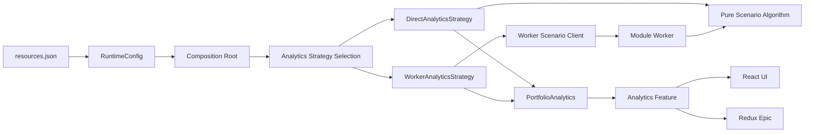

# Strategy Pattern

> **Showcase scope:** one `PortfolioAnalytics` contract with exactly two implementations: direct execution and Worker-backed execution. Selection occurs once in the Composition Root. Do not add more strategy families unless the live demo cannot explain the pattern clearly without them.

## 1. Short definition

The **Strategy Pattern** encapsulates interchangeable behavior behind one stable contract.

The application chooses one implementation at a composition boundary:

```text
RuntimeConfig
    ↓
Composition Root
    ↓ selects
PortfolioAnalytics
    ├── DirectAnalyticsStrategy
    └── WorkerAnalyticsStrategy
```

The feature consumes only `PortfolioAnalytics`. It does not know why one implementation was selected or where the calculation executes.

For the Financial Workspace demo, Strategy answers:

> Which analytics implementation should this application use?

It does **not** answer:

- which startup task may run next;
- which state an order workflow is in;
- how many actors are running;
- whether React work is scheduled with a different priority;
- whether a capability may degrade safely.

---

## 2. Problem it solves

Without a Strategy boundary, variable behavior often becomes scattered conditional logic:

```ts
export async function calculateScenario(
  input: ScenarioInput,
  config: RuntimeConfig,
): Promise<ScenarioResult> {
  if (
    config.analyticsStrategy === "worker"
  ) {
    // Create Worker.
    // Serialize input.
    // Correlate response.
    // Handle cancellation.
  } else {
    // Run calculation directly.
  }
}
```

The condition then spreads into:

- React components;
- Redux epics;
- feature facades;
- route loaders;
- tests;
- startup code.

Typical consequences:

- features know concrete infrastructure details;
- branches drift and return slightly different shapes;
- adding another implementation changes many callers;
- direct and Worker behavior are difficult to compare;
- configuration strings leak into business code;
- tests must reproduce selection logic repeatedly.

The desired shape is:

```text
Feature
    ↓ depends on
PortfolioAnalytics contract
    ↑ implemented by
Direct / Worker / future implementation
```

Selection happens once in the Composition Root.

---

## 3. Architecture diagram



### Core boundary

```text
Strategy
    encapsulates interchangeable behavior

Composition Root
    selects the concrete Strategy

Feature
    consumes the stable contract
```

---

## 4. Demo scenario

The `/analytics` route runs a synthetic portfolio scenario calculation over fake generated positions.

The route shows:

- the selected analytics Strategy;
- the same scenario input for both implementations;
- calculation progress;
- cancellation;
- elapsed time;
- a small responsiveness indicator;
- equivalent result shapes from both implementations.

Two implementations are available:

```text
DirectAnalyticsStrategy
    runs the pure calculation on the main thread

WorkerAnalyticsStrategy
    delegates the same pure calculation to a Web Worker
```

Selection is controlled by validated runtime configuration:

```json
{
  "key": "analyticsStrategy",
  "value": "worker"
}
```

The Strategy demo should emphasize:

```text
Strategy
    Which implementation is used?

Web Worker Offloading
    On which thread does one implementation execute?
```

The Worker is one implementation detail. It is not the Strategy Pattern itself.

---

## 5. Architecture and responsibilities

### `PortfolioAnalytics` contract

Responsibilities:

- define the capability required by the feature;
- accept one stable input shape;
- return one stable result shape;
- expose cancellation semantics when useful;
- avoid leaking Worker message types;
- avoid leaking runtime configuration.

The contract should express feature language:

```ts
portfolioAnalytics.calculateScenario(...)
```

not infrastructure language:

```ts
workerClient.postMessage(...)
```

---

### Direct Strategy

Responsibilities:

- call the pure scenario algorithm directly;
- produce the same result contract as every other Strategy;
- support cancellation checkpoints where practical;
- remain useful for tests and small demo inputs.

It should not:

- inspect `RuntimeConfig`;
- construct the Worker Strategy;
- update React state directly;
- own application-level selection.

---

### Worker Strategy

Responsibilities:

- adapt the capability contract to a Worker client;
- map progress and cancellation;
- hide request IDs and protocol details;
- return the same domain result as the Direct Strategy.

It should not:

- expose `MessageEvent` to the feature;
- change result semantics;
- become a second feature API;
- contain selection logic.

---

### Pure calculation

Responsibilities:

- contain synthetic, deterministic demo logic;
- be reusable by Direct and Worker implementations;
- avoid browser APIs;
- avoid React, Redux, and XState dependencies;
- use only fake local data.

This shared algorithm proves that the two Strategies differ in execution mechanism rather than business meaning.

---

### Composition Root

Responsibilities:

- inspect the typed `RuntimeConfig`;
- create required Worker infrastructure;
- select one concrete Strategy;
- inject the selected capability into the feature;
- register cleanup for Worker resources;
- expose the selection in diagnostics.

---

### Feature adapter

Responsibilities:

- expose view-ready state and actions;
- call `PortfolioAnalytics`;
- remain independent from concrete implementation names;
- prevent stale results from replacing newer jobs.

The feature may use:

- local React state;
- Redux Toolkit and `redux-observable`;
- an XState actor;
- a small application-owned facade.

Strategy does not prescribe the state-management mechanism.

---

## 6. Minimal but complete code example

The example below keeps the Strategy boundary small while leaving Worker protocol details to the Web Worker document.

### 6.1 Domain types

```ts
// packages/feature-analytics-lab/src/domain.ts

export type Position = Readonly<{
  id: string;
  quantity: number;
  baseValue: number;
  sensitivity: number;
}>;

export type ScenarioInput = Readonly<{
  scenarioId: string;
  shockPercent: number;
  positions: readonly Position[];
}>;

export type ScenarioResult = Readonly<{
  scenarioId: string;
  positionCount: number;
  baseTotal: number;
  shockedTotal: number;
  change: number;
}>;

export type ScenarioProgress = Readonly<{
  completed: number;
  total: number;
}>;
```

All values are synthetic and exist only for the architecture demo.

---

### 6.2 Stable capability contract

```ts
// packages/feature-analytics-lab/src/portfolioAnalytics.ts

import type {
  ScenarioInput,
  ScenarioProgress,
  ScenarioResult,
} from "./domain";

export type CalculateScenarioOptions =
  Readonly<{
    signal?: AbortSignal;

    onProgress?(
      progress: ScenarioProgress,
    ): void;
  }>;

export interface PortfolioAnalytics {
  calculateScenario(
    input: ScenarioInput,
    options?: CalculateScenarioOptions,
  ): Promise<ScenarioResult>;
}
```

Cancellation uses `AbortSignal`, keeping the contract independent from Worker-specific APIs.

---

### 6.3 Shared pure algorithm

```ts
// packages/feature-analytics-lab/src/calculateScenario.ts

import type {
  CalculateScenarioOptions,
} from "./portfolioAnalytics";

import type {
  ScenarioInput,
  ScenarioResult,
} from "./domain";

export async function calculateScenario(
  input: ScenarioInput,
  options: CalculateScenarioOptions = {},
): Promise<ScenarioResult> {
  const batchSize = 1_000;

  let baseTotal = 0;
  let shockedTotal = 0;

  for (
    let start = 0;
    start < input.positions.length;
    start += batchSize
  ) {
    throwIfAborted(
      options.signal,
    );

    const end = Math.min(
      start + batchSize,
      input.positions.length,
    );

    for (
      let index = start;
      index < end;
      index += 1
    ) {
      const position =
        input.positions[index];

      if (!position) {
        continue;
      }

      const base =
        position.quantity *
        position.baseValue;

      const shocked =
        base *
        (
          1 +
          (
            input.shockPercent /
            100
          ) *
          position.sensitivity
        );

      baseTotal += base;
      shockedTotal += shocked;
    }

    options.onProgress?.({
      completed: end,
      total: input.positions.length,
    });

    /**
     * Yields between coarse batches.
     * This makes cancellation observable
     * in the direct demo, but it does not
     * move work off the main thread.
     */
    await Promise.resolve();
  }

  return Object.freeze({
    scenarioId: input.scenarioId,
    positionCount:
      input.positions.length,
    baseTotal,
    shockedTotal,
    change:
      shockedTotal - baseTotal,
  });
}

function throwIfAborted(
  signal: AbortSignal | undefined,
): void {
  if (signal?.aborted) {
    throw new DOMException(
      "Scenario calculation was cancelled.",
      "AbortError",
    );
  }
}
```

The formula is deliberately generic and must not be presented as real risk or pricing logic.

---

### 6.4 Direct Strategy

```ts
// packages/feature-analytics-lab/src/directAnalyticsStrategy.ts

import type {
  PortfolioAnalytics,
  CalculateScenarioOptions,
} from "./portfolioAnalytics";

import type {
  ScenarioInput,
  ScenarioResult,
} from "./domain";

import {
  calculateScenario,
} from "./calculateScenario";

export class DirectAnalyticsStrategy
  implements PortfolioAnalytics {
  calculateScenario(
    input: ScenarioInput,
    options?: CalculateScenarioOptions,
  ): Promise<ScenarioResult> {
    return calculateScenario(
      input,
      options,
    );
  }
}
```

This implementation is intentionally thin. The Strategy class provides a stable replaceable object while the algorithm remains independently testable.

---

### 6.5 Worker client contract

```ts
// packages/feature-analytics-lab/src/workerScenarioClient.ts

import type {
  CalculateScenarioOptions,
} from "./portfolioAnalytics";

import type {
  ScenarioInput,
  ScenarioResult,
} from "./domain";

export interface WorkerScenarioClient {
  calculate(
    input: ScenarioInput,
    options?: CalculateScenarioOptions,
  ): Promise<ScenarioResult>;

  stop(): void;
}
```

The native Worker protocol belongs behind this adapter.

---

### 6.6 Worker Strategy

```ts
// packages/feature-analytics-lab/src/workerAnalyticsStrategy.ts

import type {
  PortfolioAnalytics,
  CalculateScenarioOptions,
} from "./portfolioAnalytics";

import type {
  ScenarioInput,
  ScenarioResult,
} from "./domain";

import type {
  WorkerScenarioClient,
} from "./workerScenarioClient";

export class WorkerAnalyticsStrategy
  implements PortfolioAnalytics {
  constructor(
    private readonly client:
      WorkerScenarioClient,
  ) {}

  calculateScenario(
    input: ScenarioInput,
    options?: CalculateScenarioOptions,
  ): Promise<ScenarioResult> {
    return this.client.calculate(
      input,
      options,
    );
  }
}
```

The feature sees no difference between Direct and Worker execution.

---

### 6.7 Exhaustive Strategy selection

```ts
// packages/feature-analytics-lab/src/createPortfolioAnalytics.ts

import type {
  AnalyticsStrategyName,
} from "@demo/shared-runtime-config";

import {
  DirectAnalyticsStrategy,
} from "./directAnalyticsStrategy";

import {
  WorkerAnalyticsStrategy,
} from "./workerAnalyticsStrategy";

import type {
  PortfolioAnalytics,
} from "./portfolioAnalytics";

import type {
  WorkerScenarioClient,
} from "./workerScenarioClient";

export function createPortfolioAnalytics(
  strategy:
    AnalyticsStrategyName,

  dependencies: Readonly<{
    workerClient:
      WorkerScenarioClient;
  }>,
): PortfolioAnalytics {
  switch (strategy) {
    case "direct":
      return new DirectAnalyticsStrategy();

    case "worker":
      return new WorkerAnalyticsStrategy(
        dependencies.workerClient,
      );

    default:
      return assertNever(
        strategy,
      );
  }
}

function assertNever(
  value: never,
): never {
  throw new Error(
    `Unsupported analytics Strategy: ${String(value)}.`,
  );
}
```

The exhaustive switch ensures that adding a new supported configuration value requires an explicit implementation decision.

---

### 6.8 Composition Root integration

```ts
// apps/financial-workspace/src/composition/
// createApplicationDependencies.ts

import type {
  RuntimeConfig,
} from "@demo/shared-runtime-config";

import {
  createPortfolioAnalytics,
} from "@demo/feature-analytics-lab";

import {
  createWorkerScenarioClient,
} from "@demo/shared-workers";

export function createApplicationDependencies(
  config: RuntimeConfig,
) {
  const workerClient =
    createWorkerScenarioClient();

  const portfolioAnalytics =
    createPortfolioAnalytics(
      config.analyticsStrategy,
      {
        workerClient,
      },
    );

  return {
    portfolioAnalytics,

    diagnostics: {
      analyticsStrategy:
        config.analyticsStrategy,
    },

    stop() {
      workerClient.stop();
    },
  };
}
```

The Composition Root owns both selection and cleanup.

---

### 6.9 Feature facade

```ts
// packages/feature-analytics-lab/src/
// createAnalyticsFacade.ts

import type {
  PortfolioAnalytics,
} from "./portfolioAnalytics";

import type {
  ScenarioInput,
  ScenarioProgress,
  ScenarioResult,
} from "./domain";

export type AnalyticsSnapshot =
  | Readonly<{
      status: "idle";
    }>
  | Readonly<{
      status: "running";
      progress: ScenarioProgress;
    }>
  | Readonly<{
      status: "completed";
      result: ScenarioResult;
    }>
  | Readonly<{
      status: "cancelled";
    }>
  | Readonly<{
      status: "failed";
      message: string;
    }>;

export function createAnalyticsFacade(
  analytics: PortfolioAnalytics,
) {
  let snapshot:
    AnalyticsSnapshot = {
      status: "idle",
    };

  let currentController:
    AbortController | undefined;

  let currentJob = 0;

  const listeners =
    new Set<() => void>();

  function update(
    next: AnalyticsSnapshot,
  ): void {
    snapshot = next;

    for (const listener of listeners) {
      listener();
    }
  }

  return {
    getSnapshot():
      AnalyticsSnapshot {
      return snapshot;
    },

    subscribe(
      listener: () => void,
    ): () => void {
      listeners.add(listener);

      return () => {
        listeners.delete(
          listener,
        );
      };
    },

    async run(
      input: ScenarioInput,
    ): Promise<void> {
      currentController?.abort();

      const controller =
        new AbortController();

      currentController =
        controller;

      const job =
        ++currentJob;

      update({
        status: "running",
        progress: {
          completed: 0,
          total:
            input.positions.length,
        },
      });

      try {
        const result =
          await analytics.calculateScenario(
            input,
            {
              signal:
                controller.signal,

              onProgress(
                progress,
              ) {
                if (
                  job === currentJob
                ) {
                  update({
                    status: "running",
                    progress,
                  });
                }
              },
            },
          );

        if (
          job !== currentJob
        ) {
          return;
        }

        update({
          status: "completed",
          result,
        });
      } catch (error) {
        if (
          job !== currentJob
        ) {
          return;
        }

        if (
          error instanceof DOMException &&
          error.name === "AbortError"
        ) {
          update({
            status: "cancelled",
          });

          return;
        }

        update({
          status: "failed",
          message:
            error instanceof Error
              ? error.message
              : "Scenario calculation failed.",
        });
      }
    },

    cancel(): void {
      currentController?.abort();
    },
  };
}
```

This facade also prevents an older result from replacing a newer job.

---

### 6.10 React adapter

```tsx
// packages/feature-analytics-lab/src/
// AnalyticsDemo.tsx

import {
  useSyncExternalStore,
} from "react";

import type {
  ScenarioInput,
} from "./domain";

import type {
  createAnalyticsFacade,
} from "./createAnalyticsFacade";

type AnalyticsFacade =
  ReturnType<
    typeof createAnalyticsFacade
  >;

export function AnalyticsDemo({
  facade,
  input,
  strategyName,
}: {
  facade: AnalyticsFacade;
  input: ScenarioInput;
  strategyName: string;
}) {
  const snapshot =
    useSyncExternalStore(
      facade.subscribe,
      facade.getSnapshot,
      facade.getSnapshot,
    );

  return (
    <section>
      <h1>
        Portfolio Analytics
      </h1>

      <p>
        Selected Strategy:
        {" "}
        <strong>
          {strategyName}
        </strong>
      </p>

      <button
        disabled={
          snapshot.status ===
          "running"
        }
        onClick={() => {
          void facade.run(
            input,
          );
        }}
      >
        Run scenario
      </button>

      <button
        disabled={
          snapshot.status !==
          "running"
        }
        onClick={
          facade.cancel
        }
      >
        Cancel
      </button>

      <AnalyticsStatus
        snapshot={snapshot}
      />
    </section>
  );
}
```

React does not branch on `direct` versus `worker`. It only renders the selected Strategy name as diagnostics.

---

### 6.11 Public package API

```ts
// packages/feature-analytics-lab/src/index.ts

export type {
  Position,
  ScenarioInput,
  ScenarioProgress,
  ScenarioResult,
} from "./domain";

export type {
  PortfolioAnalytics,
  CalculateScenarioOptions,
} from "./portfolioAnalytics";

export {
  DirectAnalyticsStrategy,
} from "./directAnalyticsStrategy";

export {
  WorkerAnalyticsStrategy,
} from "./workerAnalyticsStrategy";

export {
  createPortfolioAnalytics,
} from "./createPortfolioAnalytics";

export {
  createAnalyticsFacade,
} from "./createAnalyticsFacade";

export {
  AnalyticsDemo,
} from "./AnalyticsDemo";
```

Application code imports the package root only.

---

## 7. Testing the Strategy boundary

### Contract-equivalence test

Both Strategies should return the same result shape for the same input.

```ts
import {
  describe,
  expect,
  it,
} from "vitest";

import {
  DirectAnalyticsStrategy,
  WorkerAnalyticsStrategy,
} from "./index";

const input = {
  scenarioId: "scenario-1",
  shockPercent: 2,
  positions: [
    {
      id: "position-1",
      quantity: 10,
      baseValue: 100,
      sensitivity: 0.5,
    },
  ],
} as const;

describe(
  "PortfolioAnalytics strategies",
  () => {
    it(
      "return equivalent results",
      async () => {
        const direct =
          new DirectAnalyticsStrategy();

        const worker =
          new WorkerAnalyticsStrategy({
            calculate:
              (value, options) =>
                direct.calculateScenario(
                  value,
                  options,
                ),

            stop() {},
          });

        await expect(
          direct.calculateScenario(
            input,
          ),
        ).resolves.toEqual(
          await worker.calculateScenario(
            input,
          ),
        );
      },
    );
  },
);
```

---

### Selection test

```ts
it(
  "selects the Worker Strategy",
  () => {
    const analytics =
      createPortfolioAnalytics(
        "worker",
        {
          workerClient: {
            async calculate() {
              return {
                scenarioId: "test",
                positionCount: 0,
                baseTotal: 0,
                shockedTotal: 0,
                change: 0,
              };
            },

            stop() {},
          },
        },
      );

    expect(
      analytics,
    ).toBeInstanceOf(
      WorkerAnalyticsStrategy,
    );
  },
);
```

Priority tests:

- direct result correctness;
- Strategy contract equivalence;
- runtime selection;
- cancellation behavior;
- progress forwarding;
- stale-result rejection in the facade;
- Worker cleanup;
- exhaustive configuration handling.

---

## 8. Best-fit use cases

Use Strategy when:

- several implementations provide the same capability;
- selection belongs to startup or composition;
- a feature should not know concrete infrastructure;
- algorithms vary by deployment, product mode, or dataset;
- a direct implementation and Worker-backed implementation must be interchangeable;
- a mock and real adapter share one contract;
- policy variants can be selected without changing workflow structure.

Financial-application examples:

- snapshot versus streaming pricing;
- direct versus Worker-backed analytics;
- mock versus REST repository;
- standard versus restricted-market validation;
- simple versus advanced chart projection;
- Shell versus FDC3 context adaptation.

A Strategy family should represent one coherent dimension of variation.

---

## 9. When not to use it

### One small conditional

This is often enough:

```ts
const label =
  isCompact
    ? "Qty"
    : "Quantity";
```

A Strategy object would add ceremony without meaningful isolation.

---

### Workflow state

Bad Strategy candidates:

```text
EditingStrategy
SubmittingStrategy
AcceptedStrategy
```

If behavior changes because a workflow transitions through explicit states, use a State Machine or Statechart.

---

### Unrelated implementations

Do not force unrelated capabilities behind one weak interface:

```ts
interface FeatureStrategy {
  run(input: unknown): unknown;
}
```

The contract must preserve meaningful semantics.

---

### Object creation only

If the main difference is how an object is constructed, a small factory may be enough.

The factory may create a Strategy, but Factory and Strategy solve different concerns:

```text
Factory
    creates an object

Strategy
    encapsulates interchangeable behavior
```

---

### Pure formatting choices

Use normal functions or view-model mapping when no long-lived replaceable capability is required.

---

### Dynamic plugin system

Strategy selects among known implementations. It is not automatically a runtime plugin architecture with discovery, manifests, compatibility negotiation, and third-party extensions.

---

## 10. Benefits

### Stable feature contract

React components, epics, and facades depend on one capability.

### Central selection

Configuration is interpreted once in the Composition Root.

### Replaceability

A new implementation can be introduced without rewriting feature callers.

### Direct comparison

The demo can compare Direct and Worker-backed execution behind the same API.

### Better tests

The feature can receive a fake Strategy without changing globals.

### Infrastructure isolation

Worker protocol, REST calls, or platform APIs remain behind adapters.

### Clear relationship to Runtime Configuration

External strings choose a supported implementation without leaking into features.

### Incremental adoption

One conditional-heavy capability can be extracted without restructuring the complete application.

---

## 11. Disadvantages and risks

### Interface dilution

Trying to accommodate every implementation can produce vague contracts.

Mitigation:

- use domain-specific names;
- keep one coherent responsibility;
- split capabilities when semantics differ.

---

### Too many tiny classes

Every branch does not need a Strategy class.

Mitigation:

- functions are valid Strategies;
- introduce objects only when lifecycle, dependencies, or identity justify them.

---

### Hidden behavioral differences

Two implementations may technically satisfy the type but differ in:

- cancellation;
- ordering;
- precision;
- progress frequency;
- error semantics.

Mitigation:

- document behavioral guarantees;
- add contract tests;
- normalize errors and results.

---

### Selection spread

If features still inspect configuration, the pattern is only partially applied.

Mitigation:

> Select once in the Composition Root.

---

### Lifecycle leakage

A Worker Strategy may own resources that require cleanup.

Mitigation:

- let the Composition Root own the Worker client;
- register cleanup in `ApplicationRuntime.stop()`.

---

### Overlapping concerns

The Worker implementation may make people conclude that Strategy and Worker Offloading are the same pattern.

Mitigation:

- demonstrate the Direct Strategy using the same contract;
- show the selection question separately from the execution-thread question.

---

### Runtime switching complexity

Replacing a Strategy while jobs are active introduces:

- cancellation;
- state migration;
- result ownership;
- UI consistency.

Mitigation:

- select at application creation for the first implementation;
- use controlled demo-profile restart instead of hot-swapping live services.

---

## 12. Relevant libraries

The Strategy Pattern requires no library.

Useful TypeScript tools:

- interfaces and type aliases;
- discriminated unions;
- exhaustive `switch` statements;
- `AbortSignal`;
- contract tests.

Related libraries may implement Strategy internals:

- native Web Workers;
- Comlink;
- `threads.js`;
- TanStack Query;
- RxJS;
- XState.

A dependency-injection container is not required. The implementation plan explicitly prefers small explicit TypeScript wiring in the Composition Root.

Functions can also be Strategies:

```ts
export type PricingStrategy =
  (
    input: PricingInput,
  ) => Promise<PricingResult>;
```

Use a class or object when the implementation has dependencies, lifecycle, cancellation, caches, or diagnostic identity.

---

## 13. Relationship to the other patterns

### Runtime Configuration

```text
Runtime Configuration
    provides "worker"

Strategy selection
    maps it to WorkerAnalyticsStrategy
```

Raw configuration does not enter the feature.

---

### Composition Root

The Composition Root:

- creates Strategy dependencies;
- chooses the implementation;
- injects the stable contract;
- owns cleanup;
- records diagnostics.

Strategy selection is one responsibility inside the Root.

---

### State Machines and Statecharts

A State Machine may invoke a Strategy:

```text
calculating state
    ↓ invokes
PortfolioAnalytics
```

Strategy selects the algorithm or implementation. The statechart controls workflow transitions.

---

### Actor Model

An actor may own or receive a Strategy.

Example:

```text
Scenario Actor
    owns lifecycle and messages

PortfolioAnalytics Strategy
    performs calculation
```

The Strategy is not an actor because it does not automatically have a mailbox, independent state, or hierarchical lifecycle.

---

### Declarative Bootstrap Task Graph

A bootstrap task may warm up or verify the selected Strategy.

The graph decides **when** initialization runs. Strategy decides **which implementation** is initialized.

---

### Web Worker Offloading

```text
Strategy
    Which implementation?

Web Worker Offloading
    Which execution thread?
```

`WorkerAnalyticsStrategy` demonstrates both patterns at once, but they remain separable.

---

### Intent-Based Prefetching

Intent prefetching may warm the analytics module or Worker infrastructure before navigation.

It changes **when loading starts**, not which Strategy contract the feature uses.

---

### Graceful Capability Degradation

If optional analytics fails, the application may expose a degraded analytics capability or local unavailable state.

Degradation decides what remains usable. Strategy may provide a fallback implementation only when that fallback is safe and explicit.

Bad:

```text
Worker fails
    → silently run a huge calculation on the main thread
```

Good:

```text
Worker fails
    → offer bounded Direct fallback for small datasets
```

---

## 14. Working demo location

Implemented repository locations:

```text
packages/feature-analytics-lab/
  src/
    model/
      analyticsTypes.ts
      calculateScenario.ts
      directAnalyticsStrategy.ts
      workerAnalyticsStrategy.ts
      createPortfolioAnalytics.ts
    worker/
      workerProtocol.ts
      scenario.worker.ts
      createWorkerScenarioClient.ts
    AnalyticsEntry.tsx
    index.ts

apps/financial-workspace/src/composition/
  createApplication.ts

apps/financial-workspace/src/routes/
  AnalyticsRoute.tsx
```

Primary visible demo:

```text
/analytics
```

Implementation status:

> Implemented. Runtime configuration selects the Direct or Worker Strategy in
> the Composition Root, and `/analytics` displays the active implementation.

---

## 15. Presentation talking points

### One-sentence explanation

> Strategy gives a feature one stable capability while the Composition Root chooses which implementation provides it.

### Visual story

```text
RuntimeConfig
    ↓
Composition Root
    ↓
Direct or Worker Strategy
    ↓
PortfolioAnalytics contract
    ↓
Analytics feature
```

### Main distinction

> Strategy chooses behavior. Worker Offloading chooses execution location.

### Demo sequence

1. Open `/analytics`.
2. Show the selected Strategy in diagnostics.
3. Run the synthetic scenario with the Direct Strategy.
4. Keep a small animation visible.
5. Restart with the Worker profile.
6. Run the identical input again.
7. Compare result shapes.
8. Show that the React feature code did not branch.
9. Cancel an active job.
10. Explain that protocol and Worker lifecycle are hidden behind the same contract.

### Questions to ask the audience

- Which conditionals represent one genuine dimension of variation?
- Can every implementation honor the same semantics?
- Who should select the implementation?
- Does the feature depend on a capability or an infrastructure API?
- Is this actually workflow state rather than a Strategy?
- What cleanup responsibilities does the selected implementation own?

### Common misconception

```text
Strategy
≠ workflow state
≠ factory
≠ plugin system
≠ Worker
≠ every conditional
```

---

## 16. Implementation checklist

### Contract

- [ ] Define one domain-specific `PortfolioAnalytics` contract.
- [ ] Use one input and result shape.
- [ ] Define cancellation semantics.
- [ ] Keep Worker protocol types out of the contract.

### Implementations

- [ ] Extract one pure synthetic algorithm.
- [ ] Implement Direct Strategy.
- [ ] Implement Worker Strategy.
- [ ] Return equivalent result shapes.
- [ ] Normalize error behavior.
- [ ] Document progress guarantees.

### Selection

- [ ] Select from typed `RuntimeConfig`.
- [ ] Use an exhaustive switch.
- [ ] Keep selection inside the Composition Root.
- [ ] Expose selected Strategy in diagnostics.
- [ ] Avoid live hot-swapping in the first implementation.

### Lifecycle

- [ ] Composition Root creates Worker client.
- [ ] `ApplicationRuntime.stop()` releases Worker resources.
- [ ] Cancellation reaches the active implementation.
- [ ] Stale responses cannot update newer jobs.

### Demo

- [ ] `/analytics` shows selected Strategy.
- [ ] Both Strategies use identical fake input.
- [ ] UI remains understandable without source code.
- [ ] Direct and Worker results can be compared.
- [ ] All calculations are labelled synthetic.

### Verification

- [ ] Contract-equivalence tests pass.
- [ ] Selection tests cover every supported value.
- [ ] Cancellation is tested.
- [ ] Existing Part 1 routes remain intact.
- [ ] Package-root imports are used.

---

## 17. Final summary

The Strategy Pattern creates a deliberate seam around behavior that may vary:

```text
Feature requirement
    ↓
stable PortfolioAnalytics contract
    ↑
Direct implementation
or
Worker-backed implementation
```

For the Financial Workspace demo:

- runtime configuration names the desired implementation;
- the Composition Root selects and creates it;
- Direct and Worker Strategies share one pure fake algorithm;
- the feature consumes only the stable capability;
- Worker protocol and lifecycle remain hidden;
- result and cancellation semantics are tested across implementations.

The success criterion is not merely that two classes implement the same interface.

The success criterion is:

> The application can replace one meaningful behavior without spreading selection logic or infrastructure details through the feature.
