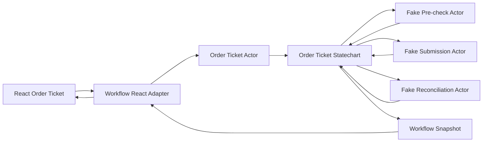
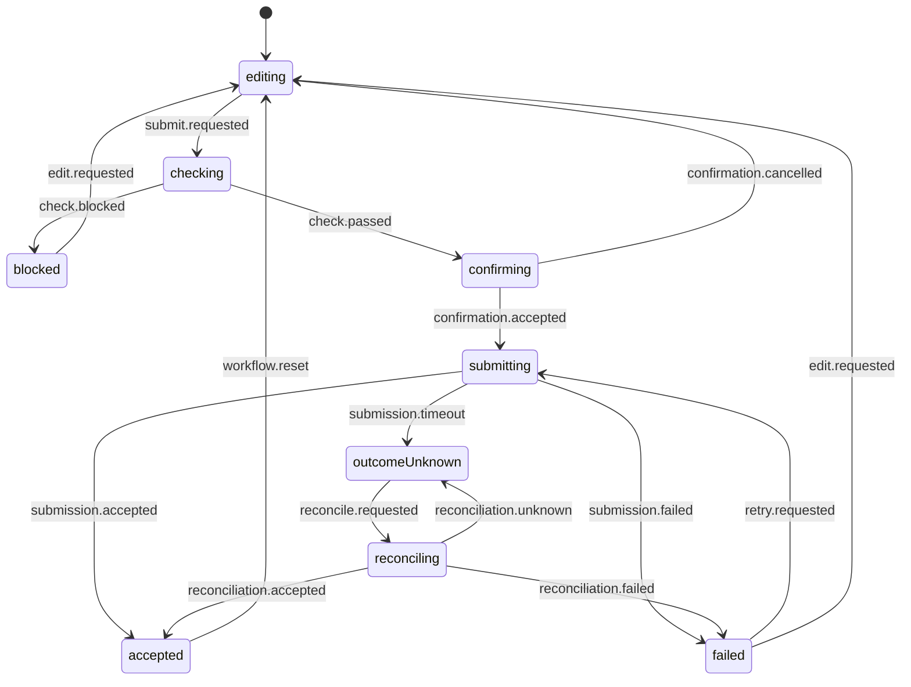

# State Machines and Statecharts

> **Showcase scope:** one small fake order-ticket statechart with the important happy, blocked, failed, timeout, and reconciliation paths. React consumes a view-ready adapter. The browser workflow is illustrative and never replaces authoritative server-side validation in a real system.

## 1. Short definition

A **State Machine** models a system as:

- a finite set of states;
- a finite set of events;
- explicit transitions between states;
- rules that determine which transitions are valid.

A **Statechart** extends a basic state machine with concepts such as:

- hierarchical states;
- parallel states;
- guards;
- actions;
- invoked asynchronous work;
- delayed transitions;
- history;
- actor spawning.

For the Financial Workspace demo, a statechart models one fake order-ticket workflow:

```text
editing
    ↓ submit
checking
    ├── blocked
    └── confirming
            ↓ confirm
        submitting
            ├── accepted
            ├── failed
            └── outcomeUnknown
                    ↓ reconcile
                reconciling
                    ├── accepted
                    └── failed
```

The key principle is:

> Only declared states and transitions are valid.

This removes impossible combinations such as:

```text
isSubmitting = true
isAccepted = true
hasFailed = true
```

---

## 2. Problem it solves

Complex UI workflows often begin with a few booleans:

```ts
const [isEditing, setIsEditing] =
  useState(true);

const [isChecking, setIsChecking] =
  useState(false);

const [isSubmitting, setIsSubmitting] =
  useState(false);

const [isAccepted, setIsAccepted] =
  useState(false);

const [hasFailed, setHasFailed] =
  useState(false);
```

As the workflow grows, the application must coordinate:

- which flags become true;
- which flags must become false;
- what happens if a request finishes late;
- which actions are available in each state;
- how retry works;
- what timeout means;
- whether the operation may already have succeeded.

Typical consequences:

- impossible combinations;
- duplicated transition logic;
- race conditions;
- event handlers that perform orchestration;
- effects that react to other effects;
- unclear retry paths;
- timeout represented as rejection;
- workflows that are difficult to explain or test.

The desired shape is:

```text
current state
    +
event
    ↓
declared transition
    ↓
next state
```

The machine becomes the single owner of workflow progression.

---

## 3. Architecture diagram



### Responsibility boundary

```text
React
    renders state and sends business events

Statechart
    owns workflow rules and transitions

Invoked actors
    perform asynchronous work

Repository adapters
    hide fake infrastructure details
```

React components must not manually coordinate the workflow.

---

## 4. Demo scenario

The `/workflows` route contains one-ticket mode and actor-workspace mode.

This document focuses on one-ticket mode.

The demo should support:

1. Edit a fake order draft.
2. Submit it for checking.
3. Simulate a pass or block result.
4. Show a confirmation step.
5. Submit the fake order.
6. Simulate:
   - accepted;
   - definite failure;
   - timeout with unknown outcome.
7. If outcome is unknown, reconcile using a fake idempotency key.
8. Resolve reconciliation to accepted or failed.
9. Reset and run another scenario.

The demo must make this distinction visible:

```text
definite failure
    we know the operation did not succeed

timeout
    the client does not know the final outcome
```

Therefore:

```text
timeout
    ≠ rejection
```

The workflow uses only synthetic checks and fake repositories. It must not be presented as authoritative financial validation, compliance, risk, or order execution.

---

## 5. Architecture and responsibilities

### Statechart

Responsibilities:

- define valid workflow states;
- define valid business events;
- run guards;
- invoke fake asynchronous actors;
- map results to transitions;
- represent timeout as `outcomeUnknown`;
- support retry or reconciliation;
- produce a serializable snapshot suitable for diagnostics.

It should not:

- render React;
- know route layout;
- read `window`;
- create infrastructure clients;
- access runtime configuration directly.

---

### Workflow context

Context stores data needed across transitions:

```text
draft
validation result
submission request ID
last error
reconciliation attempts
```

Context is not a replacement for all application state.

Keep only workflow-owned data inside the machine.

---

### Events

Events should describe business intent or facts:

```text
draft.changed
submit.requested
confirmation.accepted
retry.requested
workflow.reset
```

Avoid UI-shaped names:

```text
button.clicked
modal.closed
spinner.finished
```

The UI can translate gestures into business events.

---

### Guards

Guards answer:

> Is this transition allowed?

Examples:

- draft is complete;
- quantity is positive;
- confirmation is required;
- retry limit has not been exceeded.

Guards should be:

- synchronous;
- side-effect free;
- easy to test.

Do not perform network calls inside guards.

---

### Invoked actors

Invoked actors own asynchronous work:

- fake pre-check;
- fake submission;
- fake reconciliation.

They receive typed input and return typed output.

The statechart decides what happens when they:

- complete;
- fail;
- time out;
- are cancelled because the state is exited.

---

### React adapter

Responsibilities:

- start and stop the actor;
- subscribe to snapshots;
- expose view-ready state;
- expose business-friendly commands;
- keep XState APIs out of most components.

The adapter should expose:

```ts
state
api
```

rather than forcing every component to understand actor refs and machine internals.

---

## 6. State model

The planned workflow states are:

| State | Meaning | User actions |
| --- | --- | --- |
| `editing` | Draft can be changed | Update draft, submit |
| `checking` | Fake pre-check is running | Cancel/reset if allowed |
| `blocked` | Check rejected the draft | Edit, reset |
| `confirming` | User confirmation required | Confirm, return to editing |
| `submitting` | Fake submission is in progress | Wait |
| `outcomeUnknown` | Client timed out; final result unknown | Reconcile |
| `reconciling` | Fake status lookup is running | Wait |
| `accepted` | Fake submission definitely succeeded | Reset |
| `failed` | Fake submission definitely failed | Retry or edit |

State progression is not a single linear path.



---

## 7. Minimal but complete code example

The example uses XState v5 and `@xstate/react`.

### 7.1 Domain types

```ts
// packages/feature-workflow-lab/src/domain.ts

export type OrderDraft = Readonly<{
  instrumentId: string;
  side: "buy" | "sell";
  quantity: number;
  limitPrice?: number;
}>;

export type CheckResult =
  | Readonly<{
      outcome: "passed";
    }>
  | Readonly<{
      outcome: "blocked";
      reason: string;
    }>;

export type SubmissionResult =
  | Readonly<{
      outcome: "accepted";
      orderId: string;
    }>
  | Readonly<{
      outcome: "failed";
      reason: string;
    }>
  | Readonly<{
      outcome: "timeout";
    }>;

export type ReconciliationResult =
  | Readonly<{
      outcome: "accepted";
      orderId: string;
    }>
  | Readonly<{
      outcome: "failed";
      reason: string;
    }>
  | Readonly<{
      outcome: "unknown";
    }>;
```

---

### 7.2 Service contracts

```ts
// packages/feature-workflow-lab/src/services.ts

import type {
  CheckResult,
  OrderDraft,
  ReconciliationResult,
  SubmissionResult,
} from "./domain";

export interface OrderWorkflowServices {
  checkDraft(
    draft: OrderDraft,
    signal: AbortSignal,
  ): Promise<CheckResult>;

  submitOrder(
    input: Readonly<{
      draft: OrderDraft;
      requestId: string;
    }>,
    signal: AbortSignal,
  ): Promise<SubmissionResult>;

  reconcileOrder(
    requestId: string,
    signal: AbortSignal,
  ): Promise<ReconciliationResult>;
}
```

The machine receives this service contract from the Composition Root.

---

### 7.3 Machine context and events

```ts
// packages/feature-workflow-lab/src/orderTicketMachine.ts

import type {
  OrderDraft,
} from "./domain";

export type OrderTicketContext =
  Readonly<{
    draft: OrderDraft;
    requestId?: string;
    orderId?: string;
    blockedReason?: string;
    failureReason?: string;
    reconciliationAttempts: number;
  }>;

export type OrderTicketEvent =
  | Readonly<{
      type: "draft.changed";
      draft: OrderDraft;
    }>
  | Readonly<{
      type: "submit.requested";
    }>
  | Readonly<{
      type: "edit.requested";
    }>
  | Readonly<{
      type: "confirmation.accepted";
    }>
  | Readonly<{
      type: "confirmation.cancelled";
    }>
  | Readonly<{
      type: "retry.requested";
    }>
  | Readonly<{
      type: "reconcile.requested";
    }>
  | Readonly<{
      type: "workflow.reset";
    }>;
```

---

### 7.4 Machine factory

```ts
// packages/feature-workflow-lab/src/orderTicketMachine.ts

import {
  assign,
  fromPromise,
  setup,
} from "xstate";

import type {
  OrderWorkflowServices,
} from "./services";

import type {
  CheckResult,
  OrderDraft,
  ReconciliationResult,
  SubmissionResult,
} from "./domain";

export function createOrderTicketMachine(
  services: OrderWorkflowServices,
) {
  return setup({
    types: {
      context:
        {} as OrderTicketContext,

      events:
        {} as OrderTicketEvent,

      input:
        {} as Readonly<{
          initialDraft: OrderDraft;
        }>,
    },

    actors: {
      checkDraft:
        fromPromise<
          CheckResult,
          Readonly<{
            draft: OrderDraft;
          }>
        >(
          ({
            input,
            signal,
          }) =>
            services.checkDraft(
              input.draft,
              signal,
            ),
        ),

      submitOrder:
        fromPromise<
          SubmissionResult,
          Readonly<{
            draft: OrderDraft;
            requestId: string;
          }>
        >(
          ({
            input,
            signal,
          }) =>
            services.submitOrder(
              input,
              signal,
            ),
        ),

      reconcileOrder:
        fromPromise<
          ReconciliationResult,
          Readonly<{
            requestId: string;
          }>
        >(
          ({
            input,
            signal,
          }) =>
            services.reconcileOrder(
              input.requestId,
              signal,
            ),
        ),
    },

    guards: {
      draftIsComplete:
        ({ context }) =>
          context.draft
            .instrumentId
            .trim() !== "" &&
          context.draft
            .quantity > 0,
    },
  }).createMachine({
    id: "order-ticket",

    initial: "editing",

    context:
      ({ input }) => ({
        draft:
          input.initialDraft,

        reconciliationAttempts:
          0,
      }),

    states: {
      editing: {
        on: {
          "draft.changed": {
            actions:
              assign({
                draft:
                  ({ event }) =>
                    event.draft,

                blockedReason:
                  undefined,

                failureReason:
                  undefined,
              }),
          },

          "submit.requested": {
            guard:
              "draftIsComplete",

            target:
              "checking",
          },
        },
      },

      checking: {
        invoke: {
          src:
            "checkDraft",

          input:
            ({ context }) => ({
              draft:
                context.draft,
            }),

          onDone: [
            {
              guard:
                ({ event }) =>
                  event.output
                    .outcome ===
                  "blocked",

              target:
                "blocked",

              actions:
                assign({
                  blockedReason:
                    ({ event }) =>
                      event.output
                        .outcome ===
                      "blocked"
                        ? event.output
                            .reason
                        : undefined,
                }),
            },

            {
              target:
                "confirming",
            },
          ],

          onError: {
            target:
              "failed",

            actions:
              assign({
                failureReason:
                  "Pre-check could not be completed.",
              }),
          },
        },
      },

      blocked: {
        on: {
          "edit.requested":
            "editing",

          "workflow.reset": {
            target:
              "editing",

            actions:
              "resetWorkflow",
          },
        },
      },

      confirming: {
        on: {
          "confirmation.cancelled":
            "editing",

          "confirmation.accepted": {
            target:
              "submitting",

            actions:
              assign({
                requestId:
                  () =>
                    crypto
                      .randomUUID(),

                failureReason:
                  undefined,
              }),
          },
        },
      },

      submitting: {
        invoke: {
          src:
            "submitOrder",

          input:
            ({ context }) => ({
              draft:
                context.draft,

              requestId:
                requireRequestId(
                  context,
                ),
            }),

          onDone: [
            {
              guard:
                ({ event }) =>
                  event.output
                    .outcome ===
                  "accepted",

              target:
                "accepted",

              actions:
                assign({
                  orderId:
                    ({ event }) =>
                      event.output
                        .outcome ===
                      "accepted"
                        ? event.output
                            .orderId
                        : undefined,
                }),
            },

            {
              guard:
                ({ event }) =>
                  event.output
                    .outcome ===
                  "failed",

              target:
                "failed",

              actions:
                assign({
                  failureReason:
                    ({ event }) =>
                      event.output
                        .outcome ===
                      "failed"
                        ? event.output
                            .reason
                        : undefined,
                }),
            },

            {
              target:
                "outcomeUnknown",
            },
          ],

          onError: {
            target:
              "outcomeUnknown",
          },
        },
      },

      outcomeUnknown: {
        on: {
          "reconcile.requested":
            "reconciling",
        },
      },

      reconciling: {
        entry:
          assign({
            reconciliationAttempts:
              ({ context }) =>
                context
                  .reconciliationAttempts +
                1,
          }),

        invoke: {
          src:
            "reconcileOrder",

          input:
            ({ context }) => ({
              requestId:
                requireRequestId(
                  context,
                ),
            }),

          onDone: [
            {
              guard:
                ({ event }) =>
                  event.output
                    .outcome ===
                  "accepted",

              target:
                "accepted",

              actions:
                assign({
                  orderId:
                    ({ event }) =>
                      event.output
                        .outcome ===
                      "accepted"
                        ? event.output
                            .orderId
                        : undefined,
                }),
            },

            {
              guard:
                ({ event }) =>
                  event.output
                    .outcome ===
                  "failed",

              target:
                "failed",

              actions:
                assign({
                  failureReason:
                    ({ event }) =>
                      event.output
                        .outcome ===
                      "failed"
                        ? event.output
                            .reason
                        : undefined,
                }),
            },

            {
              target:
                "outcomeUnknown",
            },
          ],

          onError: {
            target:
              "outcomeUnknown",
          },
        },
      },

      failed: {
        on: {
          "retry.requested":
            "submitting",

          "edit.requested":
            "editing",

          "workflow.reset": {
            target:
              "editing",

            actions:
              "resetWorkflow",
          },
        },
      },

      accepted: {
        on: {
          "workflow.reset": {
            target:
              "editing",

            actions:
              "resetWorkflow",
          },
        },
      },
    },
  }, {
    actions: {
      resetWorkflow:
        assign({
          requestId:
            undefined,

          orderId:
            undefined,

          blockedReason:
            undefined,

          failureReason:
            undefined,

          reconciliationAttempts:
            0,
        }),
    },
  });
}

function requireRequestId(
  context: OrderTicketContext,
): string {
  if (!context.requestId) {
    throw new Error(
      "Order workflow requires a request ID.",
    );
  }

  return context.requestId;
}
```

### Important note

The `requestId` represents a synthetic idempotency key.

The retry path reuses it:

```text
failed
    ↓ retry
submitting with same requestId
```

This prevents the demo from implying that every retry is a brand-new command.

---

## 8. React adapter

The UI should not directly coordinate the machine.

```ts
// packages/feature-workflow-lab/src/
// createOrderTicketController.ts

import {
  createActor,
} from "xstate";

import type {
  OrderDraft,
} from "./domain";

import type {
  OrderWorkflowServices,
} from "./services";

import {
  createOrderTicketMachine,
} from "./orderTicketMachine";

export function createOrderTicketController(
  services: OrderWorkflowServices,
  initialDraft: OrderDraft,
) {
  const actor =
    createActor(
      createOrderTicketMachine(
        services,
      ),
      {
        input: {
          initialDraft,
        },
      },
    );

  return {
    start(): void {
      actor.start();
    },

    stop(): void {
      actor.stop();
    },

    subscribe:
      actor.subscribe.bind(
        actor,
      ),

    getSnapshot:
      actor.getSnapshot.bind(
        actor,
      ),

    api: {
      changeDraft(
        draft: OrderDraft,
      ): void {
        actor.send({
          type: "draft.changed",
          draft,
        });
      },

      submit(): void {
        actor.send({
          type:
            "submit.requested",
        });
      },

      edit(): void {
        actor.send({
          type:
            "edit.requested",
        });
      },

      confirm(): void {
        actor.send({
          type:
            "confirmation.accepted",
        });
      },

      cancelConfirmation():
        void {
        actor.send({
          type:
            "confirmation.cancelled",
        });
      },

      retry(): void {
        actor.send({
          type:
            "retry.requested",
        });
      },

      reconcile(): void {
        actor.send({
          type:
            "reconcile.requested",
        });
      },

      reset(): void {
        actor.send({
          type:
            "workflow.reset",
        });
      },
    },
  };
}
```

---

## 9. React integration

```tsx
// packages/feature-workflow-lab/src/
// OrderTicketDemo.tsx

import {
  useEffect,
  useSyncExternalStore,
} from "react";

import type {
  createOrderTicketController,
} from "./createOrderTicketController";

type Controller =
  ReturnType<
    typeof createOrderTicketController
  >;

export function OrderTicketDemo({
  controller,
}: {
  controller: Controller;
}) {
  useEffect(
    () => {
      controller.start();

      return () => {
        controller.stop();
      };
    },
    [controller],
  );

  const snapshot =
    useSyncExternalStore(
      (listener) => {
        const subscription =
          controller.subscribe(
            listener,
          );

        return () => {
          subscription
            .unsubscribe();
        };
      },

      controller.getSnapshot,

      controller.getSnapshot,
    );

  const state =
    snapshot.value;

  return (
    <section>
      <header>
        <h1>
          Order Workflow
        </h1>

        <p>
          Current state:
          {" "}
          <strong>
            {String(state)}
          </strong>
        </p>
      </header>

      {state === "editing" && (
        <EditingView
          draft={
            snapshot
              .context
              .draft
          }
          onChange={
            controller
              .api
              .changeDraft
          }
          onSubmit={
            controller
              .api
              .submit
          }
        />
      )}

      {state ===
        "checking" && (
        <BusyView
          label=
            "Running fake pre-check…"
        />
      )}

      {state ===
        "blocked" && (
        <BlockedView
          reason={
            snapshot
              .context
              .blockedReason
          }
          onEdit={
            controller
              .api
              .edit
          }
        />
      )}

      {state ===
        "confirming" && (
        <ConfirmationView
          onConfirm={
            controller
              .api
              .confirm
          }
          onCancel={
            controller
              .api
              .cancelConfirmation
          }
        />
      )}

      {state ===
        "submitting" && (
        <BusyView
          label=
            "Submitting fake order…"
        />
      )}

      {state ===
        "outcomeUnknown" && (
        <OutcomeUnknownView
          requestId={
            snapshot
              .context
              .requestId
          }
          onReconcile={
            controller
              .api
              .reconcile
          }
        />
      )}

      {state ===
        "reconciling" && (
        <BusyView
          label=
            "Reconciling outcome…"
        />
      )}

      {state ===
        "accepted" && (
        <AcceptedView
          orderId={
            snapshot
              .context
              .orderId
          }
          onReset={
            controller
              .api
              .reset
          }
        />
      )}

      {state ===
        "failed" && (
        <FailedView
          reason={
            snapshot
              .context
              .failureReason
          }
          onRetry={
            controller
              .api
              .retry
          }
          onEdit={
            controller
              .api
              .edit
          }
        />
      )}
    </section>
  );
}
```

The view branches on one machine state instead of coordinating several booleans.

---

## 10. View-ready projection

Large components should not depend on raw machine internals.

A projection can expose:

```ts
export type OrderTicketViewModel =
  Readonly<{
    state:
      | "editing"
      | "checking"
      | "blocked"
      | "confirming"
      | "submitting"
      | "outcomeUnknown"
      | "reconciling"
      | "accepted"
      | "failed";

    canEdit: boolean;
    canSubmit: boolean;
    canRetry: boolean;
    canReconcile: boolean;

    message?: string;
  }>;
```

Projection helper:

```ts
export function toViewModel(
  snapshot: OrderTicketSnapshot,
): OrderTicketViewModel {
  const state =
    String(
      snapshot.value,
    ) as
      OrderTicketViewModel[
        "state"
      ];

  return {
    state,

    canEdit:
      state === "editing" ||
      state === "blocked" ||
      state === "failed",

    canSubmit:
      state === "editing",

    canRetry:
      state === "failed",

    canReconcile:
      state ===
      "outcomeUnknown",

    message:
      snapshot
        .context
        .failureReason ??
      snapshot
        .context
        .blockedReason,
  };
}
```

This keeps the UI readable and limits statechart coupling.

---

## 11. Fake service implementation

```ts
// packages/feature-workflow-lab/src/
// createFakeOrderWorkflowServices.ts

import type {
  OrderWorkflowServices,
} from "./services";

export type FakeWorkflowProfile =
  | "accepted"
  | "blocked"
  | "failed"
  | "timeout-then-accepted"
  | "timeout-then-failed";

export function createFakeOrderWorkflowServices(
  profile:
    FakeWorkflowProfile,
): OrderWorkflowServices {
  return {
    async checkDraft(
      _draft,
      signal,
    ) {
      await delay(
        500,
        signal,
      );

      if (
        profile ===
        "blocked"
      ) {
        return {
          outcome:
            "blocked",

          reason:
            "Synthetic demo block.",
        };
      }

      return {
        outcome:
          "passed",
      };
    },

    async submitOrder(
      _input,
      signal,
    ) {
      await delay(
        700,
        signal,
      );

      switch (profile) {
        case "failed":
          return {
            outcome:
              "failed",

            reason:
              "Synthetic submission failure.",
          };

        case "timeout-then-accepted":
        case "timeout-then-failed":
          return {
            outcome:
              "timeout",
          };

        default:
          return {
            outcome:
              "accepted",

            orderId:
              "FAKE-ORDER-001",
          };
      }
    },

    async reconcileOrder(
      _requestId,
      signal,
    ) {
      await delay(
        600,
        signal,
      );

      if (
        profile ===
        "timeout-then-failed"
      ) {
        return {
          outcome:
            "failed",

          reason:
            "Synthetic reconciliation failure.",
        };
      }

      return {
        outcome:
          "accepted",

        orderId:
          "FAKE-ORDER-001",
      };
    },
  };
}

function delay(
  milliseconds:
    number,
  signal:
    AbortSignal,
): Promise<void> {
  return new Promise(
    (
      resolve,
      reject,
    ) => {
      const timeout =
        window.setTimeout(
          resolve,
          milliseconds,
        );

      signal.addEventListener(
        "abort",
        () => {
          window.clearTimeout(
            timeout,
          );

          reject(
            new DOMException(
              "Operation cancelled.",
              "AbortError",
            ),
          );
        },
        {
          once:
            true,
        },
      );
    },
  );
}
```

All data and outcomes are synthetic.

---

## 12. Testing

State machines are valuable because transitions can be tested without rendering React.

### Happy path

```ts
import {
  createActor,
} from "xstate";

import {
  describe,
  expect,
  it,
} from "vitest";

it(
  "moves from editing to accepted",
  async () => {
    const machine =
      createOrderTicketMachine(
        createFakeOrderWorkflowServices(
          "accepted",
        ),
      );

    const actor =
      createActor(
        machine,
        {
          input: {
            initialDraft: {
              instrumentId:
                "INST-ALPHA",

              side:
                "buy",

              quantity:
                10,
            },
          },
        },
      );

    actor.start();

    actor.send({
      type:
        "submit.requested",
    });

    await waitForState(
      actor,
      "confirming",
    );

    actor.send({
      type:
        "confirmation.accepted",
    });

    await waitForState(
      actor,
      "accepted",
    );

    expect(
      actor
        .getSnapshot()
        .context
        .orderId,
    ).toBe(
      "FAKE-ORDER-001",
    );

    actor.stop();
  },
);
```

---

### Timeout path

```ts
it(
  "represents timeout as outcome unknown",
  async () => {
    const actor =
      createActor(
        createOrderTicketMachine(
          createFakeOrderWorkflowServices(
            "timeout-then-accepted",
          ),
        ),
        {
          input: {
            initialDraft: {
              instrumentId:
                "INST-BETA",

              side:
                "sell",

              quantity:
                5,
            },
          },
        },
      );

    actor.start();

    actor.send({
      type:
        "submit.requested",
    });

    await waitForState(
      actor,
      "confirming",
    );

    actor.send({
      type:
        "confirmation.accepted",
    });

    await waitForState(
      actor,
      "outcomeUnknown",
    );

    expect(
      actor
        .getSnapshot()
        .matches(
          "outcomeUnknown",
        ),
    ).toBe(true);

    actor.stop();
  },
);
```

Priority tests:

- incomplete draft cannot submit;
- check can block;
- check can pass;
- confirmation can return to editing;
- accepted path;
- definite failure path;
- timeout path;
- reconciliation accepted;
- reconciliation failed;
- retry reuses request ID;
- reset clears workflow-owned context;
- invoked work is cancelled when actor stops.

---

## 13. Best-fit use cases

Use State Machines and Statecharts when:

- workflow states are explicit and meaningful;
- many booleans describe one process;
- only certain transitions are valid;
- async work is tied to lifecycle states;
- retries and timeouts matter;
- users may resume or reconcile a process;
- several terminal outcomes exist;
- the workflow must be explained visually;
- the same behavior will later run in multiple actors.

Financial-application examples:

- order entry;
- trade amendment;
- approval workflow;
- account onboarding;
- report generation;
- document import;
- reconciliation;
- multi-step confirmation;
- staged validation.

---

## 14. When not to use it

### Simple local UI state

Examples:

```text
tooltip open
accordion expanded
single checkbox
```

Normal React state is enough.

---

### Plain server cache state

A query library is usually better for:

```text
loading
success
error
stale
refetch
```

Use a statechart only when those states participate in a larger business workflow.

---

### Shared application data

A statechart is not automatically a replacement for Redux.

Use Redux for existing shared application state when appropriate.

---

### Pure calculation

Use a function or Strategy for an algorithm with no workflow lifecycle.

---

### Startup dependency scheduling

Use the Declarative Bootstrap Task Graph for application initialization dependencies.

---

### Every component

Do not wrap all components in machines. Use them where explicit workflow rules justify the model.

---

## 15. Benefits

### Impossible states disappear

The workflow occupies one declared state.

### Transition rules are centralized

Event handling no longer spreads across components and effects.

### Async lifecycle is explicit

Work starts when entering a state and is cancelled when leaving it.

### Better timeout semantics

`outcomeUnknown` can be represented directly.

### Strong visual communication

The statechart becomes useful architecture documentation.

### Easier testing

Transitions can be tested without rendering the full UI.

### Better Actor Model foundation

The same machine definition can run as multiple independent actor instances.

### Safer retry design

The machine can preserve and reuse an idempotency key.

### Better diagnostics

Current state, event, and context can be displayed in a presentation panel.

---

## 16. Disadvantages and risks

### Learning curve

Statecharts introduce:

- states;
- events;
- guards;
- actions;
- actors;
- snapshots;
- hierarchy.

Mitigation:

- begin with one flat workflow;
- use business language;
- avoid advanced features until needed.

---

### Over-modelling

A machine may become larger than the problem.

Mitigation:

- keep view-only details outside;
- model one cohesive workflow;
- split independent processes into child actors.

---

### Context becomes a data store

Teams may place unrelated application state into machine context.

Mitigation:

> Keep only workflow-owned data inside the machine.

---

### React coupling

Using XState hooks throughout the component tree spreads infrastructure details.

Mitigation:

- create one feature adapter;
- expose view-ready state and business commands.

---

### State explosion

Every minor variation may become a top-level state.

Mitigation:

- use context for data;
- use guards for conditions;
- use nested states only when they simplify the model.

---

### Incorrect error semantics

A network timeout may be modelled as definite failure.

Mitigation:

- distinguish known rejection from outcome uncertainty;
- model reconciliation explicitly.

---

### Hidden side effects

Actions may perform arbitrary asynchronous work.

Mitigation:

- keep actions synchronous;
- use invoked actors for async work;
- keep dependencies explicit.

---

### False authority

A polished client workflow may appear to enforce real financial controls.

Mitigation:

- label checks as synthetic;
- state that backend systems remain authoritative;
- avoid real financial formulas and claims.

---

## 17. Relevant libraries

### XState v5

Recommended by the implementation plan.

Useful capabilities:

- typed machine definitions;
- actor model;
- invoked promise actors;
- guards;
- actions;
- delayed transitions;
- inspection;
- snapshots.

### `@xstate/react`

Useful for React subscription and actor integration.

### Redux Toolkit

May remain responsible for shared application state.

### redux-observable

May remain responsible for existing event-driven state flows.

XState does not need to replace either library.

### Robot, Zustand finite-state patterns, or reducers

Smaller alternatives may be suitable for simpler workflows.

The architectural pattern is more important than the library.

---

## 18. Relationship to the other patterns

### Runtime Configuration

Runtime configuration may select a fake workflow profile or adapter.

It should not store live machine state.

---

### Composition Root

The Composition Root:

- creates fake workflow services;
- creates machine logic or controller factories;
- injects dependencies;
- registers application cleanup.

---

### Strategy Pattern

A state may invoke a Strategy:

```text
checking
    ↓
ValidationStrategy
```

The machine owns progression. The Strategy owns interchangeable behavior.

---

### Actor Model

```text
Statechart
    defines workflow behavior

Actor
    runs one independent instance
```

The Actor Model demo creates several ticket actors from this machine.

---

### Bootstrap Task Graph

Both may use XState, but they solve different problems:

```text
Order Statechart
    business workflow progression

Bootstrap Graph
    startup dependency scheduling
```

---

### Web Worker Offloading

A state may invoke a Worker-backed Strategy.

The machine does not imply background-thread execution.

---

### Intent-Based Prefetching

Intent prefetching may warm the workflow route before activation.

It does not change valid workflow transitions.

---

### Graceful Capability Degradation

If an optional workflow panel fails to render, a local boundary may preserve the rest of the workspace.

A critical workflow state such as `outcomeUnknown` must not be hidden as generic degradation.

---

## 19. Working demo location

Planned repository locations:

```text
packages/feature-workflow-lab/
  src/
    domain.ts
    services.ts
    orderTicketMachine.ts
    createOrderTicketController.ts
    createFakeOrderWorkflowServices.ts
    OrderTicketDemo.tsx
    projections.ts
    index.ts

apps/financial-workspace/src/routes/
  WorkflowsRoute.tsx

apps/financial-workspace/src/composition/
  createApplicationDependencies.ts
```

Primary visible demo:

```text
/workflows
```

One-ticket mode demonstrates this pattern.

Multi-ticket mode demonstrates the Actor Model.

Status during documentation phase:

> Planned. Source paths become definitive after Phase 5 implementation.

---

## 20. Presentation talking points

### One-sentence explanation

> A statechart makes one complex workflow explicit by declaring every valid state, event, and transition.

### Visual story

```text
boolean soup
    ↓
one explicit state
    ↓
declared transitions
    ↓
predictable workflow
```

### Main safety message

> Timeout does not mean rejection.

### Demo sequence

1. Open one fake order ticket.
2. Show `editing`.
3. Submit and show `checking`.
4. Demonstrate blocked outcome.
5. Edit and submit again.
6. Confirm and show `submitting`.
7. Trigger timeout.
8. Show `outcomeUnknown`.
9. Reconcile.
10. Resolve to `accepted`.
11. Reset.
12. Show that invalid events do nothing in the wrong state.

### Questions to ask the audience

- Which impossible boolean combinations exist today?
- Which transitions are valid?
- Who owns retries?
- What does timeout mean?
- Which data belongs in workflow context?
- Which async work should be invoked actors?
- Where should the machine stop and Redux begin?

### Common misconception

```text
State Machine
≠ every UI state
≠ Redux replacement
≠ query cache
≠ Actor Model by itself
≠ backend authority
```

---

## 21. Implementation checklist

### Model

- [ ] Define explicit business states.
- [ ] Define business events.
- [ ] Distinguish blocked, failed, and outcome unknown.
- [ ] Keep workflow context small.
- [ ] Define terminal and recovery paths.

### Dependencies

- [ ] Inject fake services.
- [ ] Keep guards synchronous.
- [ ] Use invoked actors for async work.
- [ ] Reuse request ID for retries.
- [ ] Cancel invoked work on actor stop.

### React

- [ ] Create one feature adapter.
- [ ] Expose view-ready state.
- [ ] Expose business-friendly API.
- [ ] Keep orchestration out of components.
- [ ] Display current state for presentation.

### Safety

- [ ] Label all checks and outcomes as synthetic.
- [ ] Do not present the client as authoritative.
- [ ] Model timeout as outcome uncertainty.
- [ ] Reconcile before declaring success or failure.
- [ ] Avoid real financial rules.

### Verification

- [ ] Transition tests cover every main path.
- [ ] Invalid transitions are tested.
- [ ] Retry preserves request identity.
- [ ] Reset clears workflow-owned data.
- [ ] Actor cleanup is tested.
- [ ] Existing Part 1 routes remain intact.

---

## 22. Final summary

State Machines and Statecharts provide an explicit model for workflows that are difficult to represent safely with independent booleans and effects.

For the Financial Workspace demo:

- one order ticket has one current state;
- only declared events cause transitions;
- async checks, submission, and reconciliation are invoked actors;
- timeout becomes `outcomeUnknown`, not rejection;
- retry preserves a synthetic idempotency key;
- React renders snapshots and sends business events;
- the same machine later becomes the logic for multiple ticket actors.

The success criterion is not simply that XState is installed.

The success criterion is:

> The workflow can be understood, tested, and demonstrated as a finite set of valid states and transitions, without React components manually coordinating the process.
