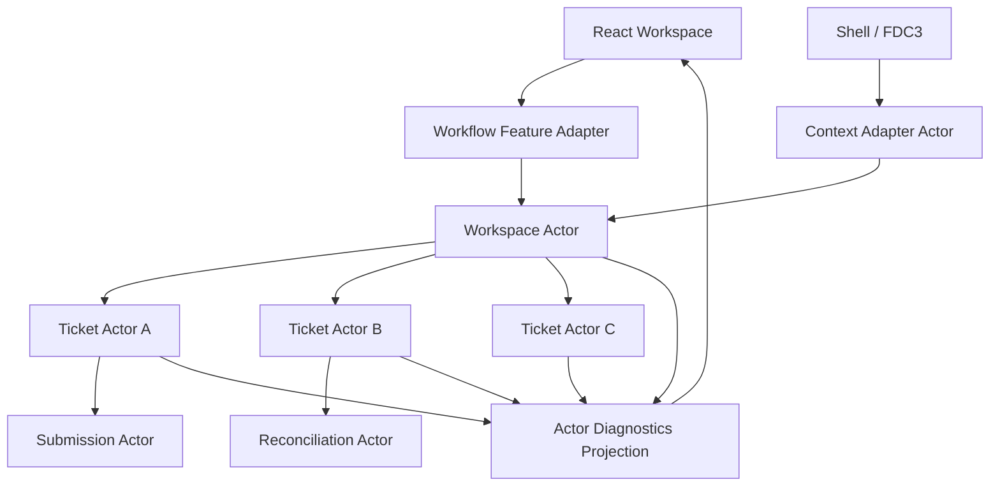

# Actor Model for UI Orchestration

> **Showcase scope:** one workspace actor and a few independently running ticket actors created from the same order-ticket logic. Actors remain in the browser and normally execute on the main thread. Only the analytics calculation uses a Web Worker.

## 1. Short definition

The **Actor Model** structures a system as independent runtime entities called actors.

Each actor:

- owns private state;
- receives messages through a mailbox;
- processes one message at a time;
- may send messages to other actors;
- may create child actors;
- owns a lifecycle;
- can stop independently.

For the Financial Workspace demo, the Actor Model coordinates several fake order tickets at once:

```text
Workspace Actor
    ├── Ticket Actor: INST-ALPHA
    │       └── Submission Actor
    ├── Ticket Actor: INST-BETA
    │       └── Reconciliation Actor
    ├── Ticket Actor: INST-GAMMA
    └── Shell/FDC3 Adapter Actor
```

The key principle is:

> One statechart defines behavior; many actor instances run that behavior independently.

Actors model **logical concurrency**. They do not automatically execute on background threads.

---

## 2. Problem it solves

A large React application often has many independent processes running at the same time:

- several open order tickets;
- independent submissions;
- market-data subscriptions;
- report-generation jobs;
- imports;
- panel lifecycles;
- external context adapters;
- Worker-backed calculations.

A naïve implementation may centralize all of this in one Redux tree or one event bus:

```text
Global Store
    ├── ticketsById
    ├── submissionsById
    ├── messages
    ├── timers
    ├── subscriptions
    └── cleanup flags
```

Or:

```text
global event bus
    ↓
every feature receives every event
```

Typical consequences:

- lifecycle ownership is unclear;
- temporary processes remain after their UI closes;
- messages are broadcast more widely than necessary;
- identifiers are threaded through every reducer and effect;
- one workflow instance can accidentally affect another;
- cleanup becomes manual and scattered;
- parent-child relationships are implicit;
- feature-level orchestration leaks into React components.

The desired shape is:

```text
one process
    ↓
one actor
    ↓
private state + mailbox + lifecycle
```

A parent actor owns the actors it creates and stops them when their work is no longer needed.

---

## 3. Architecture diagram



### Core boundary

```text
React
    renders actor snapshots and sends user intent

Workspace Actor
    owns ticket actor lifecycle and routing

Ticket Actor
    owns one order workflow instance

Child Actor
    owns one temporary async operation

Adapter Actor
    translates external protocol events
```

---

## 4. Demo scenario

The `/workflows` route has two presentation modes:

```text
One-ticket mode
    demonstrates State Machines and Statecharts

Multi-ticket mode
    demonstrates the Actor Model
```

In multi-ticket mode, the presenter can:

1. Open several fake order tickets.
2. Put each ticket into a different workflow state.
3. Submit one ticket while another remains in editing.
4. Trigger timeout and reconciliation for a third ticket.
5. Send a fake external instrument-selection event through a Shell/FDC3 adapter.
6. Close one ticket.
7. Show that its actor stops and disappears from diagnostics.
8. Show targeted actor messages.
9. Confirm that sibling actors continue unaffected.

Visible diagnostics should include:

- actor ID;
- actor type;
- current state;
- parent actor;
- last message;
- lifecycle status.

The demo should make this distinction explicit:

```text
Actor Model
    independent runtime ownership and messaging

Web Worker
    actual background-thread execution
```

---

## 5. Architecture and responsibilities

### Workspace Actor

Responsibilities:

- own the collection of open ticket actors;
- spawn a ticket actor when a ticket opens;
- stop a ticket actor when the ticket closes;
- route adapted external context to the correct ticket;
- expose a stable workspace snapshot;
- coordinate high-level actions that involve several tickets;
- avoid storing every child’s internal workflow state centrally.

It should not:

- reproduce the complete state of every ticket;
- execute fake submission logic directly;
- render React;
- consume raw Shell or FDC3 payloads;
- become a universal application event bus.

---

### Ticket Actor

Responsibilities:

- run one order-ticket statechart instance;
- own one draft and one workflow state;
- invoke child actors for submission or reconciliation;
- accept targeted messages;
- report relevant facts to the parent;
- stop when the ticket closes.

Each ticket actor is isolated:

```text
Ticket A timeout
    does not move Ticket B

Ticket B accepted
    does not reset Ticket C
```

---

### Child Actors

A ticket actor may invoke or spawn short-lived child actors:

```text
Submission Actor
Reconciliation Actor
Validation Actor
```

Responsibilities:

- own one async operation;
- receive typed input;
- report completion or failure;
- stop when the parent leaves the owning state;
- avoid leaking infrastructure APIs to React.

For simple promise work, an invoked promise actor is enough. Do not create a persistent actor hierarchy for every function call.

---

### External Context Adapter Actor

Responsibilities:

- subscribe to a fake Shell or FDC3 source;
- translate external payloads into internal events;
- validate or normalize the context;
- send targeted internal messages;
- clean up the external subscription on stop.

External protocols must not enter the actor system unadapted.

Bad:

```ts
workspaceActor.send(rawFdc3Context);
```

Good:

```ts
workspaceActor.send({
  type: "instrument.selected",
  instrumentId: "INST-ALPHA",
});
```

---

### React Adapter

Responsibilities:

- start and stop the workspace actor;
- subscribe to a view-ready projection;
- expose business-friendly commands;
- hide XState details from most components;
- avoid putting actor refs into global React context unless necessary.

---

### Diagnostics Projection

Responsibilities:

- expose actor IDs and states for presentation;
- keep diagnostics read-only;
- avoid exposing private sensitive data;
- avoid becoming the source of truth.

The actor system remains authoritative.

---

## 6. Actor concepts

### Actor logic versus actor instance

```text
Actor logic
    reusable definition of behavior

Actor instance
    one running entity with private state and mailbox
```

Example:

```text
OrderTicketMachine
    actor logic

ticket:INST-ALPHA
ticket:INST-BETA
ticket:INST-GAMMA
    actor instances
```

---

### Mailbox

Messages sent to an actor are queued and processed one at a time.

This avoids simultaneous mutation of one actor’s private state.

It does not mean the complete application is single-threaded or that asynchronous work cannot overlap.

---

### Actor reference

An actor reference is a handle used to send messages to a specific actor.

```ts
ticketRef.send({
  type: "submit.requested",
});
```

Prefer targeted references over global broadcasts.

---

### Parent-child lifecycle

```text
Workspace Actor
    spawns Ticket Actor

Ticket Actor
    invokes Submission Actor

Ticket closes
    ↓
Ticket Actor stops
    ↓
its child work stops
```

This hierarchy gives lifecycle ownership a structural form.

---

## 7. Message design

Messages should describe intent or facts.

Good:

```ts
type WorkspaceEvent =
  | {
      type: "ticket.opened";
      ticketId: string;
      initialDraft: OrderDraft;
    }
  | {
      type: "ticket.closed";
      ticketId: string;
    }
  | {
      type: "instrument.selected";
      instrumentId: string;
    };
```

Good ticket events:

```ts
type TicketEvent =
  | {
      type: "draft.changed";
      draft: OrderDraft;
    }
  | {
      type: "submit.requested";
    }
  | {
      type: "workflow.reset";
    };
```

Weak messages:

```ts
{
  type: "BUTTON_CLICKED";
}

{
  type: "UPDATE_THING";
  payload: unknown;
}
```

Message contracts are part of the architecture and should remain typed.

---

## 8. Minimal but complete implementation

The example uses XState v5.

### 8.1 Shared domain types

```ts
// packages/feature-workflow-lab/src/domain.ts

export type TicketId = string;

export type OrderDraft = Readonly<{
  instrumentId: string;
  side: "buy" | "sell";
  quantity: number;
}>;

export type ExternalInstrumentContext =
  Readonly<{
    instrumentId: string;
  }>;
```

---

### 8.2 Ticket actor logic

The ticket actor reuses the statechart from the previous pattern document.

```ts
// packages/feature-workflow-lab/src/
// createOrderTicketLogic.ts

import type {
  OrderWorkflowServices,
} from "./services";

import {
  createOrderTicketMachine,
} from "./orderTicketMachine";

export function createOrderTicketLogic(
  services: OrderWorkflowServices,
) {
  return createOrderTicketMachine(
    services,
  );
}
```

The statechart is the logic. Each created actor is an independent runtime instance.

---

### 8.3 Workspace context and events

```ts
// packages/feature-workflow-lab/src/
// workspaceMachine.ts

import type {
  ActorRefFrom,
} from "xstate";

import type {
  OrderDraft,
  TicketId,
} from "./domain";

import type {
  createOrderTicketMachine,
} from "./orderTicketMachine";

type TicketActorRef =
  ActorRefFrom<
    ReturnType<
      typeof createOrderTicketMachine
    >
  >;

export type WorkspaceContext =
  Readonly<{
    tickets:
      ReadonlyMap<
        TicketId,
        TicketActorRef
      >;

    activeTicketId?:
      TicketId;

    selectedInstrumentId?:
      string;
  }>;

export type WorkspaceEvent =
  | Readonly<{
      type: "ticket.opened";
      ticketId: TicketId;
      initialDraft: OrderDraft;
    }>
  | Readonly<{
      type: "ticket.closed";
      ticketId: TicketId;
    }>
  | Readonly<{
      type: "ticket.focused";
      ticketId: TicketId;
    }>
  | Readonly<{
      type: "instrument.selected";
      instrumentId: string;
    }>;
```

---

### 8.4 Workspace machine factory

```ts
// packages/feature-workflow-lab/src/
// workspaceMachine.ts

import {
  assign,
  setup,
  stopChild,
} from "xstate";

import type {
  OrderWorkflowServices,
} from "./services";

import {
  createOrderTicketMachine,
} from "./orderTicketMachine";

export function createWorkspaceMachine(
  services: OrderWorkflowServices,
) {
  const ticketLogic =
    createOrderTicketMachine(
      services,
    );

  return setup({
    types: {
      context:
        {} as WorkspaceContext,

      events:
        {} as WorkspaceEvent,
    },

    actors: {
      ticket:
        ticketLogic,
    },
  }).createMachine({
    id: "workflow-workspace",

    context: {
      tickets:
        new Map(),

      activeTicketId:
        undefined,

      selectedInstrumentId:
        undefined,
    },

    on: {
      "ticket.opened": {
        actions:
          assign({
            tickets:
              ({
                context,
                event,
                spawn,
              }) => {
                if (
                  context.tickets.has(
                    event.ticketId,
                  )
                ) {
                  return context.tickets;
                }

                const ticketRef =
                  spawn(
                    "ticket",
                    {
                      id:
                        `ticket:${event.ticketId}`,

                      input: {
                        initialDraft:
                          event.initialDraft,
                      },
                    },
                  );

                const next =
                  new Map(
                    context.tickets,
                  );

                next.set(
                  event.ticketId,
                  ticketRef,
                );

                return next;
              },

            activeTicketId:
              ({ event }) =>
                event.ticketId,
          }),
      },

      "ticket.focused": {
        guard:
          ({ context, event }) =>
            context.tickets.has(
              event.ticketId,
            ),

        actions:
          assign({
            activeTicketId:
              ({ event }) =>
                event.ticketId,
          }),
      },

      "ticket.closed": {
        actions: [
          stopChild(
            ({ event }) =>
              `ticket:${event.ticketId}`,
          ),

          assign({
            tickets:
              ({
                context,
                event,
              }) => {
                const next =
                  new Map(
                    context.tickets,
                  );

                next.delete(
                  event.ticketId,
                );

                return next;
              },

            activeTicketId:
              ({
                context,
                event,
              }) =>
                context
                  .activeTicketId ===
                event.ticketId
                  ? undefined
                  : context
                      .activeTicketId,
          }),
        ],
      },

      "instrument.selected": {
        actions: [
          assign({
            selectedInstrumentId:
              ({ event }) =>
                event.instrumentId,
          }),

          ({
            context,
            event,
          }) => {
            if (
              !context.activeTicketId
            ) {
              return;
            }

            const ticket =
              context.tickets.get(
                context.activeTicketId,
              );

            const snapshot =
              ticket?.getSnapshot();

            if (
              !ticket ||
              !snapshot
            ) {
              return;
            }

            ticket.send({
              type: "draft.changed",

              draft: {
                ...snapshot
                  .context
                  .draft,

                instrumentId:
                  event.instrumentId,
              },
            });
          },
        ],
      },
    },
  });
}
```

### Note on actor references in context

Keeping actor refs in workspace context is acceptable for this small presentation demo.

For a larger implementation, consider whether the parent only needs:

- IDs and projected metadata;
- child state facts reported through messages;
- direct actor refs held outside persisted context.

Do not serialize actor refs into persisted workspace state.

---

### 8.5 Workspace controller

```ts
// packages/feature-workflow-lab/src/
// createWorkspaceController.ts

import {
  createActor,
} from "xstate";

import type {
  OrderDraft,
  TicketId,
} from "./domain";

import type {
  OrderWorkflowServices,
} from "./services";

import {
  createWorkspaceMachine,
} from "./workspaceMachine";

export function createWorkspaceController(
  services: OrderWorkflowServices,
) {
  const actor =
    createActor(
      createWorkspaceMachine(
        services,
      ),
    );

  return {
    start(): void {
      actor.start();
    },

    stop(): void {
      actor.stop();
    },

    subscribe:
      actor.subscribe.bind(
        actor,
      ),

    getSnapshot:
      actor.getSnapshot.bind(
        actor,
      ),

    api: {
      openTicket(
        ticketId: TicketId,
        initialDraft: OrderDraft,
      ): void {
        actor.send({
          type: "ticket.opened",
          ticketId,
          initialDraft,
        });
      },

      closeTicket(
        ticketId: TicketId,
      ): void {
        actor.send({
          type: "ticket.closed",
          ticketId,
        });
      },

      focusTicket(
        ticketId: TicketId,
      ): void {
        actor.send({
          type: "ticket.focused",
          ticketId,
        });
      },

      selectInstrument(
        instrumentId: string,
      ): void {
        actor.send({
          type: "instrument.selected",
          instrumentId,
        });
      },
    },
  };
}
```

---

### 8.6 React adapter

```tsx
// packages/feature-workflow-lab/src/
// WorkflowWorkspaceDemo.tsx

import {
  useEffect,
  useSyncExternalStore,
} from "react";

import type {
  createWorkspaceController,
} from "./createWorkspaceController";

type WorkspaceController =
  ReturnType<
    typeof createWorkspaceController
  >;

export function WorkflowWorkspaceDemo({
  controller,
}: {
  controller:
    WorkspaceController;
}) {
  useEffect(
    () => {
      controller.start();

      return () => {
        controller.stop();
      };
    },
    [controller],
  );

  const snapshot =
    useSyncExternalStore(
      (listener) => {
        const subscription =
          controller.subscribe(
            listener,
          );

        return () => {
          subscription
            .unsubscribe();
        };
      },

      controller.getSnapshot,

      controller.getSnapshot,
    );

  const tickets =
    Array.from(
      snapshot
        .context
        .tickets
        .entries(),
    );

  return (
    <section>
      <header>
        <h1>
          Actor Workspace
        </h1>

        <button
          onClick={() => {
            const ticketId =
              crypto
                .randomUUID();

            controller
              .api
              .openTicket(
                ticketId,
                {
                  instrumentId:
                    "INST-ALPHA",

                  side:
                    "buy",

                  quantity:
                    10,
                },
              );
          }}
        >
          Open ticket
        </button>
      </header>

      <div>
        {tickets.map(
          ([
            ticketId,
            ticketRef,
          ]) => (
            <TicketActorCard
              key={
                ticketId
              }

              ticketId={
                ticketId
              }

              actorRef={
                ticketRef
              }

              active={
                snapshot
                  .context
                  .activeTicketId ===
                ticketId
              }

              onFocus={() =>
                controller
                  .api
                  .focusTicket(
                    ticketId,
                  )
              }

              onClose={() =>
                controller
                  .api
                  .closeTicket(
                    ticketId,
                  )
              }
            />
          ),
        )}
      </div>
    </section>
  );
}
```

Each ticket card subscribes only to its own actor.

---

### 8.7 Ticket actor card

```tsx
// packages/feature-workflow-lab/src/
// TicketActorCard.tsx

import {
  useSelector,
} from "@xstate/react";

import type {
  ActorRefFrom,
} from "xstate";

import type {
  createOrderTicketMachine,
} from "./orderTicketMachine";

type TicketRef =
  ActorRefFrom<
    ReturnType<
      typeof createOrderTicketMachine
    >
  >;

export function TicketActorCard({
  ticketId,
  actorRef,
  active,
  onFocus,
  onClose,
}: {
  ticketId: string;
  actorRef: TicketRef;
  active: boolean;
  onFocus(): void;
  onClose(): void;
}) {
  const state =
    useSelector(
      actorRef,
      (snapshot) =>
        String(
          snapshot.value,
        ),
    );

  const draft =
    useSelector(
      actorRef,
      (snapshot) =>
        snapshot
          .context
          .draft,
    );

  return (
    <article
      data-active={
        active
      }
      onClick={
        onFocus
      }
    >
      <header>
        <h2>
          {draft.instrumentId}
        </h2>

        <button
          onClick={(
            event,
          ) => {
            event
              .stopPropagation();

            onClose();
          }}
        >
          Close
        </button>
      </header>

      <p>
        Actor:
        {" "}
        {ticketId}
      </p>

      <p>
        State:
        {" "}
        <strong>
          {state}
        </strong>
      </p>

      <button
        onClick={() => {
          actorRef.send({
            type:
              "submit.requested",
          });
        }}
      >
        Submit
      </button>
    </article>
  );
}
```

This demonstrates fine-grained subscriptions. Updating one ticket does not require projecting the complete state of every ticket through the parent.

---

## 9. External context adapter actor

The demo should route a fake external instrument selection through an adapter.

```ts
// packages/feature-workflow-lab/src/
// createExternalContextAdapter.ts

import {
  fromCallback,
} from "xstate";

import type {
  ExternalInstrumentContext,
} from "./domain";

export interface ExternalContextSource {
  subscribe(
    listener:
      (
        context:
          ExternalInstrumentContext,
      ) => void,
  ): () => void;
}

export function createExternalContextAdapter(
  source:
    ExternalContextSource,
) {
  return fromCallback<
    never,
    Readonly<{
      onInstrumentSelected(
        instrumentId:
          string,
      ): void;
    }>
  >(
    ({ input }) => {
      const unsubscribe =
        source.subscribe(
          (context) => {
            if (
              context
                .instrumentId
                .trim() ===
              ""
            ) {
              return;
            }

            input
              .onInstrumentSelected(
                context
                  .instrumentId,
              );
          },
        );

      return () => {
        unsubscribe();
      };
    },
  );
}
```

The adapter translates external protocol context into internal business language.

In the demo, the source is local and fake. A real application may provide Shell or FDC3 adapters from the Composition Root.

---

## 10. Actor diagnostics

A presentation-friendly projection may look like:

```ts
export type ActorDiagnostic =
  Readonly<{
    actorId: string;
    actorType:
      | "workspace"
      | "ticket"
      | "submission"
      | "reconciliation"
      | "external-context";

    parentId?:
      string;

    state:
      string;

    status:
      "running" | "stopped";

    lastMessage?:
      string;
  }>;
```

Diagnostics can be produced through:

- XState inspection APIs;
- parent-reported child metadata;
- a small presentation-only observer.

Do not make the diagnostics panel responsible for actor lifecycle.

---

## 11. Lifecycle and cleanup

The Actor Model is valuable only when lifecycle ownership is real.

### Ticket close

```text
user closes ticket
    ↓
Workspace Actor receives ticket.closed
    ↓
Workspace Actor stops child
    ↓
Ticket Actor stops
    ↓
invoked submission/reconciliation work is cancelled
    ↓
React card disappears
```

### Route unmount

```text
/workflows route unmounts
    ↓
controller.stop()
    ↓
Workspace Actor stops
    ↓
all child actors stop
```

### Application stop

The Composition Root should register any application-owned top-level actors with `ApplicationRuntime.stop()`.

---

## 12. Main-thread execution versus Workers

Ordinary XState actors usually execute on the main JavaScript thread.

```text
multiple actors
    logical concurrency

Web Worker
    physical execution on another thread
```

An actor may delegate CPU-heavy work to a Worker-backed Strategy:

```text
Scenario Actor
    ↓ sends request
WorkerAnalyticsStrategy
    ↓
Web Worker
```

The actor still owns:

- lifecycle;
- state;
- messages;
- result handling.

The Worker owns:

- background execution of the calculation.

Do not describe the Actor Model as multithreading.

---

## 13. Relationship to Redux

Redux remains appropriate for shared application state such as:

- current user-facing preferences;
- shared normalized entities;
- existing Part 1 feature state;
- route-independent view data.

Actors are useful for:

- independent process instances;
- hierarchical lifecycle;
- targeted messages;
- temporary workflow ownership;
- cancellation tied to process lifetime.

A useful division is:

```text
Redux
    shared application data

Actor
    one running process
```

Avoid duplicating the complete actor state into Redux.

If shared UI needs a summary, publish a projection or fact:

```ts
{
  type: "ticket.accepted",
  ticketId: "ticket-1",
  orderId: "FAKE-ORDER-001",
}
```

---

## 14. Relationship to an event bus

An event bus broadcasts by topic.

An actor reference targets a specific recipient.

```text
Event bus
    anyone subscribed may react

Actor message
    one known actor receives it
```

The Shell event bus or FDC3 may remain at the application boundary.

Use an adapter actor to translate external broadcast context into targeted internal messages.

Do not turn the actor system into another uncontrolled global event bus.

---

## 15. Testing

### Independent ticket instances

```ts
import {
  createActor,
} from "xstate";

import {
  expect,
  it,
} from "vitest";

it(
  "runs ticket actors independently",
  () => {
    const workspace =
      createActor(
        createWorkspaceMachine(
          createFakeOrderWorkflowServices(
            "accepted",
          ),
        ),
      );

    workspace.start();

    workspace.send({
      type:
        "ticket.opened",

      ticketId:
        "ticket-a",

      initialDraft: {
        instrumentId:
          "INST-ALPHA",

        side:
          "buy",

        quantity:
          10,
      },
    });

    workspace.send({
      type:
        "ticket.opened",

      ticketId:
        "ticket-b",

      initialDraft: {
        instrumentId:
          "INST-BETA",

        side:
          "sell",

        quantity:
          5,
      },
    });

    const tickets =
      workspace
        .getSnapshot()
        .context
        .tickets;

    const ticketA =
      tickets.get(
        "ticket-a",
      );

    const ticketB =
      tickets.get(
        "ticket-b",
      );

    ticketA?.send({
      type:
        "submit.requested",
    });

    expect(
      ticketB
        ?.getSnapshot()
        .matches(
          "editing",
        ),
    ).toBe(true);

    workspace.stop();
  },
);
```

### Child cleanup

```ts
it(
  "stops a ticket actor when closed",
  () => {
    const workspace =
      createActor(
        createWorkspaceMachine(
          services,
        ),
      );

    workspace.start();

    workspace.send({
      type:
        "ticket.opened",

      ticketId:
        "ticket-a",

      initialDraft,
    });

    const ticket =
      workspace
        .getSnapshot()
        .context
        .tickets
        .get(
          "ticket-a",
        );

    workspace.send({
      type:
        "ticket.closed",

      ticketId:
        "ticket-a",
    });

    expect(
      workspace
        .getSnapshot()
        .context
        .tickets
        .has(
          "ticket-a",
        ),
    ).toBe(false);

    expect(
      ticket
        ?.getSnapshot()
        .status,
    ).toBe(
      "stopped",
    );

    workspace.stop();
  },
);
```

Priority tests:

- workspace spawns one actor per ticket;
- duplicate open does not create a second actor;
- ticket actors progress independently;
- focusing a ticket changes only workspace selection;
- external context is routed only to the active ticket;
- close stops the correct actor;
- stopping workspace stops all children;
- child failure does not stop siblings;
- diagnostics do not become a source of truth.

---

## 16. Best-fit use cases

Use the Actor Model when:

- many independent workflow instances may exist;
- each process needs private state and lifecycle;
- parent-child ownership matters;
- targeted messaging is preferable to broadcast events;
- temporary processes must stop cleanly;
- one process may spawn short-lived child work;
- external protocols need adaptation;
- orchestration is difficult to represent in one global store.

Financial-application examples:

- multiple order tickets;
- multiple independent approvals;
- import jobs;
- report-generation jobs;
- market-data subscriptions per panel;
- scenario-calculation sessions;
- reconciliation processes;
- workspace tools with independent lifecycle.

---

## 17. When not to use it

### Simple component state

Use normal React state for:

```text
dropdown open
tab selected
tooltip visible
```

### One isolated workflow

A single State Machine may be enough if there is no need for multiple instances or hierarchy.

### Shared normalized data

Redux or a query cache may be better for data that many features consume.

### Pure computation

Use a function or Strategy.

### Background execution only

Use a Web Worker if the main concern is CPU work on another thread.

### Application startup dependencies

Use the Declarative Bootstrap Task Graph.

### Every panel

A dynamic panel does not automatically need an actor.

Use an actor only when the panel owns an independent process with meaningful lifecycle and messaging.

---

## 18. Benefits

### Independent state ownership

Each actor owns its own process state.

### Natural lifecycle

Parents create and stop children.

### Targeted communication

Messages go to known recipients.

### Reduced global coordination

One ticket does not require global flags and IDs everywhere.

### Better cleanup

Closing a process stops its subscriptions, timers, and invoked work.

### Fine-grained React updates

Components can subscribe to one actor rather than one giant tree.

### Reusable behavior

One statechart can run as many actor instances.

### Better external adaptation

Shell or FDC3 events can be normalized at the boundary.

### Presentation value

The actor hierarchy is easy to demonstrate visually.

---

## 19. Disadvantages and risks

### Learning curve

Actors introduce:

- actor logic;
- actor instances;
- refs;
- mailboxes;
- parent-child hierarchy;
- spawning;
- stopping;
- snapshots.

Mitigation:

- begin with one workspace and ticket actor type;
- use business names;
- keep message contracts explicit.

### Over-actorization

Turning every component or utility into an actor creates unnecessary indirection.

Mitigation:

> Create actors for independently valuable processes, not for every object.

### Hidden topology

Actor relationships may be difficult to understand without diagnostics.

Mitigation:

- keep hierarchy shallow;
- name actors consistently;
- add presentation diagnostics;
- document ownership.

### Message sprawl

A weak `unknown` payload recreates an untyped event bus.

Mitigation:

- use discriminated unions;
- use business facts and intent;
- avoid generic message names.

### State duplication

Copying every child snapshot into the parent creates synchronization problems.

Mitigation:

- keep child state private;
- publish only required facts or projections.

### Serialization assumptions

Actor refs and live snapshots are not suitable for direct persistence.

Mitigation:

- persist domain data and stable IDs;
- recreate actor topology during restoration.

### Main-thread misconception

Teams may assume actors create threads.

Mitigation:

- label actors as logical concurrency;
- use Workers explicitly for background execution.

### React coupling

Using actor refs throughout the whole component tree spreads infrastructure details.

Mitigation:

- expose a feature adapter;
- pass narrow refs only to components that own that actor view.

### Debugging distributed behavior

Messages may cross several actors.

Mitigation:

- use structured event names;
- include correlation IDs where needed;
- keep diagnostics;
- avoid deep unnecessary hierarchies.

---

## 20. Relevant libraries

### XState v5

Recommended by the implementation plan.

Useful for:

- actor creation;
- statechart actor logic;
- spawning child actors;
- invoked actors;
- inspection;
- snapshots;
- parent-child lifecycle.

### `@xstate/react`

Useful for:

- `useSelector`;
- actor subscriptions;
- React integration.

### Native Web Workers

Useful when an actor delegates CPU-heavy work off-thread.

### Redux Toolkit and redux-observable

Remain valid for existing shared state and event-driven flows.

The Actor Model does not require replacing them.

Other actor libraries exist, but the implementation plan standardizes the demo on XState to keep the architecture coherent.

---

## 21. Relationship to the other patterns

### Runtime Configuration

Runtime configuration may select:

- context provider;
- workflow demo profile;
- optional actor-backed capabilities.

It should not contain live actor state.

### Composition Root

The Composition Root:

- creates actor logic factories;
- injects fake services;
- creates top-level application actors;
- provides platform adapters;
- registers cleanup.

### Strategy Pattern

An actor may invoke a Strategy:

```text
Scenario Actor
    ↓
PortfolioAnalytics Strategy
```

The actor owns lifecycle. The Strategy owns interchangeable behavior.

### State Machines and Statecharts

```text
Statechart
    reusable behavior definition

Actor
    running instance of that behavior
```

This is the closest relationship.

### Declarative Bootstrap Task Graph

Both may use XState actors.

They remain distinct:

```text
Bootstrap actor system
    temporary application startup coordination

Workspace actor system
    runtime process coordination
```

### Web Worker Offloading

An actor may own a Worker-backed service or Worker actor.

Actors do not automatically execute off-thread.

### Intent-Based Prefetching

Intent prefetching may load the workflow feature before navigation.

It does not start ticket actors until the feature actually needs them.

### Graceful Capability Degradation

A failed optional actor-backed panel may degrade locally.

Actor failure and React rendering failure remain different concerns.

One child actor failure should not automatically stop sibling actors unless the parent explicitly chooses that policy.

---

## 22. Working demo location

Implemented repository locations:

```text
packages/feature-workflow-lab/
  src/
    model/
      orderTicketTypes.ts
      createOrderTicketMachine.ts
      createWorkflowWorkspaceMachine.ts
      externalContextSource.ts
    WorkflowWorkspaceEntry.tsx
    index.ts

apps/financial-workspace/src/routes/
  WorkflowsRoute.tsx

apps/financial-workspace/src/composition/
  createApplication.ts
```

Primary visible demo:

```text
/workflows
```

Implementation status:

> Implemented. `/workflows` Actor Workspace mode demonstrates spawned ticket
> actors, targeted and broadcast messages, child-to-parent facts, external
> context adaptation, selection, and `stopChild` cleanup.

---

## 23. Presentation talking points

### One-sentence explanation

> The Actor Model lets us run many independent workflow instances, each with private state, a mailbox, and a lifecycle.

### Visual story

```text
one order-ticket statechart
    ↓ instantiated as
many ticket actors
    ↓ coordinated by
workspace actor
```

### Main distinction

> Actors provide logical concurrency and ownership. Workers provide background-thread execution.

### Demo sequence

1. Open three fake tickets.
2. Put each ticket into a different state.
3. Show one submitting, one editing, and one reconciling.
4. Send external instrument context through the adapter.
5. Show that only the active ticket changes.
6. Close one ticket.
7. Show its actor stopping.
8. Show that siblings continue.
9. Open actor diagnostics.
10. Explain parent-child lifecycle and targeted messages.

### Questions to ask the audience

- Which processes have independent lifecycles?
- Which events should be targeted instead of broadcast?
- Who owns cleanup?
- Which state belongs to the child rather than the parent?
- Are we duplicating actor state in Redux?
- Does this process need an actor, or only a function/state machine?
- Is the real problem concurrency or background execution?

### Common misconception

```text
Actor Model
≠ Web Worker
≠ global event bus
≠ Redux replacement
≠ actor for every component
```

---

## 24. Implementation checklist

### Actor boundaries

- [ ] Define one Workspace Actor.
- [ ] Define one Ticket Actor type.
- [ ] Spawn one actor per open ticket.
- [ ] Keep ticket workflow state private.
- [ ] Use child actors only for meaningful operations.

### Messaging

- [ ] Use typed discriminated unions.
- [ ] Prefer business intent and facts.
- [ ] Route messages to known actor refs.
- [ ] Avoid raw external protocol payloads.
- [ ] Avoid generic `unknown` messages.

### Lifecycle

- [ ] Workspace owns ticket actors.
- [ ] Closing a ticket stops its actor.
- [ ] Route unmount stops the workspace actor.
- [ ] Application stop releases top-level actors.
- [ ] Invoked work is cancelled when parents stop.

### React

- [ ] Create one feature adapter.
- [ ] Subscribe to the workspace projection.
- [ ] Subscribe ticket cards to their own actors.
- [ ] Keep actor orchestration out of components.
- [ ] Display diagnostics for presentation only.

### External context

- [ ] Add a fake Shell/FDC3 source.
- [ ] Translate external context in an adapter actor.
- [ ] Validate instrument identifiers.
- [ ] Target the active ticket.
- [ ] Clean up the external subscription.

### Verification

- [ ] Multiple tickets progress independently.
- [ ] Duplicate ticket creation is prevented.
- [ ] Child failure does not stop siblings.
- [ ] Closing a ticket stops the correct actor.
- [ ] Workspace stop stops all children.
- [ ] Existing Part 1 routes remain intact.
- [ ] No deep package imports are introduced.

---

## 25. Final summary

The Actor Model gives independent runtime processes a concrete architectural home.

For the Financial Workspace demo:

- one workspace actor owns the ticket collection;
- one order-ticket statechart becomes many ticket actor instances;
- each ticket owns private workflow state;
- child actors own temporary asynchronous operations;
- external Shell/FDC3 context is translated through an adapter;
- React subscribes through feature adapters;
- closing a ticket stops its actor and child work;
- ordinary actors remain main-thread logical concurrency;
- Workers remain the explicit mechanism for off-thread CPU work.

The success criterion is not simply that several XState actors exist.

The success criterion is:

> Independent processes have explicit ownership, targeted communication, and lifecycle boundaries without forcing their internal state into one global coordination mechanism.
