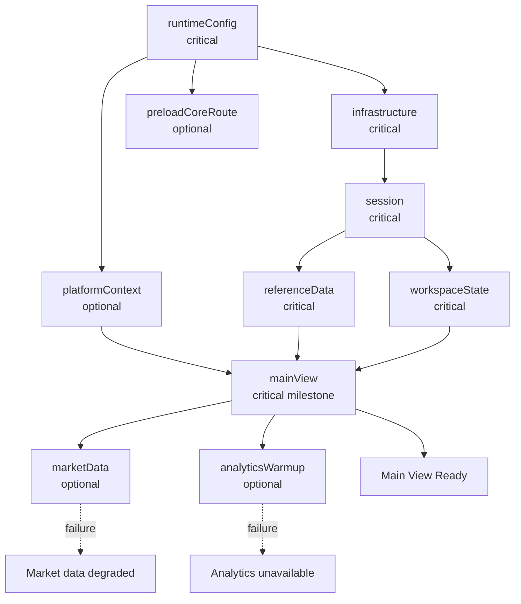

# Declarative Bootstrap Task Graph with XState

> **Showcase scope:** one explicit browser-startup graph of roughly 6–8 named tasks, with parallel execution, a Main View Ready milestone, one critical failure path, one optional degraded path, and Retry. Do not build a generic workflow engine or backend orchestrator.

## 1. Short definition

A **Declarative Bootstrap Task Graph** models application startup as named tasks with explicit dependencies rather than as one long procedural function.

Each task declares:

- its ID;
- what it depends on;
- whether it is critical or optional;
- whether it blocks the main view;
- how it runs;
- how it retries;
- what capability it provides;
- how its status is observed.

The graph answers:

> Which startup task is allowed to run now?

For the Financial Workspace demo:

```text
runtimeConfig
    ├── infrastructure
    ├── platformContext
    └── preloadCoreRoute

infrastructure
    ↓
session
    ├── referenceData
    └── workspaceState

platformContext + referenceData + workspaceState
    ↓
mainView

mainView
    ├── marketData
    └── analyticsWarmup
```

Independent tasks run in parallel.

Critical failure prevents application readiness.

Optional failure produces a visible degraded capability without taking down the main view.

---

## 2. Problem it solves

Startup often begins as straightforward sequential code:

```ts
const config =
  await loadRuntimeConfig();

const infrastructure =
  await createInfrastructure(
    config,
  );

const session =
  await loadSession(
    infrastructure,
  );

const referenceData =
  await loadReferenceData(
    session,
  );

const workspace =
  await restoreWorkspace(
    session,
  );

await initializePlatform();
await preloadAnalytics();
await connectMarketData();

mountReact();
```

As the application grows, the procedure becomes difficult to reason about.

Typical problems:

- independent work is accidentally serialized;
- dependencies are hidden in implementation order;
- optional tasks delay the whole application;
- failure handling differs per task;
- retries are scattered;
- readiness is represented by one boolean;
- React mounts before required inputs are ready;
- startup cannot be inspected after the fact;
- cancellation and cleanup are unclear;
- one optional integration failure causes an application-level error.

The actual structure is a graph, not a list:

```text
A depends on B
C and D can run in parallel
E is optional
F defines Main View Ready
```

The graph should be represented directly.

---

## 3. Architecture diagram



### Startup architecture

```text
Task definitions
    ↓
graph validation
    ↓
XState bootstrap actor
    ↓
task actors
    ↓
task-status projection
    ↓
Main View Ready / startup failed / degraded
```

---

## 4. Demo scenario

The `/startup` route visualizes the graph during and after application startup.

The demo supports safe local profiles:

| Profile | Behavior |
| --- | --- |
| `standard` | Normal task durations and successful completion |
| `slow-startup` | Longer delays so parallel execution is visible |
| `optional-failure` | `analyticsWarmup` or `marketData` fails |
| `critical-failure` | `session` or `referenceData` fails |
| `retry-success` | Selected task fails once and succeeds after Retry |

The route should show:

- task nodes;
- dependency arrows;
- task state;
- critical versus optional classification;
- elapsed duration;
- retry count;
- provided capability;
- Main View Ready milestone;
- aggregate startup status.

Suggested task states:

```text
blocked
ready
running
succeeded
failed
skipped
retrying
cancelled
```

The application shell or startup screen may render before the main view, but normal React feature composition must not proceed as if required startup inputs were ready.

---

## 5. Architecture and responsibilities

### Task definition

A task definition describes startup work.

Responsibilities:

- identify the task;
- declare dependencies;
- classify criticality;
- declare readiness impact;
- run using explicit dependencies;
- optionally define retry policy;
- return a typed result or capability.

It should not:

- render React;
- mutate unrelated global state;
- inspect another task’s internals;
- start before dependencies succeed;
- hide undeclared dependencies.

---

### Graph validator

Responsibilities:

- reject duplicate task IDs;
- reject missing dependency IDs;
- reject self-dependencies;
- reject cycles;
- calculate reverse dependency relationships;
- fail before startup execution begins.

A cyclic graph is a configuration error:

```text
session → referenceData → session
```

Retry cannot fix a cycle.

---

### Bootstrap scheduler

Responsibilities:

- determine which blocked tasks have all dependencies satisfied;
- start independent ready tasks in parallel;
- record task status;
- propagate critical failure;
- allow optional failures without blocking readiness;
- expose Main View Ready;
- support selected retries;
- stop active work on application shutdown.

---

### Task actor

Responsibilities:

- run one task;
- own timeout and retry state;
- accept cancellation;
- report progress or completion;
- normalize failure into a task result.

Task actors should remain small and application-specific.

The implementation plan explicitly avoids creating a generic workflow engine.

---

### Status projection

Responsibilities:

- convert internal actor snapshots into presentation-friendly nodes;
- expose task ID, status, duration, criticality, attempts, and error;
- calculate aggregate readiness;
- remain read-only.

The projection is not the scheduler.

---

### Composition Root

Responsibilities:

- provide task dependencies;
- create repositories and adapters when the graph reaches the correct point;
- consume successful bootstrap outputs;
- create the final application runtime;
- register cleanup.

The graph coordinates startup.

The Composition Root creates concrete objects.

---

## 6. Task model

```ts
// packages/shared-bootstrap/src/types.ts

export type BootstrapTaskId =
  | "runtimeConfig"
  | "infrastructure"
  | "platformContext"
  | "preloadCoreRoute"
  | "session"
  | "referenceData"
  | "workspaceState"
  | "mainView"
  | "marketData"
  | "analyticsWarmup";

export type TaskCriticality =
  | "critical"
  | "optional";

export type TaskStatus =
  | "blocked"
  | "ready"
  | "running"
  | "succeeded"
  | "failed"
  | "retrying"
  | "cancelled"
  | "skipped";

export type RetryPolicy =
  Readonly<{
    maximumAttempts: number;
    initialDelayMs: number;
    maximumDelayMs: number;
  }>;

export type BootstrapTaskDefinition<
  TResult = unknown,
> =
  Readonly<{
    id: BootstrapTaskId;

    dependsOn:
      readonly BootstrapTaskId[];

    criticality:
      TaskCriticality;

    blocksMainView:
      boolean;

    timeoutMs?:
      number;

    retry?:
      RetryPolicy;

    run(
      context:
        BootstrapExecutionContext,

      signal:
        AbortSignal,
    ): Promise<TResult>;
  }>;
```

---

## 7. Execution context

Task dependencies should be explicit.

```ts
// packages/shared-bootstrap/src/types.ts

export type BootstrapResults =
  Partial<
    Record<
      BootstrapTaskId,
      unknown
    >
  >;

export type BootstrapExecutionContext =
  Readonly<{
    getResult<TResult>(
      taskId:
        BootstrapTaskId,
    ): TResult;
  }>;
```

Safe lookup:

```ts
export function createExecutionContext(
  results:
    BootstrapResults,
): BootstrapExecutionContext {
  return {
    getResult<TResult>(
      taskId:
        BootstrapTaskId,
    ): TResult {
      if (
        !Object.hasOwn(
          results,
          taskId,
        )
      ) {
        throw new Error(
          `Bootstrap result "${taskId}" is unavailable.`,
        );
      }

      return results[
        taskId
      ] as TResult;
    },
  };
}
```

A task must list every dependency it reads.

Bad:

```ts
run() {
  return globalSession.user;
}
```

Good:

```ts
dependsOn:
  ["session"],

run(context) {
  const session =
    context.getResult<Session>(
      "session",
    );

  // ...
}
```

---

## 8. Graph validation

```ts
// packages/shared-bootstrap/src/
// validateBootstrapGraph.ts

import type {
  BootstrapTaskDefinition,
  BootstrapTaskId,
} from "./types";

export function validateBootstrapGraph(
  tasks:
    readonly BootstrapTaskDefinition[],
): void {
  const byId =
    new Map<
      BootstrapTaskId,
      BootstrapTaskDefinition
    >();

  for (const task of tasks) {
    if (
      byId.has(
        task.id,
      )
    ) {
      throw new Error(
        `Duplicate bootstrap task "${task.id}".`,
      );
    }

    byId.set(
      task.id,
      task,
    );
  }

  for (const task of tasks) {
    for (
      const dependency
      of task.dependsOn
    ) {
      if (
        dependency ===
        task.id
      ) {
        throw new Error(
          `Bootstrap task "${task.id}" cannot depend on itself.`,
        );
      }

      if (
        !byId.has(
          dependency,
        )
      ) {
        throw new Error(
          `Bootstrap task "${task.id}" depends on missing task "${dependency}".`,
        );
      }
    }
  }

  detectCycles(
    tasks,
  );
}

function detectCycles(
  tasks:
    readonly BootstrapTaskDefinition[],
): void {
  const graph =
    new Map<
      BootstrapTaskId,
      readonly BootstrapTaskId[]
    >(
      tasks.map(
        (task) => [
          task.id,
          task.dependsOn,
        ],
      ),
    );

  const visiting =
    new Set<
      BootstrapTaskId
    >();

  const visited =
    new Set<
      BootstrapTaskId
    >();

  function visit(
    taskId:
      BootstrapTaskId,
  ): void {
    if (
      visited.has(
        taskId,
      )
    ) {
      return;
    }

    if (
      visiting.has(
        taskId,
      )
    ) {
      throw new Error(
        `Bootstrap graph contains a cycle at "${taskId}".`,
      );
    }

    visiting.add(
      taskId,
    );

    for (
      const dependency
      of graph.get(
        taskId,
      ) ?? []
    ) {
      visit(
        dependency,
      );
    }

    visiting.delete(
      taskId,
    );

    visited.add(
      taskId,
    );
  }

  for (const task of tasks) {
    visit(
      task.id,
    );
  }
}
```

Validation runs before the scheduler actor starts.

---

## 9. Task runtime state

```ts
// packages/shared-bootstrap/src/types.ts

export type TaskRuntimeState =
  Readonly<{
    id:
      BootstrapTaskId;

    status:
      TaskStatus;

    attempts:
      number;

    startedAt?:
      number;

    completedAt?:
      number;

    error?:
      Readonly<{
        message:
          string;

        retryable:
          boolean;
      }>;
  }>;

export type BootstrapSnapshot =
  Readonly<{
    tasks:
      Readonly<
        Record<
          BootstrapTaskId,
          TaskRuntimeState
        >
      >;

    mainViewReady:
      boolean;

    startupFailed:
      boolean;

    degradedCapabilities:
      readonly string[];
  }>;
```

---

## 10. Running one task safely

```ts
// packages/shared-bootstrap/src/
// executeTask.ts

import type {
  BootstrapExecutionContext,
  BootstrapTaskDefinition,
} from "./types";

export async function executeTask(
  task:
    BootstrapTaskDefinition,

  context:
    BootstrapExecutionContext,

  signal:
    AbortSignal,
): Promise<unknown> {
  const controller =
    new AbortController();

  const forwardAbort =
    (): void => {
      controller.abort(
        signal.reason,
      );
    };

  signal.addEventListener(
    "abort",
    forwardAbort,
    {
      once:
        true,
    },
  );

  let timeout:
    ReturnType<
      typeof setTimeout
    > | undefined;

  if (
    task.timeoutMs !==
    undefined
  ) {
    timeout =
      setTimeout(
        () => {
          controller.abort(
            new Error(
              `Bootstrap task "${task.id}" timed out.`,
            ),
          );
        },

        task.timeoutMs,
      );
  }

  try {
    return await task.run(
      context,
      controller.signal,
    );
  } finally {
    if (
      timeout !==
      undefined
    ) {
      clearTimeout(
        timeout,
      );
    }

    signal.removeEventListener(
      "abort",
      forwardAbort,
    );
  }
}
```

Timeout means the task did not complete within the accepted startup window.

For startup reads and local fake work, retry may be safe.

Do not automatically retry non-idempotent commands.

---

## 11. Retry delay

```ts
// packages/shared-bootstrap/src/
// calculateRetryDelay.ts

import type {
  RetryPolicy,
} from "./types";

export function calculateRetryDelay(
  attempt:
    number,

  policy:
    RetryPolicy,
): number {
  const exponential =
    policy.initialDelayMs *
    2 **
      Math.max(
        0,
        attempt - 1,
      );

  return Math.min(
    exponential,
    policy.maximumDelayMs,
  );
}
```

For the local demo, deterministic delay is easier to present and test.

A production implementation may add jitter to avoid synchronized retry storms.

---

## 12. Task actor logic with XState

```ts
// packages/shared-bootstrap/src/
// createTaskMachine.ts

import {
  fromPromise,
  setup,
} from "xstate";

import type {
  BootstrapExecutionContext,
  BootstrapTaskDefinition,
} from "./types";

import {
  executeTask,
} from "./executeTask";

export function createTaskMachine(
  definition:
    BootstrapTaskDefinition,
) {
  return setup({
    types: {
      input:
        {} as Readonly<{
          context:
            BootstrapExecutionContext;

          attempt:
            number;
        }>,
    },

    actors: {
      execute:
        fromPromise<
          unknown,
          Readonly<{
            context:
              BootstrapExecutionContext;
          }>
        >(
          ({
            input,
            signal,
          }) =>
            executeTask(
              definition,
              input.context,
              signal,
            ),
        ),
    },
  }).createMachine({
    id:
      `bootstrap-task:${definition.id}`,

    initial:
      "running",

    states: {
      running: {
        invoke: {
          src:
            "execute",

          input:
            ({ input }) => ({
              context:
                input.context,
            }),

          onDone:
            "succeeded",

          onError:
            "failed",
        },
      },

      succeeded: {
        type:
          "final",
      },

      failed: {
        type:
          "final",
      },
    },
  });
}
```

This small actor owns one execution attempt.

The scheduler decides whether another attempt should be created.

---

## 13. Scheduler helpers

A task is ready when all dependencies succeeded:

```ts
// packages/shared-bootstrap/src/
// graphState.ts

import type {
  BootstrapTaskDefinition,
  BootstrapTaskId,
  TaskRuntimeState,
} from "./types";

export function dependenciesSucceeded(
  task:
    BootstrapTaskDefinition,

  states:
    Readonly<
      Record<
        BootstrapTaskId,
        TaskRuntimeState
      >
    >,
): boolean {
  return task.dependsOn.every(
    (dependency) =>
      states[
        dependency
      ].status ===
      "succeeded",
  );
}

export function dependencyFailedCritically(
  task:
    BootstrapTaskDefinition,

  definitions:
    ReadonlyMap<
      BootstrapTaskId,
      BootstrapTaskDefinition
    >,

  states:
    Readonly<
      Record<
        BootstrapTaskId,
        TaskRuntimeState
      >
    >,
): boolean {
  return task.dependsOn.some(
    (dependencyId) => {
      const dependency =
        definitions.get(
          dependencyId,
        );

      return (
        dependency
          ?.criticality ===
          "critical" &&
        states[
          dependencyId
        ].status ===
          "failed"
      );
    },
  );
}
```

---

## 14. Scheduler events

```ts
// packages/shared-bootstrap/src/
// bootstrapMachine.types.ts

export type BootstrapEvent =
  | Readonly<{
      type:
        "scheduler.started";
    }>
  | Readonly<{
      type:
        "task.succeeded";

      taskId:
        BootstrapTaskId;

      result:
        unknown;

      completedAt:
        number;
    }>
  | Readonly<{
      type:
        "task.failed";

      taskId:
        BootstrapTaskId;

      error:
        unknown;

      completedAt:
        number;
    }>
  | Readonly<{
      type:
        "task.retry.requested";

      taskId:
        BootstrapTaskId;
    }>
  | Readonly<{
      type:
        "scheduler.stopped";
    }>;
```

Messages describe scheduler facts and intent rather than UI details.

---

## 15. Scheduler context

```ts
export type BootstrapContext =
  Readonly<{
    definitions:
      ReadonlyMap<
        BootstrapTaskId,
        BootstrapTaskDefinition
      >;

    taskStates:
      Readonly<
        Record<
          BootstrapTaskId,
          TaskRuntimeState
        >
      >;

    results:
      BootstrapResults;

    activeTaskIds:
      ReadonlySet<
        BootstrapTaskId
      >;
  }>;
```

The scheduler owns task status and results.

Feature packages must not mutate this context directly.

---

## 16. Creating the initial scheduler context

```ts
export function createInitialBootstrapContext(
  tasks:
    readonly BootstrapTaskDefinition[],
): BootstrapContext {
  const definitions =
    new Map(
      tasks.map(
        (task) => [
          task.id,
          task,
        ],
      ),
    );

  const taskStates =
    Object.fromEntries(
      tasks.map(
        (task) => [
          task.id,
          {
            id:
              task.id,

            status:
              task.dependsOn.length ===
              0
                ? "ready"
                : "blocked",

            attempts:
              0,
          } satisfies
            TaskRuntimeState,
        ],
      ),
    ) as Record<
      BootstrapTaskId,
      TaskRuntimeState
    >;

  return {
    definitions,
    taskStates:
      Object.freeze(
        taskStates,
      ),

    results: {},
    activeTaskIds:
      new Set(),
  };
}
```

---

## 17. Application-specific task definitions

```ts
// apps/financial-workspace/src/bootstrap/
// bootstrapTasks.ts

import type {
  BootstrapTaskDefinition,
} from "@demo/shared-bootstrap";

import type {
  RuntimeConfig,
} from "@demo/shared-runtime-config";

export function createBootstrapTasks(
  dependencies:
    BootstrapDependencies,
): readonly BootstrapTaskDefinition[] {
  return [
    {
      id:
        "runtimeConfig",

      dependsOn: [],

      criticality:
        "critical",

      blocksMainView:
        true,

      async run() {
        return dependencies
          .runtimeConfig;
      },
    },

    {
      id:
        "infrastructure",

      dependsOn: [
        "runtimeConfig",
      ],

      criticality:
        "critical",

      blocksMainView:
        true,

      async run(
        context,
      ) {
        const config =
          context.getResult<
            RuntimeConfig
          >(
            "runtimeConfig",
          );

        return dependencies
          .createInfrastructure(
            config,
          );
      },
    },

    {
      id:
        "platformContext",

      dependsOn: [
        "runtimeConfig",
      ],

      criticality:
        "optional",

      blocksMainView:
        false,

      timeoutMs:
        2_000,

      retry: {
        maximumAttempts:
          2,

        initialDelayMs:
          300,

        maximumDelayMs:
          1_000,
      },

      async run(
        context,
        signal,
      ) {
        const config =
          context.getResult<
            RuntimeConfig
          >(
            "runtimeConfig",
          );

        return dependencies
          .loadPlatformContext(
            config,
            signal,
          );
      },
    },

    {
      id:
        "preloadCoreRoute",

      dependsOn: [
        "runtimeConfig",
      ],

      criticality:
        "optional",

      blocksMainView:
        false,

      async run() {
        await dependencies
          .preloadCoreRoute();

        return {
          preloaded:
            true,
        };
      },
    },

    {
      id:
        "session",

      dependsOn: [
        "infrastructure",
      ],

      criticality:
        "critical",

      blocksMainView:
        true,

      timeoutMs:
        4_000,

      retry: {
        maximumAttempts:
          2,

        initialDelayMs:
          500,

        maximumDelayMs:
          1_500,
      },

      async run(
        context,
        signal,
      ) {
        const infrastructure =
          context.getResult<
            Infrastructure
          >(
            "infrastructure",
          );

        return infrastructure
          .sessionRepository
          .loadSession(
            signal,
          );
      },
    },

    {
      id:
        "referenceData",

      dependsOn: [
        "session",
      ],

      criticality:
        "critical",

      blocksMainView:
        true,

      async run(
        context,
        signal,
      ) {
        const session =
          context.getResult<
            Session
          >(
            "session",
          );

        return dependencies
          .loadReferenceData(
            session,
            signal,
          );
      },
    },

    {
      id:
        "workspaceState",

      dependsOn: [
        "session",
      ],

      criticality:
        "critical",

      blocksMainView:
        true,

      async run(
        context,
        signal,
      ) {
        const session =
          context.getResult<
            Session
          >(
            "session",
          );

        return dependencies
          .restoreWorkspace(
            session,
            signal,
          );
      },
    },

    {
      id:
        "mainView",

      dependsOn: [
        "platformContext",
        "referenceData",
        "workspaceState",
      ],

      criticality:
        "critical",

      blocksMainView:
        true,

      async run(
        context,
      ) {
        return {
          platformContext:
            context.getResult(
              "platformContext",
            ),

          referenceData:
            context.getResult(
              "referenceData",
            ),

          workspaceState:
            context.getResult(
              "workspaceState",
            ),
        };
      },
    },

    {
      id:
        "marketData",

      dependsOn: [
        "mainView",
      ],

      criticality:
        "optional",

      blocksMainView:
        false,

      timeoutMs:
        3_000,

      async run(
        _context,
        signal,
      ) {
        return dependencies
          .connectMarketData(
            signal,
          );
      },
    },

    {
      id:
        "analyticsWarmup",

      dependsOn: [
        "mainView",
      ],

      criticality:
        "optional",

      blocksMainView:
        false,

      async run() {
        return dependencies
          .warmAnalytics();
      },
    },
  ];
}
```

### Important nuance

The plan lists `platformContext` as a dependency of `mainView` while also classifying it as optional.

That requires one explicit policy:

- either `mainView` accepts a successful fallback result from `platformContext`;
- or the scheduler treats optional failure as a completed degraded dependency;
- or `mainView` does not directly depend on it.

For this demo, use a fallback result:

```ts
{
  provider: "none",
  degraded: true,
}
```

The optional task still completes successfully with a degraded capability when no external context is available.

An optional task that truly fails and remains failed must not be a hard dependency of a critical task.

---

## 18. Main View Ready

`Main View Ready` should be calculated from task metadata, not hard-coded UI timing.

```ts
export function isMainViewReady(
  definitions:
    ReadonlyMap<
      BootstrapTaskId,
      BootstrapTaskDefinition
    >,

  states:
    Readonly<
      Record<
        BootstrapTaskId,
        TaskRuntimeState
      >
    >,
): boolean {
  for (
    const [
      taskId,
      definition,
    ]
    of definitions
  ) {
    if (
      definition
        .blocksMainView &&
      states[
        taskId
      ].status !==
        "succeeded"
    ) {
      return false;
    }
  }

  return true;
}
```

The application may mount the full main view when this becomes true.

Optional background tasks may still be running.

---

## 19. Critical failure

```ts
export function hasCriticalFailure(
  definitions:
    ReadonlyMap<
      BootstrapTaskId,
      BootstrapTaskDefinition
    >,

  states:
    Readonly<
      Record<
        BootstrapTaskId,
        TaskRuntimeState
      >
    >,
): boolean {
  for (
    const [
      taskId,
      definition,
    ]
    of definitions
  ) {
    if (
      definition
        .criticality ===
        "critical" &&
      states[
        taskId
      ].status ===
        "failed"
    ) {
      return true;
    }
  }

  return false;
}
```

Critical failure should produce an application-level startup failure screen.

Examples:

- invalid runtime configuration;
- infrastructure creation failed;
- session unavailable;
- required reference data unavailable;
- workspace cannot be restored safely.

---

## 20. Optional degradation

Optional failure should be mapped to a capability state.

```ts
export type StartupCapability =
  Readonly<{
    id:
      string;

    state:
      | "ready"
      | "degraded"
      | "unavailable";

    message?:
      string;
  }>;
```

Example projection:

```ts
export function projectCapabilities(
  snapshot:
    BootstrapSnapshot,
): readonly StartupCapability[] {
  return [
    {
      id:
        "market-data",

      state:
        snapshot
          .tasks
          .marketData
          .status ===
        "succeeded"
          ? "ready"
          : "degraded",

      message:
        snapshot
          .tasks
          .marketData
          .status ===
        "failed"
          ? "Live market data is unavailable."
          : undefined,
    },

    {
      id:
        "analytics",

      state:
        snapshot
          .tasks
          .analyticsWarmup
          .status ===
        "failed"
          ? "unavailable"
          : "ready",
    },
  ];
}
```

This connects startup orchestration to Graceful Capability Degradation without collapsing the two patterns into one.

---

## 21. React adapter

```ts
// packages/shared-bootstrap/src/
// createBootstrapController.ts

import {
  createActor,
} from "xstate";

export function createBootstrapController(
  machine:
    BootstrapMachine,
) {
  const actor =
    createActor(
      machine,
    );

  return {
    start(): void {
      actor.start();

      actor.send({
        type:
          "scheduler.started",
      });
    },

    stop(): void {
      actor.stop();
    },

    subscribe:
      actor.subscribe.bind(
        actor,
      ),

    getSnapshot:
      actor.getSnapshot.bind(
        actor,
      ),

    retry(
      taskId:
        BootstrapTaskId,
    ): void {
      actor.send({
        type:
          "task.retry.requested",

        taskId,
      });
    },
  };
}
```

---

## 22. Startup visualization

```tsx
// apps/financial-workspace/src/routes/
// StartupRoute.tsx

import {
  useSyncExternalStore,
} from "react";

export function StartupRoute({
  controller,
}: {
  controller:
    BootstrapController;
}) {
  const snapshot =
    useSyncExternalStore(
      (listener) => {
        const subscription =
          controller.subscribe(
            listener,
          );

        return () => {
          subscription
            .unsubscribe();
        };
      },

      controller.getSnapshot,

      controller.getSnapshot,
    );

  const view =
    toBootstrapViewModel(
      snapshot,
    );

  return (
    <main>
      <header>
        <h1>
          Application Startup
        </h1>

        <p>
          Main View:
          {" "}
          <strong>
            {
              view.mainViewReady
                ? "Ready"
                : "Waiting"
            }
          </strong>
        </p>
      </header>

      <BootstrapGraph
        nodes={
          view.tasks
        }
      />

      {view.startupFailed && (
        <StartupFailurePanel
          tasks={
            view.tasks
          }
        />
      )}

      {view.degraded.length >
        0 && (
        <DegradedCapabilityList
          capabilities={
            view.degraded
          }
        />
      )}
    </main>
  );
}
```

The graph component is a presentation projection. It does not control task execution.

---

## 23. Integration with application startup

```ts
// apps/financial-workspace/src/bootstrap/
// startApplication.ts

export async function startApplication(
  root:
    HTMLElement,
): Promise<
  ApplicationRuntime
> {
  const resources =
    await loadResources();

  const runtimeConfig =
    createRuntimeConfig(
      resources,
    );

  const bootstrap =
    createBootstrapRuntime(
      createBootstrapTasks({
        runtimeConfig,
        // Other explicit dependencies.
      }),
    );

  const outcome =
    await bootstrap
      .waitForMainView();

  if (
    outcome.type ===
    "critical-failure"
  ) {
    throw outcome.error;
  }

  const application =
    await createApplication({
      runtimeConfig,

      bootstrapResults:
        outcome.results,

      startupCapabilities:
        outcome.capabilities,
    });

  application.mount(
    root,
  );

  return {
    ...application,

    stop() {
      bootstrap.stop();
      application.stop();
    },
  };
}
```

### Ordering

```text
load and validate runtime config
    ↓
run bootstrap graph
    ↓
reach Main View Ready
    ↓
create final application runtime
    ↓
mount main React application
```

The `/startup` visualization may be shown through a small startup shell or replayed from captured task diagnostics after mount.

---

## 24. Progressive readiness

The entire application does not need to wait for every task.

```text
Startup shell visible
    ↓
critical blocking tasks complete
    ↓
Main View Ready
    ↓
optional market data connects
    ↓
optional analytics warms
```

Possible capability progression:

```text
workspace
    ready

market data
    loading → ready

analytics
    loading → degraded
```

Progressive readiness is useful only if the UI clearly communicates unavailable or incomplete capabilities.

Do not silently enable actions that require optional work which has not completed.

---

## 25. Concurrency

Independent tasks should run in parallel:

```text
runtimeConfig succeeds
    ├── infrastructure
    ├── platformContext
    └── preloadCoreRoute
```

The scheduler should start all three without waiting for one another.

Benefits:

- shorter critical path;
- explicit startup timing;
- easier performance reasoning.

Do not parallelize tasks that have hidden dependencies.

The correct fix for hidden dependencies is to declare them.

---

## 26. Concurrency limits

A larger graph may need a concurrency limit.

For this demo, the task count is small enough to start every ready task.

If needed:

```ts
type SchedulerOptions =
  Readonly<{
    maximumConcurrentTasks:
      number;
  }>;
```

The scheduler chooses ready tasks while respecting the limit.

Avoid introducing this until the demo demonstrates a real need.

---

## 27. Retry policy

Retry only when:

- the task is idempotent;
- failure is plausibly transient;
- retry does not duplicate a command;
- task dependencies remain valid.

Good retry candidates:

- session read;
- reference-data read;
- optional context initialization;
- safe preload;
- analytics warmup.

Poor retry candidates:

- invalid config;
- graph cycle;
- unsupported setting;
- object-construction programming error;
- non-idempotent command.

Manual Retry should be visible in the `/startup` route for selected tasks.

---

## 28. Cancellation and shutdown

Stopping the bootstrap runtime must:

- abort running task controllers;
- stop task actors;
- prevent late completion from updating state;
- run registered cleanup for partially created resources;
- stop retry timers.

Example:

```text
application stop
    ↓
bootstrap actor stops
    ↓
active task actors stop
    ↓
AbortSignal fires
    ↓
task-owned resources clean up
```

Task functions that create persistent resources should return a result with an explicit disposer or register cleanup with an application-owned lifecycle registry.

---

## 29. Cleanup registry

```ts
export type CleanupRegistry =
  Readonly<{
    add(
      cleanup:
        () => void,
    ): void;

    runAll():
      void;
  }>;

export function createCleanupRegistry():
  CleanupRegistry {
  const cleanups:
    Array<
      () => void
    > = [];

  return {
    add(
      cleanup,
    ) {
      cleanups.push(
        cleanup,
      );
    },

    runAll() {
      for (
        const cleanup
        of cleanups
          .splice(0)
          .reverse()
      ) {
        try {
          cleanup();
        } catch {
          // Log through injected logger.
        }
      }
    },
  };
}
```

Resources should be cleaned up in reverse creation order.

---

## 30. Task result typing

The smallest implementation can use `unknown` internally.

A stronger typed mapping improves safety:

```ts
export type BootstrapResultMap =
  Readonly<{
    runtimeConfig:
      RuntimeConfig;

    infrastructure:
      Infrastructure;

    platformContext:
      PlatformContext;

    preloadCoreRoute:
      Readonly<{
        preloaded:
          boolean;
      }>;

    session:
      Session;

    referenceData:
      ReferenceData;

    workspaceState:
      WorkspaceState;

    mainView:
      MainViewDependencies;

    marketData:
      MarketDataConnection;

    analyticsWarmup:
      AnalyticsWarmupResult;
  }>;
```

Typed getter:

```ts
export interface TypedBootstrapContext {
  getResult<
    TTaskId extends
      keyof BootstrapResultMap,
  >(
    taskId:
      TTaskId,
  ):
    BootstrapResultMap[
      TTaskId
    ];
}
```

Use this if it remains readable and does not turn the demo into a type-system exercise.

---

## 31. Diagnostics

Useful task diagnostics:

```text
task ID
criticality
blocking status
dependencies
current status
attempt number
start time
completion time
duration
error category
retryability
provided capability
```

Example:

```ts
export type BootstrapTaskDiagnostic =
  Readonly<{
    id:
      BootstrapTaskId;

    status:
      TaskStatus;

    criticality:
      TaskCriticality;

    blocksMainView:
      boolean;

    dependencies:
      readonly BootstrapTaskId[];

    attempts:
      number;

    durationMs?:
      number;

    errorMessage?:
      string;
  }>;
```

Do not log:

- tokens;
- account details;
- raw session payloads;
- raw runtime config containing sensitive values;
- fake order data unnecessarily.

---

## 32. Testing

The graph should be testable without rendering React.

### Parallel execution

```ts
it(
  "starts independent tasks in parallel",
  async () => {
    const events:
      string[] = [];

    const tasks =
      createTestTasks({
        infrastructure: async () => {
          events.push(
            "infrastructure:start",
          );

          await delay(
            20,
          );

          events.push(
            "infrastructure:end",
          );
        },

        platformContext:
          async () => {
            events.push(
              "platform:start",
            );

            await delay(
              10,
            );

            events.push(
              "platform:end",
            );
          },
      });

    const runtime =
      createBootstrapRuntime(
        tasks,
      );

    runtime.start();

    await runtime
      .waitForTask(
        "platformContext",
      );

    expect(
      events.slice(
        0,
        2,
      ),
    ).toEqual([
      "infrastructure:start",
      "platform:start",
    ]);

    runtime.stop();
  },
);
```

---

### Critical failure

```ts
it(
  "fails startup when a critical task fails",
  async () => {
    const runtime =
      createBootstrapRuntime(
        createTasks({
          session:
            async () => {
              throw new Error(
                "Synthetic session failure.",
              );
            },
        }),
      );

    const outcome =
      await runtime
        .waitForMainView();

    expect(
      outcome.type,
    ).toBe(
      "critical-failure",
    );

    runtime.stop();
  },
);
```

---

### Optional failure

```ts
it(
  "reaches main readiness when optional analytics fails",
  async () => {
    const runtime =
      createBootstrapRuntime(
        createTasks({
          analyticsWarmup:
            async () => {
              throw new Error(
                "Synthetic analytics warmup failure.",
              );
            },
        }),
      );

    const outcome =
      await runtime
        .waitForMainView();

    expect(
      outcome.type,
    ).toBe(
      "ready",
    );

    expect(
      outcome.capabilities,
    ).toContainEqual({
      id:
        "analytics",

      state:
        "unavailable",
    });

    runtime.stop();
  },
);
```

---

### Retry

```ts
it(
  "retries a selected transient failure",
  async () => {
    let attempt = 0;

    const runtime =
      createBootstrapRuntime(
        createTasks({
          platformContext:
            async () => {
              attempt += 1;

              if (
                attempt === 1
              ) {
                throw new Error(
                  "Synthetic transient failure.",
                );
              }

              return {
                provider:
                  "mock",
              };
            },
        }),
      );

    runtime.start();

    await runtime
      .waitForTaskFailure(
        "platformContext",
      );

    runtime.retry(
      "platformContext",
    );

    await runtime
      .waitForTaskSuccess(
        "platformContext",
      );

    expect(
      attempt,
    ).toBe(2);

    runtime.stop();
  },
);
```

Priority tests:

- duplicate IDs rejected;
- missing dependencies rejected;
- cycles rejected;
- root tasks start immediately;
- independent tasks run in parallel;
- dependent tasks wait;
- critical failure prevents readiness;
- optional failure produces degradation;
- Main View Ready ignores non-blocking tasks;
- retry follows policy;
- stop aborts active tasks;
- late results are ignored;
- cleanup runs.

---

## 33. Best-fit use cases

Use a Declarative Bootstrap Task Graph when:

- startup has several named async operations;
- dependencies matter;
- parallelism can reduce startup time;
- some tasks are critical and others optional;
- readiness has multiple milestones;
- retry policies differ;
- startup must be inspected;
- partial capability availability matters;
- the application has a central Composition Root.

Examples:

- runtime config;
- infrastructure creation;
- session loading;
- reference-data loading;
- workspace restoration;
- platform-context initialization;
- route preloading;
- optional market-data connection;
- analytics warmup.

---

## 34. When not to use it

### Very small startup

If startup is:

```ts
const config =
  await loadConfig();

mount(
  createApp(
    config,
  ),
);
```

a graph adds unnecessary machinery.

---

### Business workflow

Use a State Machine for:

- order submission;
- approvals;
- reconciliation;
- onboarding.

The Bootstrap Graph is for application initialization.

---

### Long-running runtime processes

Use actors, services, or feature runtimes after startup.

---

### Arbitrary generic workflow engine

Do not generalize the first implementation into:

- user-authored graphs;
- dynamic executable task definitions;
- a low-code orchestration platform;
- a reusable distributed scheduler.

Build the application-specific graph first.

---

### Backend orchestration

The browser graph does not replace backend process coordination.

---

## 35. Benefits

### Explicit dependencies

The graph documents why one task waits for another.

### Safe parallelism

Independent work starts together.

### Progressive readiness

The main view can become usable before optional work completes.

### Clear criticality

Critical and optional failure paths are distinct.

### Better diagnostics

Task status and duration are observable.

### Local retry policy

Retry belongs to the task definition.

### Easier testing

Graph behavior can be tested independently from React.

### Better presentation

The graph is a direct visual explanation of startup.

### Stronger lifecycle

Cancellation and cleanup become first-class.

### Better Composition Root input

Application creation receives completed, validated startup outputs.

---

## 36. Disadvantages and risks

### More abstraction

A scheduler, task model, actor system, and projection add code.

Mitigation:

- use only when startup complexity justifies it;
- keep the graph application-specific.

---

### Hidden side effects inside tasks

A task may claim simple dependencies while reading globals.

Mitigation:

- inject dependencies;
- review every `run` function;
- ban undeclared global access.

---

### Incorrect optional dependencies

A critical task may depend on an optional task that can remain failed.

Mitigation:

- return an explicit fallback result;
- remove the dependency;
- or reclassify the task.

---

### Excessive granularity

Every small function may become a task.

Mitigation:

> A task should represent an independently meaningful startup unit.

---

### Retry storms

Several failing tasks may retry simultaneously.

Mitigation:

- bound attempts;
- use backoff;
- centralize shared dependencies;
- add jitter in production if needed.

---

### Result-map complexity

A large task graph may create a difficult shared result registry.

Mitigation:

- keep outputs narrow;
- pass only required results;
- move runtime ownership to the Composition Root after startup.

---

### Startup and runtime blur

Long-running capabilities may remain inside bootstrap ownership.

Mitigation:

- bootstrap creates or starts them;
- application runtime owns them after readiness.

---

### XState appears mandatory

The pattern can be implemented without XState.

Mitigation:

- explain that XState is the chosen demo implementation, not the definition of the pattern.

---

## 37. Relevant libraries

### XState v5

Recommended by the implementation plan.

Useful for:

- scheduler state;
- task actors;
- cancellation;
- retry transitions;
- inspection;
- status snapshots.

### `@xstate/react`

Useful for the `/startup` diagnostics UI.

### Native `AbortController`

Used for task cancellation.

### Promise utilities

Small explicit helpers are sufficient.

The plan intentionally avoids a generic task-graph framework.

Other possible tools:

- RxJS for dependency streams;
- custom DAG schedulers;
- workflow libraries;
- build-system graph concepts as inspiration.

The application does not need another dependency unless the explicit implementation becomes unreasonably complex.

---

## 38. Relationship to the other patterns

### Runtime Configuration

`runtimeConfig` is the root input to the graph.

It may be loaded immediately before graph creation or represented as the first critical task.

---

### Composition Root

```text
Bootstrap Graph
    coordinates when startup work completes

Composition Root
    creates and connects the application runtime
```

The graph may create preliminary infrastructure, but final ownership belongs to the application runtime.

---

### Strategy Pattern

A warmup task may initialize the selected analytics Strategy.

The graph decides when.

The Strategy decides which implementation.

---

### State Machines and Statecharts

Both may use XState.

```text
Statechart
    models one business workflow

Bootstrap Graph
    schedules startup dependencies
```

---

### Actor Model

The scheduler and task runners may be actors.

That does not mean every runtime actor belongs to startup.

Bootstrap actors are temporary orchestration infrastructure.

---

### Web Worker Offloading

`analyticsWarmup` may initialize a Worker-backed Strategy.

Worker Offloading determines where CPU work runs.

The graph determines when warmup starts.

---

### Intent-Based Prefetching

`preloadCoreRoute` may prefetch a route or panel during startup.

Intent prefetching later handles user-driven probable navigation.

---

### Graceful Capability Degradation

Optional task failure can produce:

```text
market-data capability degraded
analytics unavailable
platform context disabled
```

Critical failure still stops startup.

---

## 39. Working demo location

Planned repository locations:

```text
packages/shared-bootstrap/
  src/
    types.ts
    validateBootstrapGraph.ts
    calculateRetryDelay.ts
    executeTask.ts
    createTaskMachine.ts
    graphState.ts
    createBootstrapMachine.ts
    createBootstrapController.ts
    projections.ts
    index.ts

apps/financial-workspace/src/bootstrap/
  bootstrapTasks.ts
  startApplication.ts
  bootstrapDependencies.ts

apps/financial-workspace/src/routes/
  StartupRoute.tsx

apps/financial-workspace/src/components/
  BootstrapGraph.tsx
  StartupFailurePanel.tsx
```

Primary visible demo:

```text
/startup
```

Status during documentation phase:

> Planned. Source paths become definitive after Phase 3 implementation.

---

## 40. Presentation talking points

### One-sentence explanation

> A Declarative Bootstrap Task Graph makes startup dependencies, parallelism, criticality, retries, and readiness visible instead of hiding them in procedural code.

### Visual story

```text
procedural startup
    ↓
named task graph
    ↓
parallel execution
    ↓
Main View Ready
    ↓
optional capabilities continue
```

### Main distinction

> A statechart asks what state one workflow is in. A bootstrap graph asks which startup task may run now.

### Demo sequence

1. Open `/startup`.
2. Select `slow-startup`.
3. Restart the demo.
4. Show root tasks starting in parallel.
5. Show `session` waiting for `infrastructure`.
6. Show `referenceData` and `workspaceState` starting together.
7. Show Main View Ready.
8. Show optional tasks continuing afterward.
9. Trigger optional analytics failure.
10. Show application remains ready but degraded.
11. Trigger critical session failure.
12. Show startup failure.
13. Retry a selected transient task.
14. Show successful recovery.

### Questions to ask the audience

- Which startup steps are truly dependent?
- Which work is accidentally serialized?
- What defines Main View Ready?
- Which failures are critical?
- Which optional tasks may degrade?
- Which tasks are safe to retry?
- Who owns resources created during startup?
- Does any task read undeclared global state?

### Common misconception

```text
Bootstrap Task Graph
≠ business workflow engine
≠ backend orchestrator
≠ Actor Model replacement
≠ generic low-code scheduler
≠ Promise.all with extra UI
```

---

## 41. Implementation checklist

### Graph

- [ ] Define named tasks.
- [ ] Declare dependencies.
- [ ] Classify criticality.
- [ ] Mark Main View blocking tasks.
- [ ] Validate duplicate IDs.
- [ ] Validate missing dependencies.
- [ ] Detect cycles.

### Execution

- [ ] Start independent tasks in parallel.
- [ ] Use `AbortSignal`.
- [ ] Add bounded timeout where useful.
- [ ] Add retry only for safe tasks.
- [ ] Ignore late completion after cancellation.
- [ ] Record task duration.

### Readiness

- [ ] Calculate Main View Ready from metadata.
- [ ] Distinguish startup failure from degradation.
- [ ] Do not wait for non-blocking tasks.
- [ ] Project optional failures into capabilities.
- [ ] Keep disabled separate from failed.

### Lifecycle

- [ ] Stop task actors on shutdown.
- [ ] Abort active work.
- [ ] Clean up partially created resources.
- [ ] Transfer long-lived ownership to `ApplicationRuntime`.
- [ ] Avoid orphan retry timers.

### React

- [ ] Add `/startup`.
- [ ] Render task graph.
- [ ] Show status and attempts.
- [ ] Show Retry only for eligible tasks.
- [ ] Show Main View Ready milestone.
- [ ] Keep visualization read-only.

### Verification

- [ ] Critical failure blocks readiness.
- [ ] Optional failure does not.
- [ ] Parallel execution is tested.
- [ ] Retry succeeds for selected profile.
- [ ] Existing Part 1 routes remain intact.
- [ ] Package-root imports are used.

---

## 42. Final summary

A Declarative Bootstrap Task Graph turns application startup into an explicit dependency model.

For the Financial Workspace demo:

- runtime configuration is the root input;
- independent tasks run in parallel;
- dependencies are declared and validated;
- critical and optional tasks behave differently;
- Main View Ready is a real milestone;
- optional capabilities may continue after the main view appears;
- selected tasks support retry;
- XState actors provide lifecycle and observability;
- the Composition Root consumes completed startup outputs;
- React displays the graph without controlling it.

The success criterion is not merely replacing `await` statements with XState.

The success criterion is:

> Startup order, parallelism, readiness, failure, retry, and degradation are explicit architectural decisions rather than accidental consequences of procedural code.
