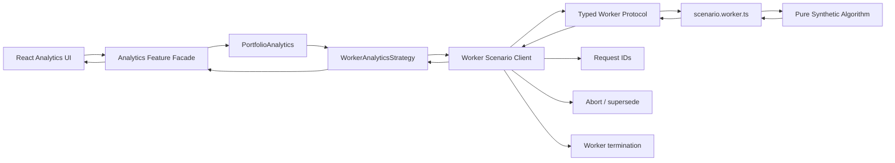

# Web Worker Offloading

> **Showcase scope:** one native module Worker, one typed request protocol, and one synthetic portfolio calculation. Demonstrate responsiveness, progress, cancellation, and stale-result protection. Worker pools, WebAssembly, `SharedArrayBuffer`, and Atomics remain discussion material only.

## 1. Short definition

**Web Worker Offloading** moves CPU-heavy JavaScript work from the browser’s main thread to a background Worker thread.

The main thread remains responsible for:

- React rendering;
- user input;
- scrolling;
- layout;
- paint;
- browser event handling.

The Worker thread handles:

- synthetic portfolio aggregation;
- large-file parsing;
- scenario calculations;
- data transformation;
- other CPU-intensive, DOM-independent work.

For the Financial Workspace demo:

```text
React UI
    ↓
PortfolioAnalytics contract
    ↓
WorkerAnalyticsStrategy
    ↓
Worker client
    ↓
scenario.worker.ts
    ↓
pure fake calculation
```

The key principle is:

> Move expensive computation off the main thread, but keep application ownership and workflow semantics in the main application.

A Worker changes **where** computation executes.

It does not automatically define:

- which Strategy is selected;
- which workflow state is active;
- who owns the process lifecycle;
- whether a capability may degrade safely.

---

## 2. Problem it solves

JavaScript in the browser normally executes on the main thread.

If a large calculation runs there:

```ts
const result =
  calculateLargeScenario(
    positions,
  );
```

the browser may be unable to respond promptly to:

- pointer events;
- keyboard input;
- button clicks;
- scrolling;
- animation;
- React rendering;
- accessibility interactions.

Typical symptoms:

- frozen interface;
- dropped frames;
- delayed input;
- “page unresponsive” warnings;
- progress indicators that do not animate;
- cancellation buttons that cannot be clicked;
- one heavy panel making the whole workspace feel broken.

The desired shape is:

```text
Main thread
    sends typed request

Worker thread
    performs CPU-heavy work

Main thread
    receives progress and final result
```

The application must also handle:

- request correlation;
- cancellation;
- stale responses;
- Worker failure;
- serialization cost;
- cleanup;
- deployment and chunk loading.

---

## 3. Architecture diagram



### Responsibility boundary

```text
Feature
    asks for a scenario result

Strategy
    selects the Worker-backed implementation

Worker client
    owns messaging, correlation, cancellation, cleanup

Worker entry point
    translates protocol messages into calculation calls

Pure algorithm
    performs deterministic fake computation
```

---

## 4. Demo scenario

The `/analytics` route demonstrates the difference between:

```text
DirectAnalyticsStrategy
    runs on the main thread

WorkerAnalyticsStrategy
    runs in a Web Worker
```

Both use the same fake input and pure calculation.

The presenter should be able to:

1. Generate a large local collection of fake positions.
2. Keep a small animation or interaction visible.
3. Run the Direct Strategy.
4. Observe that the UI becomes less responsive.
5. Run the Worker Strategy.
6. Observe that the UI remains interactive.
7. Display coarse progress.
8. Cancel the active Worker job.
9. Start a newer job before the older one finishes.
10. Show that stale Worker results are ignored.
11. Navigate away and verify Worker cleanup.

The calculation must be deliberately synthetic.

It must not resemble or claim to implement real:

- pricing;
- risk;
- capital;
- P&L;
- valuation;
- market-data logic.

---

## 5. Architecture and responsibilities

### Pure scenario algorithm

Responsibilities:

- accept plain serializable input;
- return a plain serializable result;
- contain no React, Redux, XState, or Worker APIs;
- support progress checkpoints;
- support cooperative cancellation when used directly;
- remain deterministic for tests.

It should not:

- access the DOM;
- access application globals;
- own request IDs;
- post messages;
- construct Workers;
- know runtime configuration.

---

### Worker protocol

Responsibilities:

- define request, progress, result, failure, and cancellation messages;
- include a request ID;
- preserve one stable versioned shape;
- avoid `unknown` payloads where possible;
- remain independent from React state.

---

### Worker client

Responsibilities:

- create the module Worker;
- send requests;
- correlate responses;
- route progress to the correct caller;
- reject or ignore stale responses;
- support cancellation;
- terminate the Worker on application stop;
- normalize Worker errors.

The Worker client is infrastructure.

It should be created by the Composition Root.

---

### Worker Strategy

Responsibilities:

- implement the same `PortfolioAnalytics` contract as the Direct Strategy;
- translate feature-level options to the Worker client;
- keep protocol details hidden;
- preserve result and cancellation semantics.

The Strategy should remain thin.

---

### Feature facade

Responsibilities:

- own the currently active analytics job;
- expose progress and result state;
- prevent stale completion from replacing a newer job;
- expose `run` and `cancel`;
- remain independent from Worker message types.

---

### Composition Root

Responsibilities:

- select Direct or Worker Strategy from Runtime Configuration;
- create the Worker client;
- inject the selected capability;
- expose the selection in diagnostics;
- register cleanup in `ApplicationRuntime.stop()`.

---

## 6. When Workers are a good fit

Strong candidates:

- large synthetic portfolio calculations;
- large CSV/JSON parsing;
- compression or decompression;
- image processing;
- large grouping and aggregation;
- scenario simulation;
- diffing large datasets;
- expensive normalization;
- WebAssembly execution;
- OffscreenCanvas rendering.

Poor candidates:

- waiting for an API;
- tiny calculations;
- DOM manipulation;
- React rendering;
- work dominated by network latency;
- operations where serialization costs exceed compute time;
- logic that requires direct access to browser-only main-thread APIs.

A useful rule:

> Use a Worker when the work is CPU-bound, independent from the DOM, and large enough to justify messaging overhead.

---

## 7. Main thread versus Worker thread

```text
Main thread
    React
    input
    layout
    paint
    browser APIs
    orchestration

Worker thread
    CPU-heavy calculation
    parsing
    aggregation
    transformation
```

Workers cannot directly access:

- `document`;
- DOM nodes;
- React components;
- most window-bound UI APIs.

Workers can access many platform APIs such as:

- `fetch`;
- `crypto`;
- timers;
- structured cloning;
- transferable objects;
- WebAssembly.

---

## 8. Minimal but complete implementation

### 8.1 Domain types

```ts
// packages/feature-analytics-lab/src/domain.ts

export type Position = Readonly<{
  id: string;
  quantity: number;
  baseValue: number;
  sensitivity: number;
}>;

export type ScenarioInput = Readonly<{
  scenarioId: string;
  shockPercent: number;
  positions: readonly Position[];
}>;

export type ScenarioProgress = Readonly<{
  completed: number;
  total: number;
}>;

export type ScenarioResult = Readonly<{
  scenarioId: string;
  positionCount: number;
  baseTotal: number;
  shockedTotal: number;
  change: number;
}>;
```

---

### 8.2 Pure synthetic algorithm

```ts
// packages/feature-analytics-lab/src/
// calculateScenarioSync.ts

import type {
  ScenarioInput,
  ScenarioProgress,
  ScenarioResult,
} from "./domain";

export function calculateScenarioSync(
  input: ScenarioInput,
  options: Readonly<{
    onProgress?(
      progress: ScenarioProgress,
    ): void;

    shouldCancel?():
      boolean;
  }> = {},
): ScenarioResult {
  const batchSize = 2_000;

  let baseTotal = 0;
  let shockedTotal = 0;

  for (
    let start = 0;
    start < input.positions.length;
    start += batchSize
  ) {
    if (
      options.shouldCancel?.()
    ) {
      throw new DOMException(
        "Scenario calculation cancelled.",
        "AbortError",
      );
    }

    const end = Math.min(
      start + batchSize,
      input.positions.length,
    );

    for (
      let index = start;
      index < end;
      index += 1
    ) {
      const position =
        input.positions[index];

      if (!position) {
        continue;
      }

      const base =
        position.quantity *
        position.baseValue;

      const shocked =
        base *
        (
          1 +
          (
            input.shockPercent /
            100
          ) *
          position.sensitivity
        );

      baseTotal += base;
      shockedTotal += shocked;
    }

    options.onProgress?.({
      completed: end,
      total: input.positions.length,
    });
  }

  return Object.freeze({
    scenarioId:
      input.scenarioId,

    positionCount:
      input.positions.length,

    baseTotal,

    shockedTotal,

    change:
      shockedTotal - baseTotal,
  });
}
```

The formula is generic and synthetic.

---

### 8.3 Worker protocol

```ts
// packages/shared-workers/src/protocol.ts

import type {
  ScenarioInput,
  ScenarioProgress,
  ScenarioResult,
} from "@demo/feature-analytics-lab";

export type ScenarioWorkerRequest =
  | Readonly<{
      type:
        "scenario.calculate";

      requestId:
        string;

      input:
        ScenarioInput;
    }>
  | Readonly<{
      type:
        "scenario.cancel";

      requestId:
        string;
    }>;

export type ScenarioWorkerResponse =
  | Readonly<{
      type:
        "scenario.progress";

      requestId:
        string;

      progress:
        ScenarioProgress;
    }>
  | Readonly<{
      type:
        "scenario.completed";

      requestId:
        string;

      result:
        ScenarioResult;
    }>
  | Readonly<{
      type:
        "scenario.cancelled";

      requestId:
        string;
    }>
  | Readonly<{
      type:
        "scenario.failed";

      requestId:
        string;

      message:
        string;
    }>;
```

All messages are serializable.

---

### 8.4 Worker entry point

```ts
// packages/shared-workers/src/scenario.worker.ts

/// <reference lib="webworker" />

import {
  calculateScenarioSync,
} from "@demo/feature-analytics-lab";

import type {
  ScenarioWorkerRequest,
  ScenarioWorkerResponse,
} from "./protocol";

const cancelledRequests =
  new Set<string>();

self.addEventListener(
  "message",
  (
    event:
      MessageEvent<
        ScenarioWorkerRequest
      >,
  ) => {
    const message =
      event.data;

    if (
      message.type ===
      "scenario.cancel"
    ) {
      cancelledRequests.add(
        message.requestId,
      );

      return;
    }

    void runCalculation(
      message,
    );
  },
);

async function runCalculation(
  request:
    Extract<
      ScenarioWorkerRequest,
      {
        type:
          "scenario.calculate";
      }
    >,
): Promise<void> {
  try {
    cancelledRequests.delete(
      request.requestId,
    );

    const result =
      calculateScenarioSync(
        request.input,
        {
          shouldCancel:
            () =>
              cancelledRequests.has(
                request.requestId,
              ),

          onProgress(
            progress,
          ) {
            post({
              type:
                "scenario.progress",

              requestId:
                request.requestId,

              progress,
            });
          },
        },
      );

    if (
      cancelledRequests.has(
        request.requestId,
      )
    ) {
      post({
        type:
          "scenario.cancelled",

        requestId:
          request.requestId,
      });

      return;
    }

    post({
      type:
        "scenario.completed",

      requestId:
        request.requestId,

      result,
    });
  } catch (error) {
    if (
      error instanceof DOMException &&
      error.name ===
      "AbortError"
    ) {
      post({
        type:
          "scenario.cancelled",

        requestId:
          request.requestId,
      });

      return;
    }

    post({
      type:
        "scenario.failed",

      requestId:
        request.requestId,

      message:
        error instanceof Error
          ? error.message
          : "Scenario calculation failed.",
    });
  } finally {
    cancelledRequests.delete(
      request.requestId,
    );
  }
}

function post(
  message:
    ScenarioWorkerResponse,
): void {
  self.postMessage(
    message,
  );
}
```

### Important limitation

A synchronous calculation running inside one Worker task cannot receive a cancellation message until the Worker’s event loop gets control again.

For genuinely responsive cancellation, the calculation should yield between batches.

That version is shown below.

---

## 9. Responsive chunked Worker calculation

```ts
// packages/shared-workers/src/
// runScenarioInBatches.ts

import type {
  ScenarioInput,
  ScenarioProgress,
  ScenarioResult,
} from "@demo/feature-analytics-lab";

export async function runScenarioInBatches(
  input: ScenarioInput,
  options: Readonly<{
    onProgress(
      progress: ScenarioProgress,
    ): void;

    shouldCancel():
      boolean;
  }>,
): Promise<ScenarioResult> {
  const batchSize = 2_000;

  let baseTotal = 0;
  let shockedTotal = 0;

  for (
    let start = 0;
    start < input.positions.length;
    start += batchSize
  ) {
    if (
      options.shouldCancel()
    ) {
      throw new DOMException(
        "Scenario calculation cancelled.",
        "AbortError",
      );
    }

    const end = Math.min(
      start + batchSize,
      input.positions.length,
    );

    for (
      let index = start;
      index < end;
      index += 1
    ) {
      const position =
        input.positions[index];

      if (!position) {
        continue;
      }

      const base =
        position.quantity *
        position.baseValue;

      const shocked =
        base *
        (
          1 +
          (
            input.shockPercent /
            100
          ) *
          position.sensitivity
        );

      baseTotal += base;
      shockedTotal += shocked;
    }

    options.onProgress({
      completed: end,
      total: input.positions.length,
    });

    /**
     * Yield to the Worker event loop so
     * cancellation messages can be handled.
     */
    await new Promise<void>(
      (resolve) => {
        setTimeout(
          resolve,
          0,
        );
      },
    );
  }

  return Object.freeze({
    scenarioId:
      input.scenarioId,

    positionCount:
      input.positions.length,

    baseTotal,

    shockedTotal,

    change:
      shockedTotal - baseTotal,
  });
}
```

The Worker entry point should call this asynchronous version for cancellation-aware execution.

---

## 10. Worker client

```ts
// packages/shared-workers/src/
// createWorkerScenarioClient.ts

import type {
  CalculateScenarioOptions,
  ScenarioInput,
  ScenarioResult,
} from "@demo/feature-analytics-lab";

import type {
  ScenarioWorkerRequest,
  ScenarioWorkerResponse,
} from "./protocol";

type PendingRequest =
  Readonly<{
    resolve(
      result:
        ScenarioResult,
    ): void;

    reject(
      error:
        unknown,
    ): void;

    onProgress?:
      CalculateScenarioOptions[
        "onProgress"
      ];

    cleanup():
      void;
  }>;

export function createWorkerScenarioClient() {
  const worker =
    new Worker(
      new URL(
        "./scenario.worker.ts",
        import.meta.url,
      ),
      {
        type:
          "module",
      },
    );

  const pending =
    new Map<
      string,
      PendingRequest
    >();

  worker.addEventListener(
    "message",
    (
      event:
        MessageEvent<
          ScenarioWorkerResponse
        >,
    ) => {
      const message =
        event.data;

      const request =
        pending.get(
          message.requestId,
        );

      if (!request) {
        return;
      }

      switch (
        message.type
      ) {
        case "scenario.progress":
          request
            .onProgress?.(
              message.progress,
            );
          return;

        case "scenario.completed":
          request.cleanup();

          request.resolve(
            message.result,
          );
          return;

        case "scenario.cancelled":
          request.cleanup();

          request.reject(
            new DOMException(
              "Scenario calculation cancelled.",
              "AbortError",
            ),
          );
          return;

        case "scenario.failed":
          request.cleanup();

          request.reject(
            new Error(
              message.message,
            ),
          );
          return;
      }
    },
  );

  worker.addEventListener(
    "error",
    (event) => {
      const error =
        new Error(
          event.message ||
          "Scenario Worker failed.",
        );

      for (
        const request
        of pending.values()
      ) {
        request.reject(
          error,
        );

        request.cleanup();
      }
    },
  );

  return {
    calculate(
      input:
        ScenarioInput,

      options:
        CalculateScenarioOptions = {},
    ):
      Promise<
        ScenarioResult
      > {
      const requestId =
        crypto.randomUUID();

      return new Promise(
        (
          resolve,
          reject,
        ) => {
          const abort =
            (): void => {
              post({
                type:
                  "scenario.cancel",

                requestId,
              });
            };

          const cleanup =
            (): void => {
              pending.delete(
                requestId,
              );

              options.signal
                ?.removeEventListener(
                  "abort",
                  abort,
                );
            };

          pending.set(
            requestId,
            {
              resolve,
              reject,
              onProgress:
                options.onProgress,
              cleanup,
            },
          );

          options.signal
            ?.addEventListener(
              "abort",
              abort,
              {
                once:
                  true,
              },
            );

          post({
            type:
              "scenario.calculate",

            requestId,

            input,
          });
        },
      );
    },

    stop(): void {
      worker.terminate();

      const error =
        new Error(
          "Scenario Worker stopped.",
        );

      for (
        const request
        of pending.values()
      ) {
        request.reject(
          error,
        );

        request.cleanup();
      }

      pending.clear();
    },
  };

  function post(
    message:
      ScenarioWorkerRequest,
  ): void {
    worker.postMessage(
      message,
    );
  }
}
```

---

## 11. Stale response protection

The Worker client correlates by request ID.

The feature facade should also reject stale results at the workflow level:

```text
job 1 starts
job 2 starts
job 1 finishes late
    ↓
job 1 result ignored
```

Example:

```ts
let currentJob = 0;

async function run(
  input:
    ScenarioInput,
): Promise<void> {
  const job =
    ++currentJob;

  const result =
    await analytics
      .calculateScenario(
        input,
      );

  if (
    job !== currentJob
  ) {
    return;
  }

  updateResult(
    result,
  );
}
```

This protects against:

- superseded calculations;
- navigation changes;
- stale Worker responses;
- delayed direct results.

---

## 12. Transferables

Structured cloning copies data between threads.

For large numeric datasets, copying may be expensive.

Transferable objects can move ownership without copying:

```ts
const values =
  new Float64Array(
    100_000,
  );

worker.postMessage(
  {
    type:
      "calculate",
    buffer:
      values.buffer,
  },
  [
    values.buffer,
  ],
);
```

After transfer:

```text
main thread buffer
    detached

Worker
    owns transferred buffer
```

Use transferables when:

- datasets are large;
- ownership transfer is acceptable;
- typed arrays fit the model;
- profiling shows copy cost matters.

Do not prematurely optimize a small demo.

The first implementation may use plain serializable objects for clarity.

---

## 13. Worker pools

One Worker is enough for this demo.

A Worker pool may help when:

- many independent jobs run concurrently;
- tasks are CPU-heavy;
- job queueing matters;
- available hardware concurrency is known;
- memory cost is acceptable.

Risks:

- too many Workers compete for CPU;
- each Worker has startup and memory cost;
- concurrency may worsen total responsiveness;
- cancellation and scheduling become more complex.

Do not add a pool until a measured need exists.

---

## 14. Backpressure

If the UI can submit work faster than the Worker can process it, define a policy.

Possible policies:

```text
queue every job
replace older pending job
cancel previous job
reject while busy
limit queue size
```

For the analytics demo:

> Starting a new scenario supersedes the previous scenario.

This keeps the presentation behavior simple.

---

## 15. Progress reporting

Progress should be coarse.

Bad:

```text
post one message per position
```

Good:

```text
post after each batch
```

Reasons:

- message overhead;
- React render frequency;
- memory pressure;
- noisy diagnostics.

The UI may render:

```text
38,000 / 100,000 positions processed
```

Do not imply that progress is perfectly linear if batch costs vary.

---

## 16. Cancellation options

### Cooperative cancellation

The Worker checks a cancellation flag between batches.

Benefits:

- Worker remains reusable;
- clean cancellation result;
- supports multiple logical jobs.

Cost:

- requires chunking and yielding.

---

### Terminate the Worker

```ts
worker.terminate();
```

Benefits:

- immediate;
- simple.

Cost:

- cancels all active work;
- Worker must be recreated;
- shared Worker state is lost.

For one active demo job, termination is acceptable.

For a reusable client, cooperative cancellation is more illustrative.

---

### Supersede and ignore

Allow old work to finish but ignore its result.

Benefits:

- simple.

Cost:

- wastes CPU.

Use only when jobs are short.

---

## 17. Error handling

Normalize Worker failures into feature-level errors.

Potential sources:

- module chunk failed to load;
- Worker syntax or evaluation error;
- protocol mismatch;
- calculation exception;
- serialization failure;
- termination during active job.

The feature should receive:

```ts
new Error(
  "Scenario calculation failed.",
);
```

Diagnostics may contain:

- request ID;
- Worker version;
- error category;
- elapsed time;
- active job count.

Do not expose stack traces or large input payloads in the UI.

---

## 18. Deployment and module loading

Vite module Worker:

```ts
new Worker(
  new URL(
    "./scenario.worker.ts",
    import.meta.url,
  ),
  {
    type:
      "module",
  },
);
```

This lets the bundler:

- discover the Worker entry;
- create a separate chunk;
- rewrite the final URL;
- include dependencies.

Deployment must retain compatible chunks long enough to avoid version mismatch during rolling releases.

A failed Worker chunk should degrade the analytics capability locally rather than crash the whole workspace.

---

## 19. Composition Root integration

```ts
// apps/financial-workspace/src/composition/
// createApplicationDependencies.ts

import {
  createWorkerScenarioClient,
} from "@demo/shared-workers";

import {
  createPortfolioAnalytics,
} from "@demo/feature-analytics-lab";

export function createApplicationDependencies(
  config:
    RuntimeConfig,
) {
  const workerClient =
    createWorkerScenarioClient();

  const portfolioAnalytics =
    createPortfolioAnalytics(
      config.analyticsStrategy,
      {
        workerClient,
      },
    );

  return {
    portfolioAnalytics,

    diagnostics: {
      analyticsStrategy:
        config.analyticsStrategy,

      analyticsExecution:
        config
          .analyticsStrategy ===
        "worker"
          ? "worker-thread"
          : "main-thread",
    },

    stop() {
      workerClient.stop();
    },
  };
}
```

If the Direct Strategy is selected, the first implementation may avoid creating the Worker client until needed.

---

## 20. Strategy relationship

```text
PortfolioAnalytics
    stable contract

DirectAnalyticsStrategy
    same-thread implementation

WorkerAnalyticsStrategy
    Worker-backed implementation
```

This demonstrates:

```text
Strategy
    Which implementation?

Worker Offloading
    Which execution thread?
```

Do not merge the concepts into one label.

---

## 21. State-machine relationship

A statechart may invoke the analytics capability:

```text
idle
    ↓ run
calculating
    ↓
completed / failed / cancelled
```

The statechart owns:

- workflow state;
- retry;
- cancellation intent;
- result progression.

The Worker owns:

- CPU-heavy execution.

---

## 22. Actor Model relationship

An analytics actor may own one calculation session:

```text
Scenario Actor
    receives run/cancel messages
    owns state and lifecycle
    invokes WorkerAnalyticsStrategy
```

The actor does not automatically run inside the Worker.

The Worker remains a separate execution environment.

---

## 23. Intent-prefetching relationship

The application may preload:

- analytics route chunk;
- Worker module chunk;
- safe fake input data.

Intent prefetching changes when loading begins.

It does not start the calculation.

---

## 24. Graceful degradation relationship

If Worker startup fails:

Possible safe responses:

```text
small dataset
    offer explicit Direct fallback

large dataset
    analytics unavailable

other workspace features
    remain usable
```

Bad:

```text
Worker fails
    silently run huge work on main thread
```

The fallback must be explicit and bounded.

---

## 25. `startTransition` is not a Worker

React `startTransition` may reprioritize React updates on the main thread.

It does not move computation to another thread.

```text
startTransition
    scheduling priority on main thread

Web Worker
    actual background-thread execution
```

A long synchronous calculation still blocks the browser even when started inside a transition.

---

## 26. WebAssembly

A Worker can host WebAssembly:

```text
React
    ↓
Worker client
    ↓
Worker
    ↓
WASM module
```

This may help when:

- the algorithm is suitable for WASM;
- CPU cost is high;
- data transfer is controlled.

Do not add WebAssembly to this demo. It would distract from the Worker boundary.

---

## 27. SharedArrayBuffer and Atomics

These enable shared memory between threads.

They require additional browser security headers and introduce significant complexity.

Use only when:

- shared-memory performance is proven necessary;
- cross-origin isolation is configured;
- data races are carefully controlled.

They are not needed for this presentation demo.

---

## 28. Testing

### Pure algorithm

```ts
it(
  "calculates a deterministic synthetic result",
  () => {
    const result =
      calculateScenarioSync({
        scenarioId:
          "scenario-1",

        shockPercent:
          2,

        positions: [
          {
            id:
              "position-1",

            quantity:
              10,

            baseValue:
              100,

            sensitivity:
              0.5,
          },
        ],
      });

    expect(
      result.positionCount,
    ).toBe(1);

    expect(
      result.baseTotal,
    ).toBe(1_000);
  },
);
```

---

### Worker protocol

```ts
it(
  "correlates responses by request ID",
  async () => {
    const fakeWorker =
      createFakeWorker();

    const client =
      createWorkerScenarioClientWith(
        fakeWorker,
      );

    const promise =
      client.calculate(
        input,
      );

    const request =
      fakeWorker
        .lastPostedMessage();

    fakeWorker.emitMessage({
      type:
        "scenario.completed",

      requestId:
        request.requestId,

      result:
        expectedResult,
    });

    await expect(
      promise,
    ).resolves.toEqual(
      expectedResult,
    );
  },
);
```

---

### Cancellation

```ts
it(
  "sends cancellation for the active request",
  async () => {
    const controller =
      new AbortController();

    const promise =
      client.calculate(
        input,
        {
          signal:
            controller.signal,
        },
      );

    controller.abort();

    expect(
      fakeWorker
        .postedMessages(),
    ).toContainEqual({
      type:
        "scenario.cancel",

      requestId:
        expect.any(
          String,
        ),
    });

    await expect(
      promise,
    ).rejects.toMatchObject({
      name:
        "AbortError",
    });
  },
);
```

Priority tests:

- pure calculation;
- Direct and Worker result equivalence;
- request correlation;
- progress routing;
- cancellation;
- superseding;
- stale-result rejection;
- Worker failure;
- cleanup on stop;
- no state update after disposal.

---

## 29. Browser integration tests

Verify in a real browser:

- Worker chunk loads;
- module Worker syntax works;
- progress messages arrive;
- cancellation works;
- navigation stops the Worker;
- UI remains responsive;
- old results do not overwrite new results;
- deployment paths are correct;
- CSP allows Worker execution.

The responsiveness demonstration should be tested manually as well as through automated assertions.

---

## 30. Performance measurement

Useful measurements:

```text
main-thread long tasks
input delay
frames dropped
calculation elapsed time
serialization time
Worker startup time
message count
memory use
```

Important nuance:

> A Worker may improve responsiveness without reducing total elapsed time.

The Worker adds overhead:

- startup;
- cloning;
- messaging;
- coordination.

Measure both:

```text
responsiveness
and
throughput
```

---

## 31. Best-fit use cases

Use Web Worker Offloading when:

- work is CPU-bound;
- work can be isolated from the DOM;
- the main thread must stay responsive;
- input and output can be serialized;
- jobs are large enough to justify overhead;
- cancellation or progress can be expressed in batches;
- Worker lifecycle can be owned explicitly.

Financial-workspace examples:

- fake scenario analytics;
- large trade-file parsing;
- large-grid aggregation;
- synthetic portfolio transformation;
- report preparation;
- chart data projection.

---

## 32. When not to use it

### Network waiting

Use normal async requests.

---

### Tiny calculations

Worker startup and messaging may cost more than the calculation.

---

### DOM work

Workers cannot manipulate the DOM directly.

---

### React rendering

React remains on the main thread.

---

### Hidden shared mutable state

Workers should communicate through messages or carefully controlled shared memory.

---

### One-off complexity without measurement

Do not add Worker infrastructure solely because a function “looks large.”

Profile first.

---

## 33. Benefits

### Responsive UI

Input, scrolling, and rendering remain available.

### Clear execution boundary

CPU-heavy work is isolated.

### Reusable pure algorithm

Direct and Worker Strategies share the same core logic.

### Cancellation and progress

Long-running work becomes an explicit process.

### Better fault containment

A Worker crash can be isolated to one capability.

### Strategy compatibility

The Worker-backed implementation fits behind a stable contract.

### Testability

Pure algorithm and protocol can be tested separately.

### Presentation value

The difference between logical concurrency and real threading becomes visible.

---

## 34. Disadvantages and risks

### Serialization overhead

Large object graphs may be expensive to clone.

Mitigation:

- use compact data;
- consider typed arrays;
- use transferables after measurement.

---

### More infrastructure

The application needs:

- protocol types;
- correlation;
- cancellation;
- cleanup;
- error normalization.

---

### Deployment complexity

Worker chunks must be served correctly.

---

### Debugging complexity

Main-thread and Worker logs are separated.

---

### Cancellation complexity

Synchronous Worker tasks cannot observe cancellation until they yield.

---

### Memory cost

Input may exist in both threads when cloned.

---

### API limitations

No direct DOM access.

---

### Stale result risk

Older jobs may finish after newer jobs.

Mitigation:

- request IDs;
- current-job checks;
- superseding policy.

---

### False performance assumptions

Workers do not guarantee faster completion.

They primarily protect responsiveness.

---

### Silent fallback risk

Falling back to the main thread may freeze the UI.

Mitigation:

- make fallback explicit;
- enforce dataset limits.

---

## 35. Relevant libraries

The demo can use native Worker APIs.

Possible libraries:

### Comlink

Provides proxy-style Worker RPC.

Useful when native message plumbing becomes distracting.

### `threads.js`

Provides Worker abstraction and pools.

Useful for more complex Worker topologies.

### WebAssembly tools

Useful for CPU-intensive algorithms.

### Comlink or Worker RPC libraries are optional

The implementation plan explicitly prefers native messaging first.

The architecture should remain visible.

---

## 36. Working demo location

Implemented repository locations:

```text
packages/feature-analytics-lab/
  src/
    model/
      analyticsTypes.ts
      calculateScenario.ts
      workerAnalyticsStrategy.ts
    worker/
      workerProtocol.ts
      scenario.worker.ts
      createWorkerScenarioClient.ts
    AnalyticsEntry.tsx
    index.ts

apps/financial-workspace/src/routes/
  AnalyticsRoute.tsx

apps/financial-workspace/src/composition/
  createApplication.ts
```

Primary visible demo:

```text
/analytics
```

Implementation status:

> Implemented with one native module Worker, progress events, cancellation,
> request IDs, stale UI-result protection, and application-lifetime cleanup.

---

## 37. Presentation talking points

### One-sentence explanation

> Web Worker Offloading moves CPU-heavy computation to another thread so React and browser interaction can remain responsive.

### Visual story

```text
main thread overloaded
    ↓
extract pure algorithm
    ↓
typed Worker protocol
    ↓
Worker-backed Strategy
    ↓
responsive UI
```

### Main distinction

> Actors provide logical concurrency. Workers provide physical background-thread execution.

### Demo sequence

1. Open `/analytics`.
2. Generate many fake positions.
3. Keep an animation running.
4. Run Direct Strategy.
5. Observe reduced responsiveness.
6. Run Worker Strategy.
7. Observe that interaction remains available.
8. Show progress messages.
9. Cancel the job.
10. Start two jobs quickly.
11. Show stale response rejection.
12. Navigate away and show cleanup.

### Questions to ask the audience

- Is the work CPU-bound?
- Is it independent from the DOM?
- Is it large enough to justify Worker overhead?
- What is the cancellation policy?
- Who owns the Worker lifecycle?
- How are stale results rejected?
- Is the fallback safe?
- Are we optimizing elapsed time or responsiveness?

### Common misconception

```text
Web Worker
≠ Actor Model
≠ React transition
≠ async function
≠ guaranteed faster execution
≠ automatic cancellation
```

---

## 38. Implementation checklist

### Algorithm

- [ ] Use only synthetic calculations.
- [ ] Keep the algorithm pure.
- [ ] Support coarse progress.
- [ ] Support cancellation checkpoints.
- [ ] Avoid browser globals.

### Protocol

- [ ] Define typed request and response unions.
- [ ] Include request IDs.
- [ ] Define progress, completion, failure, and cancellation.
- [ ] Avoid `unknown` payloads.
- [ ] Keep protocol versionable.

### Worker client

- [ ] Create a Vite module Worker.
- [ ] Correlate responses.
- [ ] Route progress.
- [ ] Handle Worker errors.
- [ ] Support cancellation.
- [ ] Reject pending jobs on stop.
- [ ] Terminate Worker during cleanup.

### Strategy

- [ ] Implement `PortfolioAnalytics`.
- [ ] Preserve Direct Strategy semantics.
- [ ] Hide protocol details.
- [ ] Expose selected execution mode in diagnostics.

### Feature

- [ ] Reject stale responses.
- [ ] Support superseding.
- [ ] Expose Run and Cancel.
- [ ] Show progress.
- [ ] Keep UI responsive.

### Verification

- [ ] Direct and Worker results are equivalent.
- [ ] Worker chunk loads in production build.
- [ ] Cancellation is tested.
- [ ] Cleanup is tested.
- [ ] UI remains interactive.
- [ ] Existing Part 1 routes remain intact.
- [ ] Package-root imports are used.

---

## 39. Final summary

Web Worker Offloading gives CPU-heavy browser work an explicit execution boundary.

For the Financial Workspace demo:

- the analytics feature depends on one stable contract;
- the Composition Root selects Direct or Worker Strategy;
- both Strategies use the same synthetic algorithm;
- the Worker client owns protocol, request IDs, progress, cancellation, and cleanup;
- the feature rejects stale results;
- the UI remains interactive during large local calculations;
- Worker failure degrades analytics locally rather than crashing the workspace;
- actors and statecharts may own workflow, but the Worker owns off-thread execution.

The success criterion is not simply that a `Worker` object exists.

The success criterion is:

> Expensive computation no longer blocks the main UI thread, while execution, cancellation, result ownership, and cleanup remain explicit and testable.
