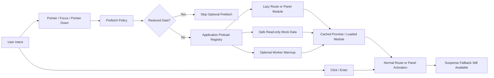

# Intent-Based Prefetching

> **Showcase scope:** one small application-owned preload registry for lazy route/panel modules and safe local read-only data. Trigger it from hover and keyboard focus, show its status in the UI, and retain normal lazy loading as the correctness path. No server rendering or framework-specific prefetch system is required.

## 1. Short definition

**Intent-Based Prefetching** starts loading a likely future resource when the user signals intent, before the actual navigation or activation occurs.

Typical intent signals include:

- pointer hover;
- keyboard focus;
- pointer down;
- an element becoming highly likely to be activated;
- a deliberate application prediction.

For the Financial Workspace demo:

```text
User hovers or focuses a route or panel
    ↓
application-owned preloader runs
    ↓
lazy module and safe read-only data begin loading
    ↓
user activates the route or panel
    ↓
normal navigation continues with less waiting
```

The key principle is:

> Start safe, likely work early without changing the correctness of normal loading.

Intent prefetching changes **when** loading begins.

It does not change:

- which module is ultimately rendered;
- whether Suspense remains necessary;
- whether a mutation is allowed;
- which Strategy is selected;
- whether a failed capability may degrade;
- the route’s correctness when no prefetch occurred.

---

## 2. Problem it solves

Code splitting reduces initial JavaScript cost, but it can move latency to the moment of interaction.

A lazy route may behave like this:

```text
user clicks Analytics
    ↓
download route chunk
    ↓
download Worker chunk
    ↓
load safe demo data
    ↓
render feature
```

The result may be:

- a noticeable loading fallback after every first click;
- delayed panel activation;
- a route that feels slow despite a small initial bundle;
- sequential module and data loading;
- avoidable waiting when the user’s next action was already obvious.

Loading everything eagerly is not a good solution because it increases:

- initial JavaScript;
- network use;
- parse and evaluation time;
- memory use;
- Worker startup cost;
- waste for features the user never opens.

Intent-Based Prefetching creates a middle ground:

```text
not eager for everyone
not delayed until activation
start when user intent is likely
```

---

## 3. Architecture diagram



### Responsibility boundary

```text
Trigger
    detects probable intent

Policy
    decides whether prefetch is permitted

Registry
    deduplicates and caches preload work

Feature preloader
    knows which safe resources belong together

Router or panel host
    performs actual activation

Suspense
    remains the correctness fallback
```

---

## 4. Demo scenario

The `/panels` route and primary navigation demonstrate intent prefetching.

The presenter can:

1. Open the page with several lazy panel cards.
2. Observe every resource in `idle`.
3. Hover one panel card.
4. See its module status change to `loading`, then `ready`.
5. Move away without activating it.
6. Focus another card using the keyboard.
7. Activate the prefetched card.
8. Compare the activation delay with a cold card.
9. Trigger the same hover repeatedly.
10. Show that only one preload promise runs.
11. Enable a simulated reduced-data preference.
12. Show that optional prefetch is skipped.
13. Activate the feature normally.
14. Show that Suspense still loads it correctly.

Resources that may be prefetched:

- lazy route module;
- lazy panel module;
- safe read-only mock data;
- Worker module initialization.

Resources that must not be prefetched:

- order submission;
- state-changing requests;
- approval actions;
- destructive commands;
- any mutation;
- sensitive data that the user may not otherwise request.

---

## 5. Architecture and responsibilities

### Preloader

A preloader is a small function:

```ts
type Preloader =
  () => Promise<unknown>;
```

Responsibilities:

- start one safe resource load;
- return the in-flight promise;
- be idempotent from the caller’s perspective;
- expose failure through rejection;
- avoid side effects beyond loading or warming.

Examples:

```text
load Analytics route chunk
load Scenario panel chunk
fetch fake read-only summary
initialize Worker module
```

---

### Preload registry

Responsibilities:

- register named preloaders;
- deduplicate repeated requests;
- cache successful promises;
- track `idle`, `loading`, `ready`, `failed`, or `skipped`;
- support diagnostics;
- optionally allow retry after failure;
- remain independent from React components.

It should not:

- navigate;
- render a component;
- perform mutations;
- decide application authorization;
- become a general service locator.

---

### Intent handler

Responsibilities:

- respond to hover, focus, or pointer down;
- apply timing and policy;
- call the registry;
- avoid unhandled promise rejections;
- remain optional to correctness.

---

### Prefetch policy

Responsibilities:

- read the typed runtime mode;
- respect reduced-data preferences;
- decide which trigger strengths are allowed;
- prevent expensive or unsafe preloads;
- remain explicit and testable.

Example modes:

```text
none
intent
```

Possible trigger strengths:

```text
focus
pointerenter
pointerdown
```

---

### Route or panel definition

Responsibilities:

- expose the canonical lazy import;
- expose the matching preloader;
- avoid defining two different import paths for the same module;
- optionally group safe module and data warming.

The lazy component and preloader must share the same import promise whenever possible.

---

### Suspense and normal loading

Responsibilities:

- remain the fallback when no prefetch happened;
- handle slow or failed module loading;
- preserve correctness on touch devices, keyboard navigation, and direct URLs;
- avoid relying on hover as a requirement.

---

## 6. Core design rules

### Rule 1: Prefetch is an optimization

The application must work when:

- the user clicks immediately;
- the user uses a touch device;
- the user opens a direct URL;
- reduced-data policy disables prefetch;
- the preload fails;
- no intent event occurs.

---

### Rule 2: Never prefetch mutations

Safe:

```text
lazy module
read-only mock summary
static metadata
Worker code
```

Unsafe:

```text
submit order
approve order
save layout
delete panel
change subscription
```

---

### Rule 3: Deduplicate

Repeated hover events must reuse one in-flight promise.

---

### Rule 4: Cache success

A successful prefetch should make later activation reuse the loaded resource.

---

### Rule 5: Failure remains recoverable

A failed prefetch must not permanently break normal activation.

The user’s click may retry through normal loading or an explicit retry policy.

---

### Rule 6: Respect user and network constraints

Skip optional prefetch when:

```ts
navigator.connection?.saveData ===
  true
```

The application may also consider effective connection type, but should not overfit to browser-specific signals.

---

## 7. Minimal but complete implementation

### 7.1 Preload types

```ts
// apps/financial-workspace/src/prefetch/types.ts

export type PreloadStatus =
  | "idle"
  | "loading"
  | "ready"
  | "failed"
  | "skipped";

export type Preloader =
  () => Promise<unknown>;

export type PreloadDiagnostic =
  Readonly<{
    id: string;
    status: PreloadStatus;
    startedAt?: number;
    completedAt?: number;
    attempts: number;
    errorMessage?: string;
    skipReason?: string;
  }>;
```

---

### 7.2 Registry contract

```ts
// apps/financial-workspace/src/prefetch/
// preloadRegistry.ts

import type {
  Preloader,
  PreloadDiagnostic,
} from "./types";

export interface PreloadRegistry {
  register(
    id: string,
    preloader: Preloader,
  ): void;

  preload(
    id: string,
    options?: Readonly<{
      retryFailed?: boolean;
    }>,
  ): Promise<unknown>;

  getDiagnostic(
    id: string,
  ): PreloadDiagnostic | undefined;

  getAllDiagnostics():
    readonly PreloadDiagnostic[];

  subscribe(
    listener: () => void,
  ): () => void;

  markSkipped(
    id: string,
    reason: string,
  ): void;
}
```

---

### 7.3 Registry implementation

```ts
// apps/financial-workspace/src/prefetch/
// createPreloadRegistry.ts

import type {
  PreloadDiagnostic,
  Preloader,
} from "./types";

import type {
  PreloadRegistry,
} from "./preloadRegistry";

type Entry = {
  preloader: Preloader;
  promise?: Promise<unknown>;
  diagnostic: PreloadDiagnostic;
};

export function createPreloadRegistry():
  PreloadRegistry {
  const entries =
    new Map<string, Entry>();

  const listeners =
    new Set<() => void>();

  function emit(): void {
    for (
      const listener
      of listeners
    ) {
      listener();
    }
  }

  return {
    register(
      id,
      preloader,
    ): void {
      if (
        entries.has(
          id,
        )
      ) {
        throw new Error(
          `Preloader "${id}" is already registered.`,
        );
      }

      entries.set(
        id,
        {
          preloader,
          diagnostic: {
            id,
            status:
              "idle",
            attempts:
              0,
          },
        },
      );

      emit();
    },

    preload(
      id,
      options = {},
    ): Promise<unknown> {
      const entry =
        entries.get(
          id,
        );

      if (!entry) {
        return Promise.reject(
          new Error(
            `Unknown preloader "${id}".`,
          ),
        );
      }

      if (
        entry.diagnostic
          .status ===
        "ready"
      ) {
        return (
          entry.promise ??
          Promise.resolve()
        );
      }

      if (
        entry.diagnostic
          .status ===
          "loading" &&
        entry.promise
      ) {
        return entry.promise;
      }

      if (
        entry.diagnostic
          .status ===
          "failed" &&
        !options.retryFailed
      ) {
        return Promise.reject(
          new Error(
            entry.diagnostic
              .errorMessage ??
            `Preloader "${id}" previously failed.`,
          ),
        );
      }

      const startedAt =
        performance.now();

      entry.diagnostic = {
        id,
        status:
          "loading",
        attempts:
          entry.diagnostic
            .attempts + 1,
        startedAt,
      };

      emit();

      const promise =
        Promise.resolve()
          .then(
            entry.preloader,
          )
          .then(
            (result) => {
              entry.diagnostic = {
                id,
                status:
                  "ready",
                attempts:
                  entry.diagnostic
                    .attempts,
                startedAt,
                completedAt:
                  performance.now(),
              };

              emit();

              return result;
            },
            (error:
              unknown) => {
              entry.promise =
                undefined;

              entry.diagnostic = {
                id,
                status:
                  "failed",
                attempts:
                  entry.diagnostic
                    .attempts,
                startedAt,
                completedAt:
                  performance.now(),
                errorMessage:
                  error instanceof Error
                    ? error.message
                    : "Prefetch failed.",
              };

              emit();

              throw error;
            },
          );

      entry.promise =
        promise;

      return promise;
    },

    getDiagnostic(
      id,
    ) {
      return entries
        .get(
          id,
        )
        ?.diagnostic;
    },

    getAllDiagnostics() {
      return Array.from(
        entries.values(),
        (entry) =>
          entry.diagnostic,
      );
    },

    subscribe(
      listener,
    ) {
      listeners.add(
        listener,
      );

      return () => {
        listeners.delete(
          listener,
        );
      };
    },

    markSkipped(
      id,
      reason,
    ): void {
      const entry =
        entries.get(
          id,
        );

      if (!entry) {
        return;
      }

      if (
        entry.diagnostic
          .status ===
          "loading" ||
        entry.diagnostic
          .status ===
          "ready"
      ) {
        return;
      }

      entry.diagnostic = {
        id,
        status:
          "skipped",
        attempts:
          entry.diagnostic
            .attempts,
        skipReason:
          reason,
      };

      emit();
    },
  };
}
```

The registry caches successful promises and clears a failed promise so a deliberate retry can run again.

---

## 8. Shared lazy import

A common mistake is defining two different dynamic imports.

Bad:

```ts
const AnalyticsRoute =
  lazy(
    () =>
      import(
        "./AnalyticsRoute"
      ),
  );

const preloadAnalytics =
  () =>
    import(
      "./AnalyticsRoute"
    );
```

Bundlers often deduplicate the module request, but the application has two unrelated functions and weaker control.

Prefer one canonical loader:

```ts
// apps/financial-workspace/src/routes/
// analyticsRouteModule.ts

export const loadAnalyticsRoute =
  () =>
    import(
      "./AnalyticsRoute"
    );

export const AnalyticsRoute =
  lazy(
    loadAnalyticsRoute,
  );
```

The registry uses `loadAnalyticsRoute`.

---

## 9. Route preloader definitions

```ts
// apps/financial-workspace/src/prefetch/
// routePreloaders.ts

import type {
  PreloadRegistry,
} from "./preloadRegistry";

import {
  loadAnalyticsRoute,
} from "../routes/analyticsRouteModule";

import {
  loadWorkflowsRoute,
} from "../routes/workflowsRouteModule";

import {
  loadPanelsRoute,
} from "../routes/panelsRouteModule";

export function registerRoutePreloaders(
  registry:
    PreloadRegistry,
): void {
  registry.register(
    "route:analytics",
    loadAnalyticsRoute,
  );

  registry.register(
    "route:workflows",
    loadWorkflowsRoute,
  );

  registry.register(
    "route:panels",
    loadPanelsRoute,
  );
}
```

---

## 10. Grouped preloader

A feature may need several safe resources.

```ts
// apps/financial-workspace/src/prefetch/
// analyticsPreloader.ts

export function createAnalyticsPreloader(
  dependencies:
    Readonly<{
      loadRoute():
        Promise<unknown>;

      loadFakePositions():
        Promise<unknown>;

      warmWorker():
        Promise<unknown>;
    }>,
) {
  return async (): Promise<void> => {
    await Promise.all([
      dependencies
        .loadRoute(),

      dependencies
        .loadFakePositions(),

      dependencies
        .warmWorker(),
    ]);
  };
}
```

Use grouped preloading only when the resources are strongly associated and all are safe.

Do not warm a Worker merely because every navigation link was hovered.

---

## 11. Runtime prefetch policy

```ts
// apps/financial-workspace/src/prefetch/
// prefetchPolicy.ts

import type {
  PrefetchMode,
} from "@demo/shared-runtime-config";

export type IntentTrigger =
  | "pointerenter"
  | "focus"
  | "pointerdown";

export type PrefetchDecision =
  | Readonly<{
      allowed:
        true;
    }>
  | Readonly<{
      allowed:
        false;

      reason:
        string;
    }>;

export function decidePrefetch(
  input: Readonly<{
    mode:
      PrefetchMode;

    trigger:
      IntentTrigger;

    saveData:
      boolean;
  }>,
): PrefetchDecision {
  if (
    input.mode ===
    "none"
  ) {
    return {
      allowed:
        false,
      reason:
        "Runtime prefetch mode is disabled.",
    };
  }

  if (
    input.saveData &&
    input.trigger !==
      "pointerdown"
  ) {
    return {
      allowed:
        false,
      reason:
        "Reduced-data preference is enabled.",
    };
  }

  return {
    allowed:
      true,
  };
}
```

`pointerdown` may be treated as stronger intent than hover because activation is likely imminent.

The exact policy should remain explicit.

---

## 12. Reading reduced-data preference

```ts
// apps/financial-workspace/src/prefetch/
// networkPreferences.ts

type NavigatorWithConnection =
  Navigator &
  Readonly<{
    connection?: Readonly<{
      saveData?: boolean;
      effectiveType?: string;
    }>;
  }>;

export function prefersReducedData():
  boolean {
  const navigatorWithConnection =
    navigator as
      NavigatorWithConnection;

  return (
    navigatorWithConnection
      .connection
      ?.saveData ===
    true
  );
}
```

This API is not available in every browser.

Absence means “unknown,” not guaranteed fast connectivity.

---

## 13. Intent handler factory

```ts
// apps/financial-workspace/src/prefetch/
// createIntentHandlers.ts

import type {
  PreloadRegistry,
} from "./preloadRegistry";

import type {
  PrefetchMode,
} from "@demo/shared-runtime-config";

import {
  decidePrefetch,
} from "./prefetchPolicy";

import {
  prefersReducedData,
} from "./networkPreferences";

export function createIntentHandlers(
  input: Readonly<{
    id:
      string;

    mode:
      PrefetchMode;

    registry:
      PreloadRegistry;
  }>,
) {
  function request(
    trigger:
      | "pointerenter"
      | "focus"
      | "pointerdown",
  ): void {
    const decision =
      decidePrefetch({
        mode:
          input.mode,

        trigger,

        saveData:
          prefersReducedData(),
      });

    if (
      !decision.allowed
    ) {
      input.registry
        .markSkipped(
          input.id,
          decision.reason,
        );

      return;
    }

    void input.registry
      .preload(
        input.id,
        {
          retryFailed:
            trigger ===
            "pointerdown",
        },
      )
      .catch(
        () => {
          /**
           * Failure is visible through
           * registry diagnostics.
           * Normal activation remains
           * responsible for fallback.
           */
        },
      );
  }

  return {
    onPointerEnter() {
      request(
        "pointerenter",
      );
    },

    onFocus() {
      request(
        "focus",
      );
    },

    onPointerDown() {
      request(
        "pointerdown",
      );
    },
  };
}
```

---

## 14. Navigation link integration

```tsx
// apps/financial-workspace/src/navigation/
// PrefetchingNavLink.tsx

import {
  NavLink,
} from "react-router-dom";

import type {
  ReactNode,
} from "react";

export function PrefetchingNavLink({
  to,
  children,
  intent,
}: {
  to:
    string;

  children:
    ReactNode;

  intent:
    Readonly<{
      onPointerEnter():
        void;

      onFocus():
        void;

      onPointerDown():
        void;
    }>;
}) {
  return (
    <NavLink
      to={
        to
      }
      onPointerEnter={
        intent
          .onPointerEnter
      }
      onFocus={
        intent
          .onFocus
      }
      onPointerDown={
        intent
          .onPointerDown
      }
    >
      {children}
    </NavLink>
  );
}
```

Keyboard focus is first-class.

Hover alone is insufficient.

---

## 15. Delay before hover prefetch

Pointer movement across navigation may trigger accidental preloads.

A small delay can improve precision.

```ts
// apps/financial-workspace/src/prefetch/
// createDelayedHoverIntent.ts

export function createDelayedHoverIntent(
  preload:
    () => void,

  delayMs =
    80,
) {
  let timer:
    ReturnType<
      typeof setTimeout
    > | undefined;

  return {
    onPointerEnter() {
      timer =
        setTimeout(
          preload,
          delayMs,
        );
    },

    onPointerLeave() {
      if (
        timer !==
        undefined
      ) {
        clearTimeout(
          timer,
        );

        timer =
          undefined;
      }
    },
  };
}
```

The demo may expose this timing in diagnostics.

Do not add a long delay that removes the latency benefit.

---

## 16. Panel definition

```ts
// packages/feature-dynamic-panels/src/
// panelDefinition.ts

import type {
  ComponentType,
} from "react";

export type PanelModule =
  Readonly<{
    default:
      ComponentType<
        PanelProps
      >;
  }>;

export type PanelDefinition =
  Readonly<{
    id:
      string;

    title:
      string;

    loadModule():
      Promise<
        PanelModule
      >;

    preloadData?():
      Promise<unknown>;
  }>;
```

---

## 17. Panel preloader

```ts
// packages/feature-dynamic-panels/src/
// createPanelPreloader.ts

import type {
  PanelDefinition,
} from "./panelDefinition";

export function createPanelPreloader(
  definition:
    PanelDefinition,
): () => Promise<void> {
  return async () => {
    const resources = [
      definition
        .loadModule(),
    ];

    if (
      definition
        .preloadData
    ) {
      resources.push(
        definition
          .preloadData(),
      );
    }

    await Promise.all(
      resources,
    );
  };
}
```

---

## 18. Panel card integration

```tsx
// packages/feature-dynamic-panels/src/
// PanelCatalogCard.tsx

export function PanelCatalogCard({
  title,
  intent,
  onOpen,
}: {
  title:
    string;

  intent:
    IntentHandlers;

  onOpen():
    void;
}) {
  return (
    <button
      type=
        "button"
      onPointerEnter={
        intent
          .onPointerEnter
      }
      onFocus={
        intent
          .onFocus
      }
      onPointerDown={
        intent
          .onPointerDown
      }
      onClick={
        onOpen
      }
    >
      Add
      {" "}
      {title}
    </button>
  );
}
```

The `onClick` path must work even when all intent handlers are removed.

---

## 19. Safe mock-data preload cache

Module caching is handled by the bundler.

Read-only data needs an application cache.

```ts
// packages/feature-dynamic-panels/src/
// createReadOnlyResource.ts

export function createReadOnlyResource<
  TResult,
>(
  load:
    () => Promise<TResult>,
) {
  let promise:
    Promise<TResult> | undefined;

  let value:
    TResult | undefined;

  return {
    preload():
      Promise<TResult> {
      if (
        value !==
        undefined
      ) {
        return Promise.resolve(
          value,
        );
      }

      promise ??=
        load().then(
          (result) => {
            value =
              result;

            return result;
          },
          (error) => {
            promise =
              undefined;

            throw error;
          },
        );

      return promise;
    },

    read():
      Promise<TResult> {
      return this.preload();
    },

    clear():
      void {
      promise =
        undefined;

      value =
        undefined;
    },
  };
}
```

This demo cache is deliberately small.

Do not build a full query library.

If the application already has a query cache, use its safe prefetch API instead.

---

## 20. Worker warmup

Worker warmup may mean:

- load the Worker module chunk;
- create the Worker;
- perform a small handshake;
- avoid starting the expensive calculation.

```ts
export interface WorkerWarmup {
  warm():
    Promise<void>;

  stop():
    void;
}
```

Do not warm every Worker eagerly.

Use intent or a post-main-view optional bootstrap task when the analytics route is likely.

---

## 21. Diagnostics model

```ts
export type PrefetchViewModel =
  Readonly<{
    id:
      string;

    label:
      string;

    status:
      PreloadStatus;

    attempts:
      number;

    durationMs?:
      number;

    skipReason?:
      string;

    errorMessage?:
      string;
  }>;
```

The `/panels` route should make these states visible:

```text
Idle
Loading
Ready
Failed
Skipped
```

This visibility is for the architecture demo.

A production UI may keep these diagnostics behind a development tool.

---

## 22. React diagnostics adapter

```tsx
// apps/financial-workspace/src/prefetch/
// PrefetchDiagnostics.tsx

import {
  useSyncExternalStore,
} from "react";

export function PrefetchDiagnostics({
  registry,
}: {
  registry:
    PreloadRegistry;
}) {
  const diagnostics =
    useSyncExternalStore(
      registry.subscribe,

      registry
        .getAllDiagnostics,

      registry
        .getAllDiagnostics,
    );

  return (
    <section>
      <h2>
        Prefetch Status
      </h2>

      <ul>
        {diagnostics.map(
          (item) => (
            <li
              key={
                item.id
              }
            >
              <strong>
                {item.id}
              </strong>
              {": "}
              {item.status}
            </li>
          ),
        )}
      </ul>
    </section>
  );
}
```

The registry must return stable snapshots or the adapter should memoize projections to satisfy `useSyncExternalStore` expectations.

---

## 23. Stable snapshot implementation

```ts
export function createPreloadRegistry():
  PreloadRegistry {
  let snapshot:
    readonly PreloadDiagnostic[] =
      [];

  function rebuildSnapshot():
    void {
    snapshot =
      Object.freeze(
        Array.from(
          entries.values(),
          (entry) =>
            entry.diagnostic,
        ),
      );
  }

  function emit():
    void {
    rebuildSnapshot();

    for (
      const listener
      of listeners
    ) {
      listener();
    }
  }

  return {
    // ...

    getAllDiagnostics() {
      return snapshot;
    },
  };
}
```

This avoids returning a new array on every `getSnapshot()` call.

---

## 24. Composition Root integration

```ts
// apps/financial-workspace/src/composition/
// createApplicationDependencies.ts

export function createApplicationDependencies(
  config:
    RuntimeConfig,
) {
  const preloadRegistry =
    createPreloadRegistry();

  registerRoutePreloaders(
    preloadRegistry,
  );

  registerPanelPreloaders(
    preloadRegistry,
  );

  return {
    preloadRegistry,

    prefetchMode:
      config.prefetchMode,

    diagnostics: {
      prefetchMode:
        config.prefetchMode,
    },

    stop() {
      /**
       * Registry-owned transient timers or
       * Worker warmups should be stopped here.
       */
    },
  };
}
```

Runtime configuration selects policy.

The Composition Root creates the registry.

Features receive narrow prefetch helpers or intent handlers.

---

## 25. Router integration

The implementation should work with the currently installed React Router version.

Do not depend on a router prefetch API that is not available.

Use application-owned preload functions:

```ts
const loadAnalyticsRoute =
  () =>
    import(
      "./AnalyticsRoute"
    );

const routeObject = {
  path:
    "/analytics",

  lazy:
    async () => {
      const module =
        await loadAnalyticsRoute();

      return {
        Component:
          module
            .AnalyticsRoute,
      };
    },
};
```

The navigation preloader calls the same `loadAnalyticsRoute`.

---

## 26. Suspense remains required

Prefetch may be:

- skipped;
- too slow;
- cancelled;
- failed;
- unsupported;
- triggered too late.

Therefore:

```tsx
<Suspense
  fallback={
    <RouteLoading />
  }
>
  <AnalyticsRoute />
</Suspense>
```

Intent prefetching reduces the chance and duration of the fallback.

It does not remove it.

---

## 27. Error handling

A preload failure should:

- appear in diagnostics;
- avoid an unhandled rejection;
- leave normal activation available;
- optionally retry on stronger intent;
- never crash the current route.

Example progression:

```text
pointerenter
    ↓
prefetch fails
    ↓
status = Failed
    ↓
pointerdown
    ↓
retry
    ↓
click
    ↓
normal loader or Error Boundary
```

The actual route or panel remains responsible for user-visible loading and failure states.

---

## 28. Retry policy

Suggested policy:

```text
hover failure
    do not retry repeatedly

focus failure
    do not retry repeatedly

pointerdown
    allow one retry

actual activation
    use normal loader behavior
```

Avoid automatic retry loops caused by repeated pointer events.

---

## 29. Cancellation

Module imports generally cannot be cancelled after they begin.

Read-only data requests may use `AbortSignal`.

However, cancelling every hover preload when the pointer leaves may create waste:

```text
enter
start request
leave
abort
enter again
restart request
```

Recommended initial policy:

- delay weak hover intent briefly;
- once safe prefetch starts, allow it to finish;
- deduplicate future requests;
- cancel only expensive preloads with clear benefit.

---

## 30. Cache lifetime

Possible policies:

```text
session lifetime
route lifetime
time-limited
memory-pressure aware
manual clear
```

For this demo:

- module promises live for the page session;
- safe fake-data resources may use a short application-owned cache;
- diagnostics may expose cache status;
- no persistent browser cache layer is required.

---

## 31. Resource budgeting

Prefetching is not free.

Costs include:

- bandwidth;
- memory;
- parse and evaluation;
- server work;
- Worker startup;
- battery use.

Budget by:

- limiting prefetch to likely actions;
- avoiding broad menus that preload everything;
- delaying hover;
- respecting reduced-data preferences;
- separating module load from expensive data warming;
- prefetching one likely next destination rather than all possible routes.

---

## 32. Touch devices

Touch devices may not provide meaningful hover.

Use:

- focus where available;
- pointer down as strong intent;
- normal activation fallback;
- optional application predictions.

Never make hover a requirement.

---

## 33. Keyboard accessibility

Keyboard focus should trigger the same safe prefetch as hover.

```tsx
onFocus={
  intent.onFocus
}
```

This creates equal performance behavior for keyboard navigation.

Do not move focus automatically as part of prefetch.

---

## 34. Server and privacy considerations

Even read-only prefetch can reveal user intent to a server.

Examples:

- hovering a sensitive route;
- focusing a restricted workflow;
- warming data for a panel the user never opens.

For this demo, all data is local and fake.

In production:

- evaluate privacy impact;
- avoid logging every hover as product intent;
- avoid fetching sensitive data prematurely;
- keep authorization enforced by the server;
- avoid exposing data merely because a module was prefetched.

---

## 35. Relationship to preload and preconnect hints

Browser hints include:

```html
<link rel="preload">
<link rel="modulepreload">
<link rel="prefetch">
<link rel="preconnect">
```

These may help static resource planning.

Application-owned intent prefetching is different:

```text
browser hint
    declarative network hint

application preloader
    user-intent-aware module/data warmup
```

Both may coexist.

---

## 36. Relationship to speculative loading

Speculative loading predicts likely future navigation.

Intent-Based Prefetching is a conservative form of speculation based on observable interaction.

Confidence ladder:

```text
page visible
    weak signal

pointerenter
    moderate signal

focus
    moderate signal

pointerdown
    strong signal

click
    activation
```

The stronger the signal, the more expensive the permitted preload may be.

---

## 37. Testing

### Deduplication

```ts
it(
  "deduplicates repeated preload calls",
  async () => {
    let calls = 0;

    const registry =
      createPreloadRegistry();

    registry.register(
      "route:analytics",
      async () => {
        calls += 1;

        return {};
      },
    );

    await Promise.all([
      registry.preload(
        "route:analytics",
      ),

      registry.preload(
        "route:analytics",
      ),

      registry.preload(
        "route:analytics",
      ),
    ]);

    expect(
      calls,
    ).toBe(1);
  },
);
```

---

### Cache success

```ts
it(
  "reuses a completed preload",
  async () => {
    let calls = 0;

    registry.register(
      "panel:scenario",
      async () => {
        calls += 1;
      },
    );

    await registry.preload(
      "panel:scenario",
    );

    await registry.preload(
      "panel:scenario",
    );

    expect(
      calls,
    ).toBe(1);
  },
);
```

---

### Failure and retry

```ts
it(
  "allows an explicit retry after failure",
  async () => {
    let calls = 0;

    registry.register(
      "route:panels",
      async () => {
        calls += 1;

        if (
          calls ===
          1
        ) {
          throw new Error(
            "Synthetic chunk failure.",
          );
        }
      },
    );

    await expect(
      registry.preload(
        "route:panels",
      ),
    ).rejects.toThrow();

    await expect(
      registry.preload(
        "route:panels",
        {
          retryFailed:
            true,
        },
      ),
    ).resolves.toBeUndefined();

    expect(
      calls,
    ).toBe(2);
  },
);
```

---

### Reduced-data policy

```ts
it(
  "skips hover prefetch when reduced data is enabled",
  () => {
    expect(
      decidePrefetch({
        mode:
          "intent",

        trigger:
          "pointerenter",

        saveData:
          true,
      }),
    ).toEqual({
      allowed:
        false,

      reason:
        "Reduced-data preference is enabled.",
    });
  },
);
```

Priority tests:

- registration;
- duplicate registration;
- unknown ID;
- in-flight deduplication;
- success caching;
- failure diagnostics;
- explicit retry;
- disabled runtime mode;
- reduced-data policy;
- pointer-down override policy;
- no mutation preload;
- normal activation without prefetch.

---

## 38. Browser integration tests

Verify:

- hover triggers module request;
- keyboard focus triggers module request;
- repeated hover does not duplicate requests;
- click works without prior hover;
- direct URL works;
- touch activation works;
- Suspense remains correct;
- reduced-data mode skips optional work;
- failed prefetch does not crash the current route;
- production chunks use correct URLs.

---

## 39. Measuring effectiveness

Useful metrics:

```text
prefetch started
prefetch completed
prefetch used
prefetch unused
activation wait time
bytes prefetched
failure count
skip reason
```

Important ratio:

```text
prefetch usefulness =
    used prefetched resources
    ÷
    completed prefetched resources
```

A very low usefulness ratio suggests waste.

For this local demo, diagnostics are enough.

---

## 40. Best-fit use cases

Use Intent-Based Prefetching when:

- routes or panels are lazy;
- first activation has noticeable latency;
- user intent can be observed;
- resources are safe to load early;
- the same resource cache is reused on activation;
- initial-bundle size must remain small;
- normal loading remains correct.

Examples:

- analytics route;
- workflow lab route;
- dynamic panels;
- Worker-backed analytics module;
- safe read-only fake summaries;
- likely next workflow step UI.

---

## 41. When not to use it

### Mutations

Never prefetch a command.

---

### Tiny resources

The added policy and registry may not be worthwhile.

---

### Very low-confidence intent

Do not load every item merely because it is visible.

---

### Sensitive data

Avoid fetching data the user may never request.

---

### Expensive server queries

Hover should not trigger costly backend work casually.

---

### Resources that cannot be reused

A preload that normal activation ignores is pure waste.

---

### Replacement for caching

Prefetch timing and cache semantics are separate concerns.

---

## 42. Benefits

### Lower perceived latency

Likely resources start before activation.

### Small initial bundle

Features remain lazy.

### Progressive optimization

Normal loading remains unchanged.

### Accessible performance

Keyboard focus receives the same benefit as hover.

### Explicit policy

Reduced-data and trigger confidence are visible.

### Deduplication

Repeated intent does not duplicate work.

### Presentation value

The timing difference is easy to demonstrate.

### Integration with Workers

Worker code may warm before analytics activation.

---

## 43. Disadvantages and risks

### Wasted bandwidth

Users may never activate the prefetched feature.

Mitigation:

- use high-confidence signals;
- delay hover;
- measure usefulness.

---

### Memory and evaluation cost

Loaded modules consume browser resources.

---

### Accidental server load

Read-only requests may still be expensive.

---

### Privacy leakage

Prefetch may reveal probable user intent.

---

### Complex cache semantics

Module, data, and Worker warmup caches differ.

---

### Browser API variability

Reduced-data signals are not universally available.

---

### Error duplication

Prefetch failure and activation failure may be reported twice.

Mitigation:

- keep prefetch diagnostics separate;
- let normal activation own user-visible errors.

---

### Over-prefetching menus

A user moving across navigation may load many routes.

Mitigation:

- delayed hover;
- prioritization;
- resource budgets.

---

### False confidence

A prefetched module does not guarantee ready data or healthy dependencies.

---

## 44. Relevant libraries

The pattern can be implemented with:

- native dynamic `import()`;
- React `lazy`;
- React `Suspense`;
- React Router;
- browser Network Information API where available;
- an application-owned registry.

Possible libraries and frameworks may provide:

- route prefetching;
- query prefetch APIs;
- preload helpers;
- resource caches.

Examples include:

- TanStack Query;
- React Router data APIs;
- Next.js routing;
- Remix;
- loadable component libraries.

The implementation plan requires compatibility with the currently installed router version, so the first implementation should remain application-owned and explicit.

---

## 45. Relationship to the other patterns

### Runtime Configuration

Runtime configuration selects:

```text
prefetchMode = none
or
prefetchMode = intent
```

It does not perform preloading.

---

### Composition Root

The Composition Root:

- creates the registry;
- registers preloaders;
- injects the runtime policy;
- owns Worker warmup cleanup;
- exposes diagnostics.

---

### Strategy Pattern

Prefetch may warm the module needed by a selected Strategy.

It does not select the Strategy.

---

### State Machines and Statecharts

A workflow may preload likely next-step UI.

The machine still decides whether that transition is valid.

---

### Actor Model

Prefetching a feature does not create its runtime actors.

Actors should start only when their process is actually needed.

---

### Declarative Bootstrap Task Graph

Startup may preload the core route as an optional task.

Intent prefetching handles later user-driven probable activation.

```text
Bootstrap preload
    startup prediction

Intent prefetch
    interaction-based prediction
```

---

### Web Worker Offloading

Intent may warm a Worker-backed analytics module.

The Worker calculation should not start until requested.

---

### Graceful Capability Degradation

A prefetch failure is not necessarily a capability failure.

Only actual activation determines whether the capability can load, retry, degrade, or fail.

---

## 46. Working demo location

Planned repository locations:

```text
apps/financial-workspace/src/prefetch/
  types.ts
  preloadRegistry.ts
  createPreloadRegistry.ts
  prefetchPolicy.ts
  networkPreferences.ts
  createIntentHandlers.ts
  createDelayedHoverIntent.ts
  routePreloaders.ts
  analyticsPreloader.ts
  PrefetchDiagnostics.tsx

apps/financial-workspace/src/navigation/
  PrefetchingNavLink.tsx

apps/financial-workspace/src/routes/
  analyticsRouteModule.ts
  workflowsRouteModule.ts
  panelsRouteModule.ts

packages/feature-dynamic-panels/src/
  panelDefinition.ts
  createPanelPreloader.ts
  PanelCatalogCard.tsx
  createReadOnlyResource.ts

apps/financial-workspace/src/routes/
  PanelsRoute.tsx
```

Primary visible demo:

```text
/panels
```

Navigation may demonstrate route-level prefetching across the whole application.

Status during documentation phase:

> Planned. Source paths become definitive after Phase 7 implementation.

---

## 47. Presentation talking points

### One-sentence explanation

> Intent-Based Prefetching keeps features lazy but starts safe loading when hover, focus, or pointer-down suggests the user is likely to activate them.

### Visual story

```text
click
    ↓
cold load
    ↓
waiting

becomes

intent
    ↓
warm module and safe data
    ↓
click
    ↓
faster activation
```

### Main distinction

> Prefetching changes when loading starts. Suspense still guarantees correctness.

### Demo sequence

1. Open `/panels`.
2. Show every resource as Idle.
3. Hover a panel.
4. Show Loading then Ready.
5. Hover it repeatedly.
6. Show one attempt.
7. Activate it.
8. Compare with a cold panel.
9. Focus another panel with keyboard.
10. Show the same behavior.
11. Enable reduced-data simulation.
12. Show hover prefetch skipped.
13. Click anyway.
14. Show normal loading still works.
15. Simulate prefetch failure.
16. Show activation retry or normal Error Boundary.

### Questions to ask the audience

- Which user signals indicate real intent?
- Which resources are safe to load early?
- Does activation reuse the prefetched resource?
- What is the bandwidth budget?
- How is keyboard navigation handled?
- What happens when reduced-data mode is enabled?
- Can prefetch failure remain invisible to correctness?
- Are we prefetching data or accidentally executing work?

### Common misconception

```text
Intent prefetching
≠ eager loading
≠ mutation prediction
≠ replacement for Suspense
≠ route activation
≠ guaranteed zero wait
```

---

## 48. Implementation checklist

### Registry

- [ ] Register named preloaders.
- [ ] Reject duplicate IDs.
- [ ] Deduplicate in-flight work.
- [ ] Cache success.
- [ ] Record failure.
- [ ] Support controlled retry.
- [ ] Expose stable diagnostics snapshots.

### Policy

- [ ] Read typed `prefetchMode`.
- [ ] Support `none` and `intent`.
- [ ] Respect reduced-data preference.
- [ ] Treat pointer down as stronger intent.
- [ ] Avoid broad low-confidence prefetching.
- [ ] Document resource budgets.

### Triggers

- [ ] Add `pointerenter`.
- [ ] Add keyboard `focus`.
- [ ] Add optional `pointerdown`.
- [ ] Add small hover delay where useful.
- [ ] Keep click path independent.

### Resources

- [ ] Share canonical lazy import.
- [ ] Prefetch only safe modules and reads.
- [ ] Never prefetch mutations.
- [ ] Avoid sensitive data.
- [ ] Warm Worker without starting calculation.
- [ ] Ensure activation reuses cached work.

### React and router

- [ ] Keep Suspense fallback.
- [ ] Keep normal direct-route loading.
- [ ] Work with installed router version.
- [ ] Add visible diagnostics to `/panels`.
- [ ] Avoid orchestration in card components.

### Verification

- [ ] Hover starts loading.
- [ ] Focus starts loading.
- [ ] Repeated intent deduplicates.
- [ ] Click works without prefetch.
- [ ] Reduced-data mode skips optional work.
- [ ] Failed prefetch does not crash current UI.
- [ ] Production chunks resolve correctly.
- [ ] Existing Part 1 routes remain intact.

---

## 49. Final summary

Intent-Based Prefetching improves perceived performance without abandoning lazy loading.

For the Financial Workspace demo:

- route and panel modules remain lazy;
- hover, focus, and pointer down express different levels of intent;
- an application-owned registry deduplicates and caches preload promises;
- Runtime Configuration selects the policy;
- the Composition Root registers resources;
- safe read-only data and Worker modules may warm early;
- mutations are never prefetched;
- reduced-data preferences are respected;
- normal navigation and Suspense remain fully correct;
- failed prefetch does not become an application failure.

The success criterion is not simply that a dynamic import runs on hover.

The success criterion is:

> Likely, safe resources begin loading early through an explicit, deduplicated policy while normal activation remains correct, accessible, and resilient when no prefetch occurs.
