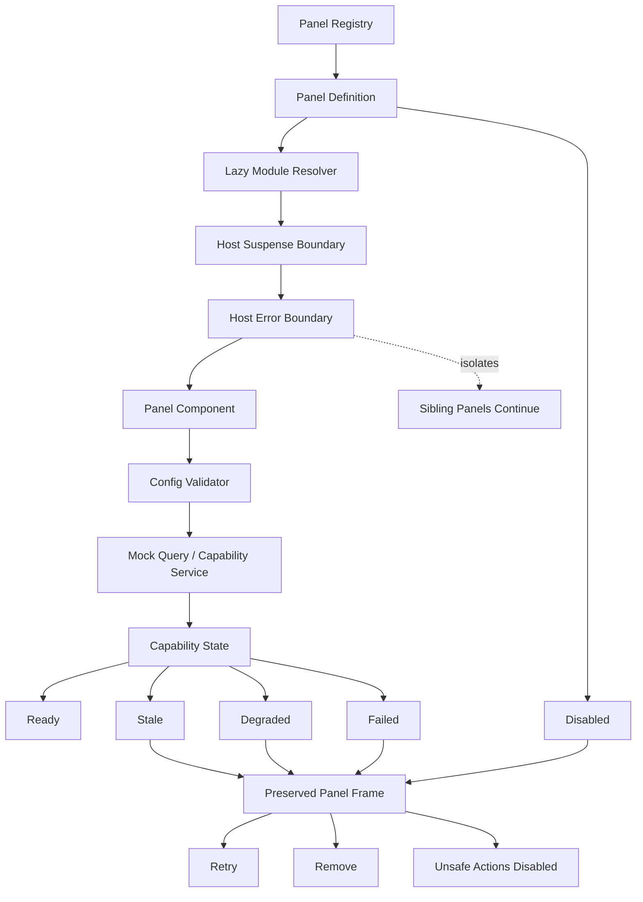
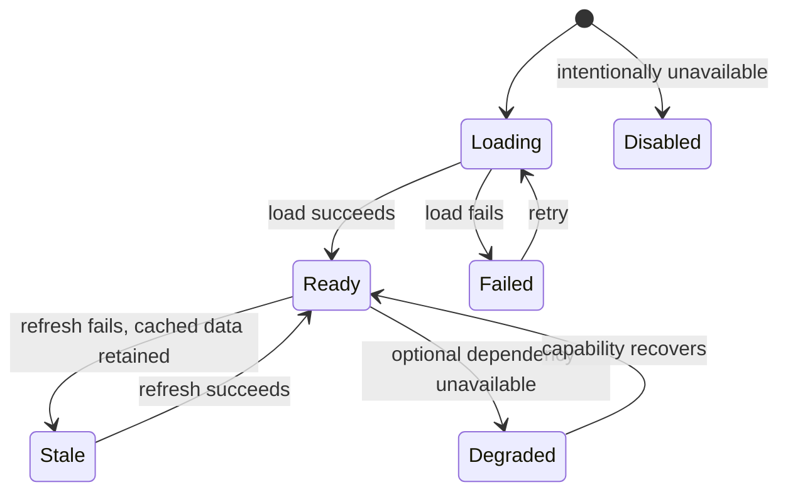

# Graceful Capability Degradation

> **Showcase scope:** three lazy browser panels owned by one panel host. Use local config validation, Suspense, a local Error Boundary, stale/degraded/failed presentation states, and Retry/Remove controls. Critical startup failures still belong to the higher application boundary.

## 1. Short definition

**Graceful Capability Degradation** allows a non-critical part of an application to become stale, reduced, unavailable, or intentionally disabled without crashing the whole workspace.

For the Financial Workspace demo:

```text
Dynamic panel
    ↓
lazy module resolution
    ↓
Suspense boundary
    ↓
Error Boundary
    ↓
config validation
    ↓
mock data loading
    ↓
capability state
```

Possible capability states are:

```text
Loading
Ready
Stale
Degraded
Failed

Disabled
    separate and intentional
```

The state model is non-linear:

```text
Loading → Ready
Loading → Failed

Ready → Stale
Ready → Degraded

Stale → Ready
Degraded → Ready

Failed → Loading
```

The key principle is:

> Optional capabilities fail locally, while critical failures still fail at the correct higher boundary.

Graceful degradation is not the same as ignoring errors.

It is an explicit decision about what remains safe and useful after a local failure.

---

## 2. Problem it solves

Large client-side applications often contain many independently useful capabilities:

- portfolio overview;
- activity summary;
- scenario analytics;
- market data;
- contextual integration;
- dynamic reports;
- optional tools;
- workspace panels.

Without local failure boundaries, one optional problem may damage the complete workspace:

```text
one panel import fails
    ↓
route crashes
    ↓
application becomes unusable
```

Or the application may hide the problem unsafely:

```text
request fails
    ↓
old data still shown
    ↓
user cannot tell it is stale
    ↓
unsafe action remains enabled
```

Typical failure modes include:

- lazy module chunk fails to load;
- panel configuration is invalid;
- optional request fails;
- Worker-backed analytics is unavailable;
- cached data is old;
- partial data omits required fields;
- external platform context is missing;
- rendering throws inside one panel;
- retry repeatedly fails.

The desired behavior is:

```text
local failure
    ↓
local capability state
    ↓
clear user-visible status
    ↓
safe remaining actions
    ↓
siblings remain usable
```

---

## 3. Architecture diagram



### Responsibility boundary

```text
Panel host
    owns lazy loading, Suspense, Error Boundary, frame, retry, and removal

Panel module
    validates feature-specific config and renders capability content

Capability service
    loads data or performs optional work

Capability state model
    defines what remains usable

Application boundary
    handles critical failures
```

---

## 4. Demo scenario

The `/panels` route displays several dynamic panels:

| Panel | Demo behavior |
| --- | --- |
| Portfolio Overview | Normal successful load |
| Activity Summary | Deliberately slow load |
| Scenario Summary | Optional analytics capability |
| Invalid Configuration Panel | Local validation failure |
| Unavailable Panel | Simulated module or request failure |
| Disabled Capability | Intentionally unavailable by configuration |

The presenter should be able to demonstrate:

1. One panel loading slowly while siblings are ready.
2. One panel throwing during render.
3. One panel receiving invalid configuration.
4. One panel showing stale cached data.
5. One panel entering degraded mode with reduced functionality.
6. One panel failing completely.
7. Retry returning `Failed → Loading → Ready`.
8. Remove closing only the affected panel.
9. A disabled panel appearing separately from a failed panel.
10. A critical application failure still reaching a higher startup or route boundary.

The panel frame should remain visible in every local state so the user retains:

- panel identity;
- layout position;
- last known context;
- Retry;
- Remove;
- explanation of unavailable actions.

---

## 5. Capability state model

### Loading

The capability is not ready yet.

```text
No current usable result
Work is in progress
```

Allowed UI:

- loading indicator;
- cancel where meaningful;
- preserved panel title and layout.

---

### Ready

The capability is fully usable with current data.

```text
Data is current
Required functionality is available
Safe actions are enabled
```

---

### Stale

Usable previous data exists, but freshness is uncertain.

```text
Last successful data preserved
Timestamp visible
Refresh failed or connectivity changed
Unsafe writes disabled
```

Stale does not mean broken.

It means:

> The data may still be useful for reference, but it must not be presented as current.

---

### Degraded

The capability still works, but with reduced quality or functionality.

Examples:

- summary available but analytics detail unavailable;
- cached totals visible but live updates absent;
- read-only mode available;
- Worker calculation unavailable, bounded fallback offered;
- external context missing but manual input remains.

Degraded does not necessarily imply stale data.

A capability may be current but reduced.

---

### Failed

No usable capability remains.

```text
No safe result
No valid fallback
Retry or Remove available
```

The panel frame should remain.

---

### Disabled

The capability is intentionally unavailable.

Examples:

- runtime configuration turned it off;
- deployment does not provide the integration;
- product profile excludes it.

Disabled is not a failure.

```text
Disabled
    intentional
    no Retry

Failed
    unintended
    Retry may be available
```

---

## 6. Non-linear transitions



Do not imply:

```text
Stale → Degraded → Failed
```

These are not mandatory deterioration stages.

They represent different capability conditions.

---

## 7. Critical versus optional capability

Every capability must be classified.

```ts
export type CapabilityCriticality =
  | "critical"
  | "optional";
```

Examples:

| Capability | Criticality | Failure behavior |
| --- | --- | --- |
| Valid runtime configuration | Critical | Application startup fails |
| Required session context | Critical | Application startup fails |
| Required workspace state | Critical | Main view cannot start |
| Scenario analytics panel | Optional | Panel degrades or fails locally |
| Market data decoration | Optional | Workspace remains usable with warning |
| External context integration | Optional | Manual context selection remains |

The classification must reflect real safety requirements.

Do not mark a capability optional merely to avoid a visible application failure.

---

## 8. Architecture and responsibilities

### Panel registry

Responsibilities:

- map stable panel IDs to definitions;
- provide the canonical lazy module loader;
- declare capability metadata;
- expose whether the panel is enabled;
- avoid importing panel internals eagerly.

```ts
export type PanelDefinition = Readonly<{
  id: string;
  title: string;
  criticality: "critical" | "optional";
  loadModule(): Promise<PanelModule>;
  validateConfig(
    input: unknown,
  ): PanelConfigResult;
}>;
```

---

### Panel host

Responsibilities:

- render the panel frame;
- resolve the lazy module;
- own Suspense;
- own the Error Boundary;
- provide Retry and Remove;
- preserve layout through failure;
- reset the local boundary during retry;
- distinguish disabled from failed;
- pass only validated host-level props.

It should not:

- know every panel’s business rules;
- perform every panel query;
- hide critical application failures;
- silently replace failed content with unrelated content.

---

### Error Boundary

Responsibilities:

- catch render and lifecycle errors below the boundary;
- prevent sibling panels from crashing;
- report a local failed state;
- reset on explicit retry or changed reset key.

It does not catch:

- event-handler errors automatically;
- all asynchronous promise failures;
- failures outside its subtree;
- errors thrown before the boundary exists.

Async service errors must be represented in capability state.

---

### Suspense boundary

Responsibilities:

- show the panel frame while the lazy module loads;
- isolate loading state to the panel;
- avoid replacing the entire route with one panel spinner.

Suspense does not replace:

- query loading state;
- error handling;
- capability classification;
- stale-data labeling.

---

### Config validator

Responsibilities:

- decode unknown panel configuration;
- reject unsupported values;
- apply only safe defaults;
- produce typed config;
- return a local configuration error.

Invalid optional panel config should fail the panel locally.

Invalid critical application config should fail at startup.

---

### Capability controller

Responsibilities:

- load data;
- preserve last successful data;
- track freshness;
- classify stale, degraded, failed, or ready;
- expose retry;
- disable unsafe actions;
- reject stale async results.

It may be implemented with:

- a small external store;
- Redux Toolkit;
- redux-observable;
- XState;
- a feature facade.

---

## 9. Core contracts

### Capability snapshot

```ts
// packages/feature-dynamic-panels/src/
// capabilityState.ts

export type CapabilitySnapshot<
  TData,
> =
  | Readonly<{
      state: "loading";
      previousData?: TData;
    }>
  | Readonly<{
      state: "ready";
      data: TData;
      updatedAt: number;
    }>
  | Readonly<{
      state: "stale";
      data: TData;
      updatedAt: number;
      message: string;
    }>
  | Readonly<{
      state: "degraded";
      data?: TData;
      updatedAt?: number;
      availableFeatures:
        readonly string[];
      unavailableFeatures:
        readonly string[];
      message: string;
    }>
  | Readonly<{
      state: "failed";
      message: string;
      retryable: boolean;
    }>
  | Readonly<{
      state: "disabled";
      reason: string;
    }>;
```

---

### Panel props

```ts
export type PanelLayout =
  Readonly<{
    width:
      "small"
      | "medium"
      | "large";

    height:
      number;
  }>;

export type PanelFilters =
  Readonly<{
    accountId?:
      string;

    instrumentId?:
      string;

    dateRange?:
      Readonly<{
        from:
          string;

        to:
          string;
      }>;
  }>;

export type DynamicPanelProps<
  TConfig,
> =
  Readonly<{
    panelId:
      string;

    layout:
      PanelLayout;

    filters:
      PanelFilters;

    config:
      TConfig;

    onRemove():
      void;
  }>;
```

---

## 10. Panel registry

```ts
// packages/feature-dynamic-panels/src/
// panelRegistry.ts

export type PanelModule =
  Readonly<{
    default:
      React.ComponentType<
        DynamicPanelProps<unknown>
      >;
  }>;

export type PanelDefinition =
  Readonly<{
    id:
      string;

    title:
      string;

    criticality:
      "critical"
      | "optional";

    enabled:
      boolean;

    disabledReason?:
      string;

    loadModule():
      Promise<
        PanelModule
      >;

    validateConfig(
      input:
        unknown,
    ):
      PanelConfigValidation;
  }>;

export type PanelConfigValidation =
  | Readonly<{
      valid:
        true;

      value:
        unknown;
    }>
  | Readonly<{
      valid:
        false;

      message:
        string;
    }>;

export interface PanelRegistry {
  get(
    panelType:
      string,
  ):
    PanelDefinition
    | undefined;
}
```

---

## 11. Example panel definitions

```ts
// packages/feature-dynamic-panels/src/
// createPanelRegistry.ts

const loadPortfolioOverview =
  () =>
    import(
      "./panels/PortfolioOverviewPanel"
    );

const loadActivitySummary =
  () =>
    import(
      "./panels/ActivitySummaryPanel"
    );

const loadScenarioSummary =
  () =>
    import(
      "./panels/ScenarioSummaryPanel"
    );

export function createPanelRegistry(
  capabilities:
    Readonly<{
      analyticsEnabled:
        boolean;
    }>,
): PanelRegistry {
  const definitions:
    readonly PanelDefinition[] =
    [
      {
        id:
          "portfolio-overview",

        title:
          "Portfolio Overview",

        criticality:
          "optional",

        enabled:
          true,

        loadModule:
          loadPortfolioOverview,

        validateConfig:
          validatePortfolioConfig,
      },

      {
        id:
          "activity-summary",

        title:
          "Activity Summary",

        criticality:
          "optional",

        enabled:
          true,

        loadModule:
          loadActivitySummary,

        validateConfig:
          validateActivityConfig,
      },

      {
        id:
          "scenario-summary",

        title:
          "Scenario Summary",

        criticality:
          "optional",

        enabled:
          capabilities
            .analyticsEnabled,

        disabledReason:
          capabilities
            .analyticsEnabled
            ? undefined
            : "Analytics is disabled by runtime configuration.",

        loadModule:
          loadScenarioSummary,

        validateConfig:
          validateScenarioConfig,
      },
    ];

  const byId =
    new Map(
      definitions.map(
        (definition) => [
          definition.id,
          definition,
        ],
      ),
    );

  return {
    get(
      panelType,
    ) {
      return byId.get(
        panelType,
      );
    },
  };
}
```

---

## 12. Local Error Boundary

```tsx
// packages/feature-dynamic-panels/src/
// PanelErrorBoundary.tsx

import {
  Component,
  type ErrorInfo,
  type ReactNode,
} from "react";

type Props =
  Readonly<{
    resetKey:
      number;

    onError(
      error:
        Error,

      info:
        ErrorInfo,
    ): void;

    fallback(
      error:
        Error,
    ):
      ReactNode;

    children:
      ReactNode;
  }>;

type State =
  Readonly<{
    error?:
      Error;
  }>;

export class PanelErrorBoundary
  extends Component<
    Props,
    State
  > {
  state:
    State = {};

  static getDerivedStateFromError(
    error:
      Error,
  ): State {
    return {
      error,
    };
  }

  componentDidCatch(
    error:
      Error,

    info:
      ErrorInfo,
  ): void {
    this.props.onError(
      error,
      info,
    );
  }

  componentDidUpdate(
    previousProps:
      Props,
  ): void {
    if (
      previousProps
        .resetKey !==
      this.props
        .resetKey &&
      this.state
        .error
    ) {
      this.setState({
        error:
          undefined,
      });
    }
  }

  render():
    ReactNode {
    if (
      this.state.error
    ) {
      return this.props
        .fallback(
          this.state.error,
        );
    }

    return this.props
      .children;
  }
}
```

The retry key resets only the local panel boundary.

---

## 13. Panel host

```tsx
// packages/feature-dynamic-panels/src/
// DynamicPanelHost.tsx

import {
  lazy,
  Suspense,
  useMemo,
  useState,
} from "react";

export function DynamicPanelHost({
  instance,
  registry,
  onRemove,
  onReportError,
}: {
  instance:
    PanelInstance;

  registry:
    PanelRegistry;

  onRemove():
    void;

  onReportError(
    input:
      PanelErrorReport,
  ): void;
}) {
  const [
    retryKey,
    setRetryKey,
  ] =
    useState(0);

  const definition =
    registry.get(
      instance.panelType,
    );

  if (!definition) {
    return (
      <PanelFrame
        title=
          "Unknown Panel"
      >
        <PanelFailure
          message=
            "The panel type is not registered."
          retryable={
            false
          }
          onRemove={
            onRemove
          }
        />
      </PanelFrame>
    );
  }

  if (
    !definition.enabled
  ) {
    return (
      <PanelFrame
        title={
          definition.title
        }
      >
        <PanelDisabled
          reason={
            definition
              .disabledReason ??
            "This capability is intentionally disabled."
          }
          onRemove={
            onRemove
          }
        />
      </PanelFrame>
    );
  }

  const validation =
    definition
      .validateConfig(
        instance.config,
      );

  if (
    !validation.valid
  ) {
    return (
      <PanelFrame
        title={
          definition.title
        }
      >
        <PanelFailure
          message={
            validation.message
          }
          retryable={
            false
          }
          onRemove={
            onRemove
          }
        />
      </PanelFrame>
    );
  }

  const LazyPanel =
    useMemo(
      () =>
        lazy(
          definition
            .loadModule,
        ),
      [
        definition,
        retryKey,
      ],
    );

  return (
    <PanelFrame
      title={
        definition.title
      }
    >
      <PanelErrorBoundary
        resetKey={
          retryKey
        }
        onError={(
          error,
          info,
        ) => {
          onReportError({
            panelId:
              instance.id,

            panelType:
              instance.panelType,

            error,

            componentStack:
              info
                .componentStack,
          });
        }}
        fallback={(
          error,
        ) => (
          <PanelFailure
            message={
              error.message
            }
            retryable={
              true
            }
            onRetry={() => {
              setRetryKey(
                (
                  current,
                ) =>
                  current + 1,
              );
            }}
            onRemove={
              onRemove
            }
          />
        )}
      >
        <Suspense
          fallback={
            <PanelLoading />
          }
        >
          <LazyPanel
            key={
              retryKey
            }
            panelId={
              instance.id
            }
            layout={
              instance.layout
            }
            filters={
              instance.filters
            }
            config={
              validation.value
            }
            onRemove={
              onRemove
            }
          />
        </Suspense>
      </PanelErrorBoundary>
    </PanelFrame>
  );
}
```

### Important React note

Hooks must not be called conditionally.

In the production implementation, place the lazy-component memoization in a child component rendered only after definition and validation succeed:

```tsx
<ResolvedPanelHost
  definition={definition}
  validatedConfig={validation.value}
  retryKey={retryKey}
/>
```

The expanded example above shows the architecture, but the final code must preserve the Rules of Hooks.

---

## 14. Hook-safe resolved panel host

```tsx
function ResolvedPanelHost({
  definition,
  validatedConfig,
  instance,
  retryKey,
  onRemove,
}: {
  definition:
    PanelDefinition;

  validatedConfig:
    unknown;

  instance:
    PanelInstance;

  retryKey:
    number;

  onRemove():
    void;
}) {
  const LazyPanel =
    useMemo(
      () =>
        lazy(
          definition
            .loadModule,
        ),
      [
        definition,
        retryKey,
      ],
    );

  return (
    <Suspense
      fallback={
        <PanelLoading />
      }
    >
      <LazyPanel
        key={
          retryKey
        }
        panelId={
          instance.id
        }
        layout={
          instance.layout
        }
        filters={
          instance.filters
        }
        config={
          validatedConfig
        }
        onRemove={
          onRemove
        }
      />
    </Suspense>
  );
}
```

---

## 15. Configuration validation

```ts
// packages/feature-dynamic-panels/src/
// validatePortfolioConfig.ts

export type PortfolioPanelConfig =
  Readonly<{
    displayCurrency:
      "USD"
      | "EUR"
      | "PLN";

    showChange:
      boolean;
  }>;

export function validatePortfolioConfig(
  input:
    unknown,
): PanelConfigValidation {
  if (
    typeof input !==
      "object" ||
    input ===
      null ||
    Array.isArray(
      input,
    )
  ) {
    return {
      valid:
        false,

      message:
        "Portfolio panel configuration must be an object.",
    };
  }

  const record =
    input as
      Record<
        string,
        unknown
      >;

  const currency =
    record
      .displayCurrency;

  if (
    currency !==
      "USD" &&
    currency !==
      "EUR" &&
    currency !==
      "PLN"
  ) {
    return {
      valid:
        false,

      message:
        "Portfolio panel requires a supported display currency.",
    };
  }

  const showChange =
    record.showChange;

  if (
    typeof showChange !==
      "boolean"
  ) {
    return {
      valid:
        false,

      message:
        "Portfolio panel requires a boolean showChange value.",
    };
  }

  return {
    valid:
      true,

    value: {
      displayCurrency:
        currency,

      showChange,
    } satisfies
      PortfolioPanelConfig,
  };
}
```

The panel receives typed validated config rather than raw unknown input.

---

## 16. Capability controller

```ts
// packages/feature-dynamic-panels/src/
// createCapabilityController.ts

export function createCapabilityController<
  TData,
>(
  dependencies:
    Readonly<{
      load(
        signal:
          AbortSignal,
      ):
        Promise<
          TData
        >;

      now():
        number;

      staleAfterMs:
        number;
    }>,
) {
  let snapshot:
    CapabilitySnapshot<
      TData
    > = {
      state:
        "loading",
    };

  let lastSuccessful:
    Readonly<{
      data:
        TData;

      updatedAt:
        number;
    }> | undefined;

  let controller:
    AbortController
    | undefined;

  let requestId =
    0;

  const listeners =
    new Set<
      () => void
    >();

  function emit(
    next:
      CapabilitySnapshot<
        TData
      >,
  ): void {
    snapshot =
      next;

    for (
      const listener
      of listeners
    ) {
      listener();
    }
  }

  async function load():
    Promise<void> {
    controller
      ?.abort();

    controller =
      new AbortController();

    const currentRequest =
      ++requestId;

    emit({
      state:
        "loading",

      previousData:
        lastSuccessful
          ?.data,
    });

    try {
      const data =
        await dependencies
          .load(
            controller.signal,
          );

      if (
        currentRequest !==
        requestId
      ) {
        return;
      }

      const updatedAt =
        dependencies
          .now();

      lastSuccessful = {
        data,
        updatedAt,
      };

      emit({
        state:
          "ready",
        data,
        updatedAt,
      });
    } catch (error) {
      if (
        currentRequest !==
        requestId
      ) {
        return;
      }

      if (
        error instanceof
          DOMException &&
        error.name ===
          "AbortError"
      ) {
        return;
      }

      if (
        lastSuccessful
      ) {
        emit({
          state:
            "stale",

          data:
            lastSuccessful
              .data,

          updatedAt:
            lastSuccessful
              .updatedAt,

          message:
            "Refresh failed. Showing the last successful snapshot.",
        });

        return;
      }

      emit({
        state:
          "failed",

        message:
          error instanceof
            Error
            ? error.message
            : "Capability failed.",

        retryable:
          true,
      });
    }
  }

  return {
    start:
      load,

    retry:
      load,

    stop():
      void {
      requestId += 1;

      controller
        ?.abort();
    },

    getSnapshot():
      CapabilitySnapshot<
        TData
      > {
      return snapshot;
    },

    subscribe(
      listener:
        () => void,
    ):
      () => void {
      listeners.add(
        listener,
      );

      return () => {
        listeners.delete(
          listener,
        );
      };
    },
  };
}
```

---

## 17. Stale-state rendering

```tsx
function StalePortfolioView({
  data,
  updatedAt,
  onRefresh,
}: {
  data:
    PortfolioSummary;

  updatedAt:
    number;

  onRefresh():
    void;
}) {
  return (
    <section>
      <CapabilityBanner
        tone=
          "warning"
      >
        Showing cached data from
        {" "}
        <time
          dateTime={
            new Date(
              updatedAt,
            ).toISOString()
          }
        >
          {
            new Date(
              updatedAt,
            ).toLocaleString()
          }
        </time>
        .
      </CapabilityBanner>

      <PortfolioSummaryView
        data={
          data
        }
        readOnly={
          true
        }
      />

      <button
        onClick={
          onRefresh
        }
      >
        Refresh
      </button>
    </section>
  );
}
```

Safety rule:

> Stale data must show its timestamp, and actions that depend on current data must be disabled.

---

## 18. Degraded-state rendering

```tsx
function DegradedScenarioView({
  summary,
  unavailableFeatures,
}: {
  summary?:
    ScenarioSummary;

  unavailableFeatures:
    readonly string[];
}) {
  return (
    <section>
      <CapabilityBanner
        tone=
          "warning"
      >
        Scenario analytics is available with reduced functionality.
      </CapabilityBanner>

      {summary && (
        <ScenarioSummaryView
          data={
            summary
          }
        />
      )}

      <ul>
        {unavailableFeatures.map(
          (feature) => (
            <li
              key={
                feature
              }
            >
              {feature}
              {" "}
              unavailable
            </li>
          ),
        )}
      </ul>
    </section>
  );
}
```

Degraded mode should name what remains available and what does not.

---

## 19. Failed-state rendering

```tsx
function PanelFailure({
  message,
  retryable,
  onRetry,
  onRemove,
}: {
  message:
    string;

  retryable:
    boolean;

  onRetry?():
    void;

  onRemove():
    void;
}) {
  return (
    <section
      role=
        "alert"
    >
      <h3>
        Panel unavailable
      </h3>

      <p>
        {message}
      </p>

      {retryable &&
        onRetry && (
        <button
          onClick={
            onRetry
          }
        >
          Retry
        </button>
      )}

      <button
        onClick={
          onRemove
        }
      >
        Remove
      </button>
    </section>
  );
}
```

The panel identity and frame remain visible around this state.

---

## 20. Disabled-state rendering

```tsx
function PanelDisabled({
  reason,
  onRemove,
}: {
  reason:
    string;

  onRemove():
    void;
}) {
  return (
    <section>
      <h3>
        Capability disabled
      </h3>

      <p>
        {reason}
      </p>

      <button
        onClick={
          onRemove
        }
      >
        Remove
      </button>
    </section>
  );
}
```

There is no Retry because the state is intentional.

---

## 21. Query-state mapping

A query library may expose:

```text
pending
success
error
fetching
stale
```

The panel should map those technical states into capability semantics.

Example:

```ts
export function toCapabilitySnapshot(
  query:
    QuerySnapshot<
      PortfolioSummary
    >,
): CapabilitySnapshot<
  PortfolioSummary
> {
  if (
    query.status ===
      "pending" &&
    !query.data
  ) {
    return {
      state:
        "loading",
    };
  }

  if (
    query.status ===
      "error" &&
    query.data
  ) {
    return {
      state:
        "stale",

      data:
        query.data,

      updatedAt:
        query.dataUpdatedAt,

      message:
        "Refresh failed. Showing cached data.",
    };
  }

  if (
    query.status ===
      "error"
  ) {
    return {
      state:
        "failed",

      message:
        query.error.message,

      retryable:
        true,
    };
  }

  return {
    state:
      "ready",

    data:
      query.data,

    updatedAt:
      query.dataUpdatedAt,
  };
}
```

Technical query state and business capability state are related but not identical.

---

## 22. Degraded Strategy fallback

A Worker-backed analytics capability may fail.

Possible policy:

```ts
export type AnalyticsCapability =
  | Readonly<{
      state:
        "ready";

      analytics:
        PortfolioAnalytics;
    }>
  | Readonly<{
      state:
        "degraded";

      analytics:
        PortfolioAnalytics;

      limitations:
        readonly string[];
    }>
  | Readonly<{
      state:
        "failed";

      message:
        string;
    }>;
```

Safe fallback:

```text
Worker unavailable
    ↓
small dataset only
    ↓
explicit Direct Strategy fallback
    ↓
Degraded
```

Unsafe fallback:

```text
Worker unavailable
    ↓
silently run unlimited workload on main thread
```

The fallback must preserve responsiveness and be visible to the user.

---

## 23. Retry behavior

Retry should reset only the failed capability.

```text
Panel A failed
Panel B ready
Panel C ready

Retry A
    ↓
Panel A Loading
Panel B unchanged
Panel C unchanged
```

Retry may reset:

- Error Boundary key;
- lazy module promise;
- query request;
- Worker client;
- actor instance;
- local capability controller.

Do not remount the entire application to retry one optional panel.

---

## 24. Retry limits

Repeated failures may require bounded behavior.

```ts
export type RetryPolicy =
  Readonly<{
    maximumAttempts:
      number;

    automatic:
      boolean;
  }>;
```

Suggested demo policy:

- no infinite automatic retry;
- one or two safe automatic retries for transient reads;
- explicit user Retry after local failure;
- no Retry for disabled or invalid static config;
- clear final failed state.

---

## 25. Preserving the panel frame

The frame should remain stable across states:

```text
title
panel ID
layout dimensions
menu
Retry
Remove
status
last known timestamp
```

Benefits:

- avoids layout collapse;
- preserves user context;
- keeps workspace understandable;
- allows local recovery;
- makes failure feel contained.

Do not replace the entire layout with an unpositioned global error page for an optional panel failure.

---

## 26. Action safety

Actions should be classified by data requirements.

```ts
export type ActionAvailability =
  Readonly<{
    view:
      boolean;

    refresh:
      boolean;

    export:
      boolean;

    submit:
      boolean;
  }>;
```

Example mapping:

```ts
export function getActionAvailability(
  state:
    CapabilitySnapshot<
      unknown
    >["state"],
): ActionAvailability {
  switch (state) {
    case "ready":
      return {
        view:
          true,
        refresh:
          true,
        export:
          true,
        submit:
          true,
      };

    case "stale":
      return {
        view:
          true,
        refresh:
          true,
        export:
          false,
        submit:
          false,
      };

    case "degraded":
      return {
        view:
          true,
        refresh:
          true,
        export:
          false,
        submit:
          false,
      };

    case "loading":
    case "failed":
    case "disabled":
      return {
        view:
          false,
        refresh:
          state ===
            "failed",
        export:
          false,
        submit:
          false,
      };
  }
}
```

The exact policy depends on the capability.

The important rule is:

> The UI must not imply that stale or incomplete information is safe for every action.

---

## 27. Startup degradation

Optional bootstrap-task failure may create a degraded capability.

Example:

```text
analyticsWarmup fails
    ↓
application still reaches Main View Ready
    ↓
Scenario Summary panel state = Degraded or Failed
```

Critical bootstrap failure remains application-level:

```text
runtimeConfig invalid
    ↓
startup fails
```

Graceful degradation begins only after the application has enough trustworthy foundation to continue safely.

---

## 28. Actor failure isolation

In the Actor Model demo:

```text
Ticket Actor A fails
    ↓
Workspace Actor decides local policy
    ↓
Ticket B and Ticket C continue
```

Possible parent policy:

- restart child;
- mark ticket failed;
- close child;
- escalate to application boundary.

Actor failure and React Error Boundary failure are separate.

A React boundary cannot replace actor supervision.

---

## 29. Statechart relationship

A capability controller may use a statechart:

```text
loading
ready
stale
degraded
failed
```

This is useful when:

- transitions are complex;
- retries are explicit;
- timers mark data stale;
- several async dependencies contribute;
- recovery paths matter.

A simple discriminated union may be enough for a small panel.

Do not require XState for every degraded capability.

---

## 30. Error categorization

Useful categories:

```ts
export type CapabilityErrorCategory =
  | "module-load"
  | "configuration"
  | "request"
  | "worker"
  | "render"
  | "timeout"
  | "unknown";
```

Category influences:

- retryability;
- message;
- fallback;
- escalation;
- diagnostics.

Example:

| Category | Retryable? | Typical state |
| --- | --- | --- |
| Module load | Often | Failed |
| Invalid static config | No | Failed |
| Refresh request | Yes | Stale |
| Optional Worker unavailable | Maybe | Degraded |
| Render exception | Maybe | Failed |
| Intentional disablement | No | Disabled |

---

## 31. Error messages

User-facing messages should state:

- what is unavailable;
- whether previous data is shown;
- when it was last updated;
- which actions are disabled;
- what the user can do next.

Bad:

```text
Something went wrong.
```

Better:

```text
Scenario analytics is unavailable. Portfolio data remains available. Retry the panel or remove it from the workspace.
```

Avoid exposing:

- stack traces;
- internal URLs;
- raw configuration;
- account details;
- Worker protocol payloads.

---

## 32. Accessibility

Requirements:

- failed states use appropriate alert semantics;
- loading state is announced without excessive repetition;
- Retry and Remove are keyboard accessible;
- stale timestamp is text, not color alone;
- degraded limitations are explicitly listed;
- disabled and failed use distinct labels;
- focus remains stable after retry;
- layout preservation prevents unexpected focus movement.

Example:

```tsx
<section
  aria-busy={
    snapshot.state ===
      "loading"
  }
>
  {/* Panel state */}
</section>
```

---

## 33. Logging and diagnostics

Useful diagnostic fields:

```text
panel instance ID
panel type
capability state
error category
retry attempt
last successful timestamp
selected Strategy
Worker availability
module version
```

Do not make diagnostics the user-facing recovery mechanism.

The UI must remain understandable without developer tools.

---

## 34. Minimal test plan

### Local isolation

```ts
it(
  "keeps sibling panels mounted when one panel throws",
  () => {
    render(
      <PanelWorkspace
        panels={[
          healthyPanel,
          throwingPanel,
          secondHealthyPanel,
        ]}
      />,
    );

    expect(
      screen.getByText(
        "Portfolio Overview",
      ),
    ).toBeVisible();

    expect(
      screen.getByText(
        "Panel unavailable",
      ),
    ).toBeVisible();

    expect(
      screen.getByText(
        "Activity Summary",
      ),
    ).toBeVisible();
  },
);
```

---

### Stale fallback

```ts
it(
  "preserves last successful data after refresh failure",
  async () => {
    const controller =
      createCapabilityController({
        load:
          createSequenceLoader([
            portfolioData,
            new Error(
              "Synthetic refresh failure.",
            ),
          ]),

        now:
          () =>
            1_000,

        staleAfterMs:
          30_000,
      });

    await controller.start();
    await controller.retry();

    expect(
      controller
        .getSnapshot(),
    ).toMatchObject({
      state:
        "stale",

      data:
        portfolioData,

      updatedAt:
        1_000,
    });
  },
);
```

---

### Retry recovery

```ts
it(
  "moves from failed to loading to ready after retry",
  async () => {
    const controller =
      createCapabilityController({
        load:
          createSequenceLoader([
            new Error(
              "Synthetic failure.",
            ),

            portfolioData,
          ]),

        now:
          () =>
            2_000,

        staleAfterMs:
          30_000,
      });

    await controller.start();

    expect(
      controller
        .getSnapshot()
        .state,
    ).toBe(
      "failed",
    );

    const retry =
      controller.retry();

    expect(
      controller
        .getSnapshot()
        .state,
    ).toBe(
      "loading",
    );

    await retry;

    expect(
      controller
        .getSnapshot()
        .state,
    ).toBe(
      "ready",
    );
  },
);
```

---

### Disabled versus failed

```ts
it(
  "does not offer Retry for an intentionally disabled panel",
  () => {
    render(
      <DynamicPanelHost
        instance={
          disabledPanel
        }
        registry={
          registry
        }
        onRemove={
          vi.fn()
        }
        onReportError={
          vi.fn()
        }
      />,
    );

    expect(
      screen.getByText(
        "Capability disabled",
      ),
    ).toBeVisible();

    expect(
      screen.queryByRole(
        "button",
        {
          name:
            "Retry",
        },
      ),
    ).toBeNull();
  },
);
```

Priority tests:

- one panel failure does not affect siblings;
- lazy module failure stays local;
- invalid config stays local;
- stale data preserves timestamp;
- stale actions are disabled;
- degraded limitations are visible;
- failed panel offers Retry and Remove;
- disabled panel offers no Retry;
- retry resets only one panel;
- late requests do not update removed panels;
- critical capability failure escalates.

---

## 35. Browser integration tests

Verify:

- slow module shows local loading frame;
- failed module shows local fallback;
- Retry reloads or re-resolves the panel;
- Remove updates only workspace layout;
- sibling interactions continue;
- stale timestamp is visible;
- disabled actions cannot be triggered;
- keyboard focus remains usable;
- production chunk failures are contained;
- Worker failure does not freeze the page;
- route-level critical errors still reach the route boundary.

---

## 36. Best-fit use cases

Use Graceful Capability Degradation when:

- the application contains optional independent capabilities;
- one feature may fail without invalidating the rest;
- cached data remains useful with clear labeling;
- reduced functionality is safer than total failure;
- lazy panels or micro-frontends fail independently;
- Worker or platform integrations are optional;
- users need Retry or Remove without reloading the application;
- the application has explicit criticality classification.

Financial-workspace examples:

- optional scenario analytics;
- live market-data decoration;
- dynamic dashboard panels;
- contextual integration;
- activity summary;
- report preview;
- chart enhancements;
- cached reference views.

---

## 37. When not to use it

### Invalid critical configuration

The application should fail startup.

---

### Missing required session

Do not show a partially trustworthy workspace.

---

### Unsafe stale data

If old data cannot be used safely, fail the capability rather than displaying it.

---

### Hidden failure

Do not silently remove functionality.

---

### Automatic unsafe fallback

Do not replace a Worker with unbounded main-thread work.

---

### Authorization failures

Do not treat lack of permission as a technical degradation unless the product explicitly models it as disabled or unavailable.

---

### Data corruption

Do not preserve or display data known to be invalid.

---

## 38. Benefits

### Fault isolation

One optional capability cannot crash siblings.

### Continued productivity

Users can keep working with healthy parts of the workspace.

### Clear safety semantics

Stale, degraded, failed, and disabled mean different things.

### Better recovery

Retry and Remove are local.

### Layout stability

The workspace remains understandable.

### Better performance architecture

Lazy modules and Workers can fail without global collapse.

### Better startup design

Optional bootstrap failures map to capability state.

### Presentation value

The failure boundaries and recovery paths are visible.

### Honest UI

The user knows when data is old or functionality is reduced.

---

## 39. Disadvantages and risks

### More states

The UI must design and test several conditions.

---

### Incorrect classification

A critical capability may be treated as optional.

Mitigation:

- classify explicitly;
- review safety consequences.

---

### Stale-data misuse

Users may act on old data.

Mitigation:

- timestamp;
- warning;
- disable unsafe actions.

---

### Hidden degradation

A small banner may be overlooked.

Mitigation:

- place status near affected content;
- list unavailable functionality.

---

### Recovery complexity

Retry may require resetting:

- module import;
- query;
- Worker;
- actor;
- Error Boundary.

---

### Inconsistent semantics

Different teams may use `stale`, `degraded`, and `failed` differently.

Mitigation:

- publish one shared capability-state vocabulary.

---

### Layout clutter

Every panel may contain warnings and controls.

Mitigation:

- use consistent host-owned frame components.

---

### Error loops

Immediate automatic retry may repeatedly fail.

Mitigation:

- bounded retries;
- backoff;
- user-triggered recovery.

---

### Masked systemic failure

Many optional capabilities may fail from one shared cause.

Mitigation:

- aggregate diagnostics;
- escalate when the foundation is no longer trustworthy.

---

## 40. Relevant libraries

The pattern itself does not require one library.

Useful tools include:

### React Error Boundaries

For render-failure isolation.

### React Suspense

For local lazy-loading boundaries.

### TanStack Query

For cached data, stale state, retry, and request lifecycle.

### XState

For explicit capability transitions and recovery.

### Redux Toolkit and redux-observable

For application-owned capability state and async coordination.

### `react-error-boundary`

Provides reusable boundary and reset helpers.

### Native Web Workers

May be contained behind an optional capability.

The implementation should use existing project tools where possible rather than adding a new state library.

---

## 41. Relationship to the other patterns

### Runtime Configuration

Runtime configuration may intentionally disable an optional capability.

```text
config says unavailable
    → Disabled
```

Invalid required runtime configuration remains a startup failure.

---

### Composition Root

The Composition Root:

- classifies available capabilities;
- creates optional services;
- selects fallbacks;
- injects capability dependencies;
- exposes startup diagnostics;
- owns cleanup.

---

### Strategy Pattern

A degraded capability may use a safe fallback Strategy.

The fallback must preserve the same contract and clearly state limitations.

---

### State Machines and Statecharts

A statechart can model:

```text
Loading
Ready
Stale
Degraded
Failed
```

Use it when transition logic is complex.

---

### Actor Model

An actor may supervise one capability instance.

Child actor failure should not automatically stop siblings unless policy requires escalation.

---

### Declarative Bootstrap Task Graph

Optional startup-task failure may produce a degraded capability.

Critical task failure prevents Main View Ready.

---

### Web Worker Offloading

Worker failure may degrade analytics locally.

Do not silently move unbounded CPU work back to the main thread.

---

### Intent-Based Prefetching

Prefetch failure is only an optimization failure.

Actual activation decides whether the capability loads, retries, degrades, or fails.

---

## 42. Working demo location

Implemented repository locations:

```text
packages/feature-dynamic-panels/
  src/
    model/
      panelTypes.ts
      panelDefinitions.ts
      panelLoaders.ts
    internal/
      DynamicPanelHost.tsx
      PanelErrorBoundary.tsx
    panels/
      PortfolioOverviewPanel.tsx
      ActivitySummaryPanel.tsx
      ScenarioSummaryPanel.tsx
    DynamicPanelsEntry.tsx
    index.ts

apps/financial-workspace/src/routes/
  PanelsRoute.tsx
```

Primary visible demo:

```text
/panels
```

Implementation status:

> Implemented. `/panels` demonstrates ready, stale, degraded, failed,
> disabled, invalid-config, retry, remove, Suspense, and rendering-isolation
> behavior across three lazy panel types.

---

## 43. Presentation talking points

### One-sentence explanation

> Graceful Capability Degradation keeps optional failures local and explicit, preserving safe functionality without pretending that stale, reduced, failed, and disabled states are equivalent.

### Visual story

```text
one panel fails
    ↓
panel frame remains
    ↓
Retry or Remove
    ↓
siblings continue
```

### Main distinction

> Optional failures degrade locally. Critical failures still fail at the correct higher boundary.

### Demo sequence

1. Open `/panels`.
2. Show healthy sibling panels.
3. Trigger a slow panel.
4. Trigger a render failure.
5. Show the local Error Boundary.
6. Trigger invalid panel configuration.
7. Show local non-retryable failure.
8. Trigger refresh failure after successful data.
9. Show Stale with timestamp.
10. Show unsafe actions disabled.
11. Trigger analytics dependency failure.
12. Show Degraded with limitations.
13. Retry a failed panel.
14. Show `Failed → Loading → Ready`.
15. Show Disabled separately with no Retry.
16. Trigger a critical startup failure and show that it does not degrade locally.

### Questions to ask the audience

- Which capabilities are truly optional?
- Is stale data safe to display?
- Which actions require current data?
- What is the difference between degraded and failed?
- Who owns Retry?
- Should this failure stay local or escalate?
- Can one panel preserve its frame?
- Is the fallback safe and bounded?

### Common misconception

```text
Graceful degradation
≠ swallowing errors
≠ showing stale data without warning
≠ making every capability optional
≠ silent fallback
≠ global error page
```

---

## 44. Implementation checklist

### Capability model

- [ ] Define Loading.
- [ ] Define Ready.
- [ ] Define Stale.
- [ ] Define Degraded.
- [ ] Define Failed.
- [ ] Define Disabled separately.
- [ ] Document non-linear transitions.

### Criticality

- [ ] Classify every capability.
- [ ] Escalate critical failures.
- [ ] Keep optional failures local.
- [ ] Review safety assumptions.
- [ ] Avoid hiding systemic failure.

### Panel host

- [ ] Preserve panel frame.
- [ ] Own Suspense.
- [ ] Own Error Boundary.
- [ ] Validate configuration.
- [ ] Provide Retry.
- [ ] Provide Remove.
- [ ] Reset only the local panel.

### Data safety

- [ ] Preserve last successful data only when safe.
- [ ] Show timestamp for stale data.
- [ ] Disable unsafe actions.
- [ ] List degraded limitations.
- [ ] Do not display corrupt data.

### Runtime integration

- [ ] Map optional bootstrap failure to capability state.
- [ ] Map runtime disablement to Disabled.
- [ ] Use safe bounded Strategy fallbacks.
- [ ] Stop Workers and actors on removal.
- [ ] Ignore late results after disposal.

### Accessibility

- [ ] Announce local failure.
- [ ] Keep Retry keyboard accessible.
- [ ] Do not rely on color.
- [ ] Preserve focus and layout.
- [ ] Distinguish Disabled from Failed in text.

### Verification

- [ ] One panel failure leaves siblings usable.
- [ ] Stale timestamp is visible.
- [ ] Unsafe actions are disabled.
- [ ] Retry affects one panel only.
- [ ] Remove works locally.
- [ ] Disabled has no Retry.
- [ ] Critical failure escalates.
- [ ] Existing Part 1 routes remain intact.
- [ ] Package-root imports are used.

---

## 45. Final summary

Graceful Capability Degradation provides an explicit safety model for partial failure.

For the Financial Workspace demo:

- dynamic panels load independently;
- the host owns Suspense and Error Boundary;
- panel configuration is validated locally;
- capability state distinguishes Loading, Ready, Stale, Degraded, Failed, and Disabled;
- stale data shows a timestamp;
- unsafe actions are disabled;
- failed panels preserve their frame;
- Retry and Remove remain local;
- optional Worker, platform, and analytics failures do not crash siblings;
- critical startup and application failures still escalate.

The success criterion is not simply that an Error Boundary catches an exception.

The success criterion is:

> The application preserves the maximum safe and honest functionality after a local failure, while clearly communicating limitations and escalating failures that invalidate the trustworthy foundation of the workspace.
